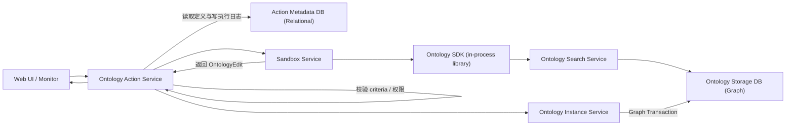
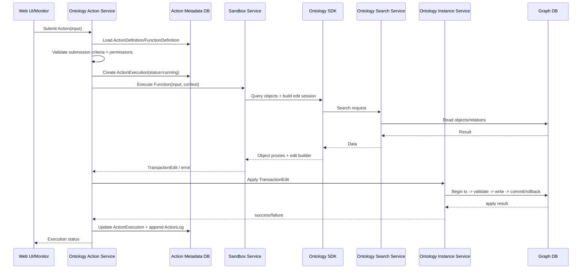
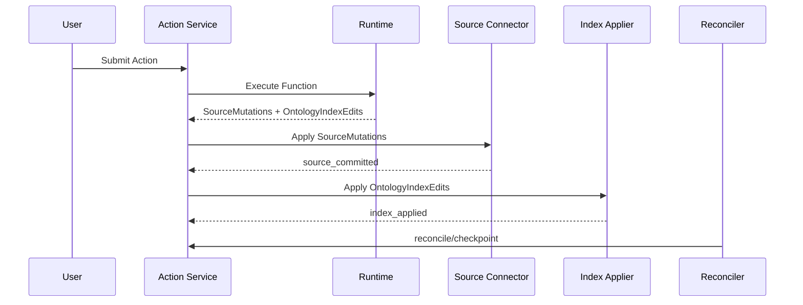

# Function-backed Action 方案设计（分阶段版）

> 目标：构建企业级、本体驱动、可审计的 Action 平台。Action 由 Function 在沙箱中执行并产出结构化变更，平台负责校验、应用、记录与（后续）跨系统一致性治理。

---

## 0. 总体设计原则（跨阶段）

- **Function 只声明变更，不直接落库**：Function 运行在 Sandbox 内，仅返回 `OntologyEdit`（阶段 1/2）或 `SourceMutations + OntologyIndexEdits`（阶段 3）。
- **先局部原子，再跨系统一致**：先保证图数据库内 Edit 原子性，再通过 Outbox/Saga 等机制处理跨库一致性。
- **控制面与数据面分离**：Action 定义/执行日志属于控制面（Relational DB），对象实例/关系属于数据面（Graph DB）。
- **可审计优先**：所有提交、执行、应用、补偿、重放都要可追踪。
- **可演进而非一次到位**：阶段 1 聚焦主链路，阶段 2 增强治理，阶段 3 才讨论非复制语义下的 Action。

---

## 1. 三阶段范围定义（不混叠）

### 阶段 1：Action 主流程（单服务边界内）

> 不包含外部系统写回、通知、Webhook、分布式事务框架。

**目标**
- 打通主流程：定义 -> 校验 -> 沙箱执行 -> 生成 Edit -> 应用 -> 记录。
- 固化可实现的语义边界（特别是事务边界、权限边界、冲突语义）。

**包含能力**
- ActionDefinition / FunctionDefinition / ActionExecution / ActionLog。
- Ontology Action Service（编排）、Sandbox Service（执行）、Ontology Search Service（查询）、Ontology Instance Service（应用）。
- Ontology SDK（沙箱内库，非独立服务）。
- Graph DB（实例存储）+ Relational DB（元数据与日志）。

**不包含能力**
- 任何跨系统副作用与异步外部写回。
- Outbox/SideEffectWorker/Saga/Reconciler。

### Palantir 中相关介绍

- Ontology 核心概念：<https://www.palantir.com/docs/foundry/ontology/core-concepts/>
- Action Types 总览：<https://www.palantir.com/docs/foundry/action-types/overview/>
- Action Types 入门：<https://www.palantir.com/docs/foundry/action-types/getting-started/>
- Action Rules：<https://www.palantir.com/docs/foundry/action-types/rules/>
- Submission Criteria：<https://www.palantir.com/docs/foundry/action-types/submission-criteria/>
- Function-backed Actions 概览：<https://www.palantir.com/docs/foundry/action-types/function-actions-overview/>
- Function-backed Actions 入门：<https://www.palantir.com/docs/foundry/action-types/function-actions-getting-started/>
- Function-backed Actions 批执行：<https://www.palantir.com/docs/foundry/action-types/function-actions-batched-execution/>
- Action 权限：<https://www.palantir.com/docs/foundry/action-types/permissions/>
- Functions 总览：<https://www.palantir.com/docs/foundry/functions/overview/>
- Functions 版本管理：<https://www.palantir.com/docs/foundry/functions/functions-versioning/>
- Python Functions 入门：<https://www.palantir.com/docs/foundry/functions/python-getting-started/>
- Python Functions on Objects：<https://www.palantir.com/docs/foundry/functions/python-functions-on-objects/>
- Functions on Objects：<https://www.palantir.com/docs/foundry/functions/functions-on-objects/>
- Foo Functions 入门：<https://www.palantir.com/docs/foundry/functions/foo-getting-started/>
- Ontology Imports：<https://www.palantir.com/docs/foundry/functions/ontology-imports/>
- API Objects/Links：<https://www.palantir.com/docs/foundry/functions/api-objects-links/>
- API Object Sets：<https://www.palantir.com/docs/foundry/functions/api-object-sets/>
- Python Ontology Edits：<https://www.palantir.com/docs/foundry/functions/python-ontology-edits/>
- Object Edits 应用机制：<https://www.palantir.com/docs/foundry/object-edits/how-edits-applied/>
- Object Edits 权限校验：<https://www.palantir.com/docs/foundry/object-edits/permission-checks/>
- Object Edits 物化：<https://www.palantir.com/docs/foundry/object-edits/materializations/>

---

### 阶段 2：跨系统副作用与一致性治理

> 阶段 1 稳定后引入；默认采用最终一致性，不把重型分布式事务框架作为前置。

**目标**
- 支持通知、Webhook、外部系统写回。
- 在“跨 Graph/Relational/External”条件下保障可恢复一致性。

**包含能力**
- SideEffectOutbox + SideEffectWorker（至少一次语义）。
- ActionState（PENDING/SUCCESS/FAILED）+ Reconciler 对账。
- Saga Step + Compensation（补偿事务）。
- 幂等键、重试退避、dead-letter、失败告警与指标。

**分层落地建议**
- 2A：Outbox + 幂等 + 重试 + 可观测性。
- 2B：Saga 补偿与失败编排。
- 2C（可选）：强一致关键流程接入 Temporal/Zeebe/Seata 等框架。

### Palantir 中相关介绍

- Side Effects 总览：<https://www.palantir.com/docs/foundry/action-types/side-effects-overview/>
- Notifications：<https://www.palantir.com/docs/foundry/action-types/notifications/>
- Set up Notification：<https://www.palantir.com/docs/foundry/action-types/set-up-notification/>
- Webhooks：<https://www.palantir.com/docs/foundry/action-types/webhooks/>
- Action Reverts：<https://www.palantir.com/docs/foundry/action-types/action-reverts/>
- Action Log：<https://www.palantir.com/docs/foundry/action-types/action-log/>
- Object Edits 用户历史：<https://www.palantir.com/docs/foundry/object-edits/user-edit-history/>

---

### 阶段 3：非复制（OSv2-like）模式下的 Action 语义

> 本阶段仅定义 Action 行为模型；本体实例化/索引后端的完整演进方案在独立文档设计。

**目标**
- 将 Action 从“更新图中真值副本”演进为“提交外部真值变更 + 维护本体索引投影”。

**语义调整**
- Function 输出扩展为：`SourceMutations` + `OntologyIndexEdits`。
- 状态维度扩展为：`pending_source -> source_committed -> index_applied -> reconciled`。

**关键约束**
- Source of Truth 在外部系统。
- Graph 侧承载索引、关系与审计上下文，不承载完整真值副本。
- 外部写回必须幂等（建议 key：`action_execution_id`）。

### Palantir 中相关介绍

- Ontology 核心概念：<https://www.palantir.com/docs/foundry/ontology/core-concepts/>
- Functions on Objects：<https://www.palantir.com/docs/foundry/functions/functions-on-objects/>
- Python Functions on Objects：<https://www.palantir.com/docs/foundry/functions/python-functions-on-objects/>
- Python Ontology Edits：<https://www.palantir.com/docs/foundry/functions/python-ontology-edits/>
- Object Edits 物化：<https://www.palantir.com/docs/foundry/object-edits/materializations/>

---

## 2. 阶段 1 详细设计

## 2.1 组件职责

- **Web UI / Monitor**：发起 Action、查看状态、查看审计轨迹。
- **Ontology Action Service**：
  - 校验 submission criteria / permissions。
  - 读取 ActionDefinition/FunctionDefinition。
  - 调度 Sandbox 执行 Function。
  - 调用 Ontology Instance Service 应用 Edit。
  - 写 ActionExecution / ActionLog。
- **Sandbox Service**：在 bwrap 中执行 Function 代码。
- **Ontology SDK（in-process library）**：被 Sandbox 内函数调用；负责查询对象、构建 Edit。
- **Ontology Search Service**：处理读取查询（对象/关系/对象集）。
- **Ontology Instance Service**：校验并应用 OntologyEdit，保证 Graph 事务内原子性。
- **Ontology Storage Database（Graph）**：对象实例/关系实例。
- **Action Metadata Database（Relational）**：Action 定义、执行状态、日志。

## 2.2 运行视图（阶段 1）

## 2.3 交互时序（阶段 1）

## 2.4 原子性与一致性边界

- **Graph 内原子性**：单次 Edit apply 必须在同一 Graph 事务中提交或回滚。
- **跨库非原子性（阶段 1 可接受）**：Graph 与 Relational 之间不保证强原子。
- **后续治理路径**：阶段 2 使用 Outbox + Reconciler + Saga 进行最终一致性收敛。

## 2.5 阶段 1 数据模型最小集

- `ActionDefinition(id, name, version, input_schema, output_schema, function_ref, submission_criteria, status)`
- `FunctionDefinition(id, name, version, runtime, code_ref, execution_policy, input_schema, output_schema)`
- `ActionExecution(id, action_id, function_id, submitter, status, input_payload, output_payload, ontology_edit, error, submitted_at, started_at, finished_at)`
- `ActionLog(id, action_execution_id, event_type, payload, created_at)`

**索引建议**
- `ActionExecution(status, action_id, submitter, submitted_at)`
- `ActionLog(action_execution_id, created_at)`

## 2.6 阶段 1 执行安全与治理

- **沙箱隔离**：文件系统隔离、最小权限、临时目录执行。
- **网络策略**：默认禁止外网，仅允许访问必要内网端点（如 Search Service）。
- **资源治理**：CPU/Memory/Disk/FD 配额与超时终止。
- **编辑约束**：Function 不允许直接写存储，只能返回结构化 Edit。
- **冲突检测**：基于对象版本号的乐观锁；默认 reject，后续可扩展 LWW/merge。

## 2.7 阶段 1 验收标准（M1）

- E2E 主链路稳定：提交、执行、应用、状态可追踪。
- 失败可定位：可区分 criteria 失败、函数执行失败、编辑冲突失败、应用失败。
- 图库事务语义正确：发生异常时无部分写入。
- 元数据闭环完整：ActionExecution 与 ActionLog 可完整重建一次执行轨迹。

---

## 3. 阶段 2 设计（副作用与一致性）

## 3.1 策略 A：State-machine Outbox（默认）

1. 写 `ActionState(PENDING)` + `intent_payload`。  
2. 提交 Graph Edit。  
3. 在 Relational 事务内更新 `ActionState=SUCCESS` 并写 `SideEffectOutbox`。  
4. Reconciler 扫描异常状态并补写/修复。

## 3.2 策略 B：Saga（补偿）

- 每个跨系统步骤配置 `forward` 与 `compensation`。
- 失败时逆序补偿，记录补偿日志与最终状态（failed/reverted）。

## 3.3 策略 C：分布式事务框架（可选）

仅在满足以下条件时引入：
- 强一致 SLA 明确且高价值；
- 步骤链条长、补偿复杂、人工介入多；
- 需要统一编排可视化与超时治理。

---

## 4. 阶段 3 设计（非复制 Action 语义）

## 4.1 执行模型

## 4.2 最小状态机建议

- `pending_source`
- `source_committed`
- `index_applied`
- `reconciled`
- `failed`

## 4.3 失败处置

- Source 成功 / Index 失败：重放 IndexEdits + 对账修复。
- Source 失败：不应用 IndexEdits，按错误类型重试或终止。
- Source 部分成功：走 Saga 补偿或人工介入队列。

---

## 5. API 与里程碑

### 5.1 API（按阶段）

**阶段 1（必需）**
- `POST /actions/submit`
- `GET /actions/{execution_id}`
- `GET /objects/{object_type}/{primary_key}`

**阶段 2（增强）**
- `POST /actions/{execution_id}/retry-side-effects`
- `POST /actions/{execution_id}/reconcile`
- `POST /actions/{execution_id}/compensate`

**阶段 3（非复制 Action）**
- `GET /actions/{execution_id}/consistency`
- `POST /actions/{execution_id}/replay-index`

### 5.2 里程碑

- **M1（阶段 1）**：主链路稳定 + 事务边界清晰 + 审计闭环。
- **M2（阶段 2A/2B）**：Outbox/Saga/Reconciler 可运行并可观测。
- **M3（阶段 2C，可选）**：关键流程接入框架化编排并验证收益。
- **M4（阶段 3）**：非复制模式 Action 双通道（source/index）可稳定收敛。

---

## 6. 结论

该设计将 Action 能力拆分为“可落地、可验证、可演进”的三阶段路径：先完成阶段 1 主链路，再建设阶段 2 一致性治理，最后扩展阶段 3 非复制语义。
