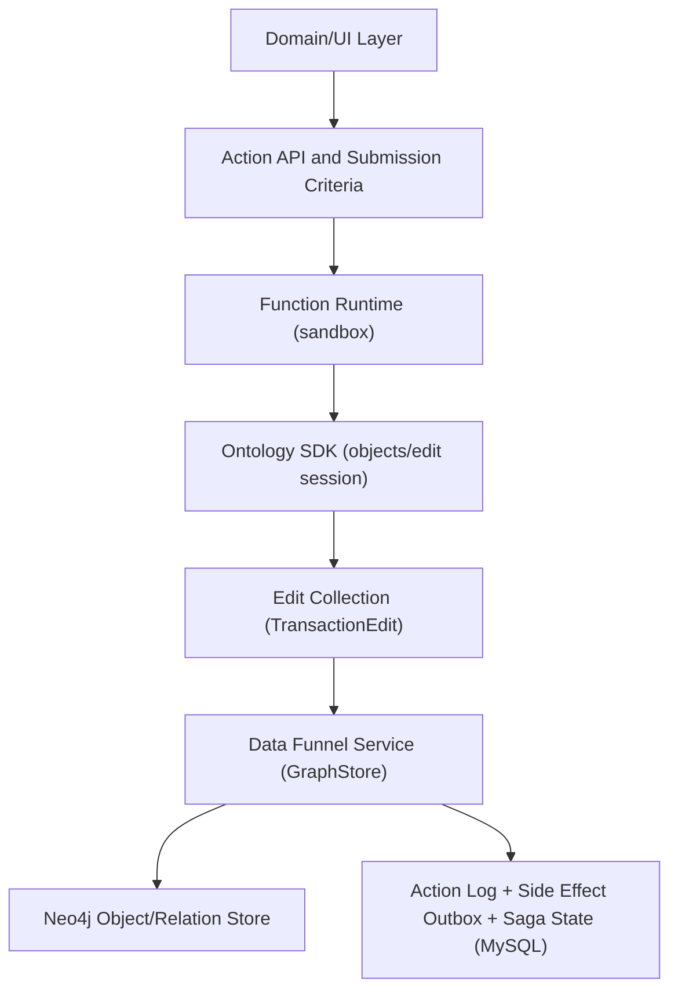
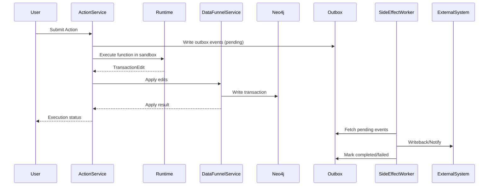

# Function-backed Action 方案设计（对标 Palantir Ontology）

> 目标：面向企业商用、高性能、可审计的本体 Action 系统。Action 由 Function 执行产生 Ontology Edit，再由 Action 引擎应用到本体存储（Neo4j），并具备可扩展的日志、审计、回滚、通知与外部副作用机制。

## 1. 设计目标与约束

### 1.1 目标
- **高性能**：支持批处理执行、异步执行与水平扩展。
- **强一致与可审计**：Action 执行结果可追踪、可回滚、可审计。
- **商用可控**：完善的权限、沙箱、配额、审计、隔离与资源管理。
- **可演进**：Ontology 与 Action、Function 版本化、兼容性治理。

### 1.2 约束与假设
- **语言与框架**：Python 实现核心服务，SQLAlchemy + MySQL 管理元数据与日志。
- **对象实例存储**：对象实例与关系实例存储在 Neo4j。
- **函数执行**：Function 在 **bubblewrap** 沙箱执行，不能直接修改 Ontology 对象，只能返回 **Ontology Edit**。

## 2. 总体架构

```
┌─────────────────────┐        ┌───────────────────────────┐
│  API Gateway / UI   │        │  External Systems         │
└─────────┬───────────┘        └──────────┬────────────────┘
          │                                │
          ▼                                ▼
┌──────────────────────────────────────────────────────────┐
│                    Action Service                        │
│  - Action Def/Version                                     │
│  - Submission Criteria                                    │
│  - Action Lifecycle                                        │
│  - Action Log / Audit                                      │
│  - Result / Notification                                   │
└─────────┬────────────────────────────┬───────────────────┘
          │                            │
          ▼                            ▼
┌───────────────────┐        ┌─────────────────────────────┐
│ Function Runtime  │        │ Data Funnel Service         │
│ - bwrap sandbox   │        │ - Conflict detection        │
│ - resource quotas │        │ - Atomic apply              │
│ - side effects    │        │ - Neo4j transaction         │
└─────────┬─────────┘        └──────────┬──────────────────┘
          │                              │
          ▼                              ▼
┌───────────────────┐        ┌─────────────────────────────┐
│ MySQL (SQLAlchemy)│        │ Neo4j (Object Instance)     │
│ - Action/Function │        │ - Nodes/Relations           │
│ - Action log      │        │ - Object history (opt)      │
│ - Outbox/Saga     │        │                             │
│ - Ontology schema │        └─────────────────────────────┘
└───────────────────┘
```

## 2.1 逻辑视图（Logical View）



## 2.2 运行视图（Runtime View）



## 3. 关键概念与流程

### 3.1 Function-backed Action
- **Action**：定义用户触发的业务行为（如审批、修复、批量更新）。
- **Function**：Action 的执行单元，运行在沙箱中，读取对象与参数，输出 **Ontology Edit**。
- **Ontology Edit**：声明式变更集合（增删改对象、关系），由 Data Funnel Service 应用到 Neo4j。

### 3.2 Action 生命周期
1. **提交**：用户或系统触发 Action，Action Service 校验权限、提交条件与参数。
2. **调度**：Action Service 调度 Function Runtime 执行（同步或异步）。
3. **执行**：Function 在沙箱中运行，产生 Ontology Edit 与 Side Effects（可选）。
4. **应用**：Data Funnel Service 原子性应用 Ontology Edit 到 Neo4j。
5. **记录**：写入 Action Log（MySQL）与审计信息。
6. **通知**：发送通知或 webhook。

> 当前实现包含 InMemoryActionRepository + ActionService + SideEffectWorker 的最小执行链路，用于验证流程与测试覆盖。

### 3.3 Ontology Edit 模型
建议定义：
- `create_object` / `update_object` / `delete_object`
- `create_relation` / `delete_relation`
- `upsert_object` / `patch_object`
- `assertions`: 预条件、冲突检测、对象版本校验

## 4. 数据存储设计（MySQL + SQLAlchemy）

### 4.1 主要表设计（示意）

**ActionDefinition**
- id
- name
- description
- input_schema (JSON)
- output_schema (JSON)
- function_ref (function_id)
- submission_criteria (JSON)
- version
- status

**FunctionDefinition**
- id
- name
- runtime (python)
- code_location (s3/git/registry)
- execution_policy (resources, timeout)
- schema (input/output JSON)
- version

**ActionExecution**
- id
- action_id
- function_id
- submitter
- status (queued/running/succeeded/failed/reverted)
- submitted_at, started_at, finished_at
- input_payload (JSON)
- output_payload (JSON)
- ontology_edit (JSON)
- error

**ActionLog**
- id
- action_execution_id
- event_type
- payload
- created_at

**ActionDefinition**
- id
- name
- version
- description
- function_name
- input_schema
- output_schema
- active

**FunctionDefinition**
- id
- name
- version
- runtime
- code_ref
- input_schema
- output_schema

**ActionState**
- id
- action_execution_id
- status (pending/succeeded/failed)
- intent_payload (edits + side effects)
- created_at
- updated_at

**ActionRevert**
- id
- original_action_execution_id
- revert_action_execution_id
- status
- created_at
- reason

**SideEffectOutbox**
- id
- action_execution_id
- effect_type
- payload
- status
- retry_count
- created_at

**NotificationLog**
- id
- action_execution_id
- channel
- subject
- payload
- created_at

> **Outbox 说明**：Outbox 是一种事务外盒模式（Transactional Outbox）的实现。由于本体数据写入 Neo4j、Outbox 写入 MySQL，无法使用单一物理事务覆盖两个存储，因此采用**应用层状态机**与**对账恢复**保障“至少一次”投递：先写入 ActionState（PENDING），再提交 Neo4j Edit，最后在 MySQL 事务内更新 ActionState=SUCCESS 并写入 Outbox，异常场景由 Reconciler 对账补写 Outbox。其核心价值在于避免分布式事务，同时保证“至少一次”投递语义、可重试与可观测性。

> 建议对 ActionExecution 增加索引：status、action_id、submitter、created_at。

### 4.2 Neo4j 中对象实例建模
- 节点：对象实例（ObjectInstance）
- 关系：对象关系（RelationInstance）
- 元信息：版本号、最后变更 ActionExecution id、时间戳
- 增强：可选历史节点或事件日志（用于回滚、审计）

## 5. Function 执行与 Sandbox（bubblewrap）

### 5.1 沙箱设计
- **隔离性**：bwrap 隔离文件系统、限制网络访问。
- **权限**：只读挂载执行环境，函数工作目录为临时目录。
- **资源限制**：CPU、内存、磁盘、打开文件数配额。
- **超时控制**：强制执行超时、kill。
- **当前实现**：提供 `BubblewrapRunner` 构建 bwrap 命令并执行 Python 函数入口脚本；在 bwrap 不可用时可回退到进程内运行（测试中会跳过）。

### 5.2 Function SDK
- 提供统一 Python SDK 供函数开发：
  - `OntologyClient`：读取对象、关系、搜索
  - `EditBuilder`：构造 Ontology Edit
  - `Context`：执行上下文、Action 信息
  - **Object Proxy（对象代理）**：函数参数注入对象代理，属性赋值与关系创建会被捕获为 Edit，避免用户手写 Edit JSON。
  - **Decorator/AST 注册**：通过装饰器 + 类型注解扫描函数签名，自动生成 Action 表单与输入映射。
  - **通用 SDK（FoundryClient）**：提供 `objects.get(object_type, primary_key)` 读取对象，以及 `edits()` 生成 Edit Session，支持 `objects.<Type>.create/edit` 风格的声明式编辑。

### 5.3 执行模式
- **单次执行**：处理单个对象或请求。
- **批量执行（batch）**：输入对象集合，优化数据库访问与结果生成。

### 5.5 Function Runtime 实现
- **FunctionRuntime**：统一封装进程内执行与 bubblewrap 沙箱执行。
- **进程内模式**：通过 ActionRunner 执行并返回 TransactionEdit。
- **沙箱模式**：通过 BubblewrapRunner 执行模块函数入口并返回 JSON 结果（可扩展为返回 Edit 载荷）。

### 5.4 FastAPI 服务与 SDK 集成
- **FastAPI 后端**：提供对象读取接口（如 `GET /objects/{object_type}/{primary_key}`），作为 Ontology SDK 的数据访问入口。
- **SDK 调用方式**：FoundryClient 使用 HTTP 客户端调用 FastAPI，获取对象实例并构造编辑会话，Edit 应用仍由 Data Funnel Service 负责。
- **测试策略**：使用 FastAPI TestClient/httpx client 进行端到端验证，确保 SDK 与后端交互正常。

## 6. Ontology Edit Data Funnel Service

### 6.1 Apply 机制
- **校验**：结构校验、权限校验、版本冲突检测（通过可插拔校验链实现）。
- **事务**：Neo4j 写入使用事务，保证 Edit 原子性。
- **失败回滚**：Apply 失败时 ActionExecution 标记失败。

### 6.2 冲突检测策略
- **版本号**：对象实例携带版本号，Edit 需提供预期版本。
- **乐观锁**：版本不一致拒绝变更。
- **可选策略**：支持 “last write wins” 或 “merge” 策略配置。

### 6.3 Revert / Undo
- **Action Revert**：记录 Edit 的逆向操作，支持执行回滚 Action。
- **历史版本**：可选将每次变更写入 `ObjectHistory` 或关系历史表。

## 7. Side Effects 与外部集成

### 7.1 通知与 Webhook
- 支持 Action 执行结束后触发通知（邮件、消息系统）。
- Webhook 支持签名校验、重试机制。
- 当前实现提供 `NotificationDispatcher`（内存记录）与 `WebhookDispatcher`（HTTP POST，支持可选签名）。

### 7.2 外部副作用
- Side Effect 由 Action 执行后触发，推荐由专门的 Side Effect Worker 异步执行。
- 记录执行状态与重试日志。
  - `notify`：发送通知消息（subject/body/channel）。
  - `webhook`：发送 HTTP POST 并记录响应状态。
  - **重试策略**：指数退避 + 最大重试次数，超限进入 dead-letter 状态。

### 7.3 事务性保障与分布式一致性
Action 往往同时包含 **本体 Edit 应用** 与 **外部系统写回**（如 MySQL、通知系统、第三方 API）。需要在一致性与可用性之间权衡，推荐以下策略组合：

**策略 A：状态机 Outbox（State-machine Outbox）+ 异步 Side Effect**
- **核心思路**：Action 使用 MySQL 作为**事务协调器**：先写入 ActionState(PENDING)，再提交 Neo4j Edit，最后在 MySQL 事务内更新 ActionState=SUCCESS 并写入 Outbox。  
- **优势**：避免跨库分布式事务复杂度，同时通过对账恢复保证“至少一次”语义。
- **落地**：
  - 在 MySQL 中新增 `action_states` 与 `side_effect_outbox` 表。
  - Phase1：写入 ActionState(PENDING) + intent payload（edits + side effects）。
  - Phase2：提交 Neo4j Edit，并将 `last_modified_by_action_id` 写入节点属性（幂等标记）。
  - Phase3：在 MySQL 事务中更新 ActionState=SUCCESS 并写入 Outbox。
  - Reconciler 定期扫描 PENDING 的 ActionState，对账 Neo4j 的 `last_modified_by_action_id`，补写 Outbox 或标记 FAILED。

**策略 B：Saga 编排（补偿事务）**
- **核心思路**：Action 拆为多个步骤，若外部写回失败则执行补偿动作（回滚或反向编辑）。
- **优势**：适用于可逆操作与多系统协调。
- **落地**：
  - ActionExecution 记录每个步骤状态。
  - 提供 `CompensationEdit` 或 `RevertAction` 用于回滚本体修改。
  - 外部系统写回通过 Saga Step 管理，失败时按逆序执行补偿动作。

**策略 C：分布式事务（2PC / XA / SAGA 引擎）**
- 对极少数“强一致”场景可引入分布式事务框架（如 Seata/TCC），但成本与运维复杂度高。
- 建议将其限制在关键业务流程中，或通过“写回一致性 SLA”进行治理。

**推荐实践组合**：优先采用 A（Outbox）+ B（Saga），极少数需要强一致场景才考虑 C。

**当前实现说明**
- **Outbox**：ActionService 在提交时可写入 outbox 事件；SideEffectWorker 负责消费并记录重试。
- **Saga**：ActionDefinition 支持 `saga_steps` 与 `compensation_fn`。当执行或应用失败时触发补偿 Edit，并在外部写回失败时按逆序执行 Saga Step 补偿，必要时将 ActionExecution 标记为 `reverted`。

**原子性分析（当前实现）**
- 当前实现无法保证 **Ontology Edit（Neo4j）** 与 **外部系统写入（如 MySQL）** 的强原子性，因为它们位于不同的持久化系统中。
- 采用 **Outbox + Saga** 的 **最终一致性**：Outbox 确保外部写回“至少一次”，Saga 在失败时执行补偿逻辑。
- 若必须强一致，需要引入 2PC/TCC 或工作流引擎统一协调，但成本较高且会降低可用性。

**代码层优化（当前实现）**
- 引入 ActionState(PENDING/SUCCESS/FAILED) 作为本体与 Outbox 的协调状态机。
- Outbox 事件在 Neo4j Edit 成功后，由 MySQL 事务写入，避免“外部写回成功但 Ontology 失败”的不一致。
- Reconciler 基于 `last_modified_by_action_id` 对账补写 Outbox，保障“至少一次”语义。
- 失败时执行 Saga Step 补偿，并对本体修改执行 `compensation_fn` 回滚。
- 通知与回调的调用会记录 NotificationLog，Action Revert 会记录 ActionRevert 事件。

**是否需要引入分布式 Saga 框架？**
- **结论**：短期可不引入，采用应用内 Saga Orchestrator（当前实现）即可满足大多数场景；当出现大量跨系统协调、补偿复杂、需要可视化编排与超时监控时，再考虑引入专业框架。
- **引入时机**：
  - 跨系统步骤数量多、补偿链复杂且依赖人工介入。
  - 需要图形化编排、全局事务追踪与 SLA 保障。
  - 需要与消息中间件、定时任务紧密集成。
- **候选方案**：
  - 工作流引擎：Temporal / Cadence / Zeebe（BPMN）。
  - Java 生态：Seata (TCC/Saga)。
  - Python 生态：自研 Orchestrator + 消息队列（推荐在本阶段）。

### 7.4 Side Effect 执行模型（建议）
- **幂等性设计**：所有外部写回必须具备幂等 key（action_execution_id）。
- **重试与熔断**：指数退避重试 + 失败告警 + dead-letter。
- **可观测性**：Side Effect 独立日志与指标（成功率、延迟、失败原因）。

## 11. API 与管理面

- **Action API**
  - `POST /actions/submit`：提交 Action，返回 execution_id。
  - `GET /actions/{execution_id}`：查询执行状态。
- **对象读取 API**：`GET /objects/{object_type}/{primary_key}`。

## 8. 权限与审计

### 8.1 权限模型
- 角色权限（RBAC）：Action 执行权限、对象读写权限。
- Function 执行权限与资源配额限制。

### 8.2 审计与日志
- 所有 ActionExecution 记录执行详情。
- 关键事件写 ActionLog。
- Revert 操作记录 `reverted` 事件，并保存补偿 Edit。

## 9. 高性能与可扩展设计

- **任务队列**：ActionExecution 支持异步调度（如 Celery / Kafka）。
- **批量执行**：Function 支持批量处理。
- **缓存**：函数可使用只读缓存，提高读取性能。
- **水平扩展**：Action Service / Function Runtime 可独立扩展。

## 10. 典型执行流程（示例）

1. 用户提交 Action（审批订单）。
2. Action Service 校验 submission criteria 与权限。
3. 调度 Function Runtime 执行。
4. Function 读取对象实例 -> 计算 -> 输出 Ontology Edit。
5. Data Funnel Service 校验并应用 Ontology Edit 到 Neo4j。
6. ActionExecution 更新状态并记录日志。
7. 触发通知或 webhook。

## 11. 下一步实施建议

- ✅ 定义 Action / Function / Ontology Edit 的 Python SDK API（已实现通用 FoundryClient 与 EditSession）。
- ✅ 实现基础 Action Service 与 Data Funnel Service（含 ActionExecution/Log/Outbox 内存实现）。
- ✅ 提供 SQLAlchemy/MySQL 版本 Action/Log/Outbox 持久化（基础实现，需完善索引与迁移）。
- ✅ 提供 FastAPI 服务用于对象读取接口，并由 SDK 通过 HTTP 调用。
- ✅ 构建 Function Runtime + bubblewrap sandbox（基础实现与测试已接入）。
- ✅ 接入 Neo4j Apply 事务与冲突检测。
 - ✅ 构建 Action Log 与 Revert 机制（已实现基础记录与回滚，持久化与审计查询待加强）。
 - ✅ 引入通知与 webhook 组件（已提供内存 dispatcher 与 webhook 发送，生产通道待接入）。

---

**以上为第一版设计方案，后续可根据讨论完善实现细节与接口定义。**
