# Object Monitor 对标方案调研与设计文档（金融/制造，私有云）

## 1. 背景与目标

本文面向“本体（Ontology）系统 + Object Monitor”建设，目标行业为金融与制造。目标是对标 Palantir Foundry Object Monitor 的核心能力，并形成可商用、可私有化部署、可持续演进的技术方案。

### 1.1 目标约束（来自需求）
- 行业：金融、制造（示例：银行级客户）。
- 对象规模：约 100 万。
- 规则规模：约 1000。
- 用户规模：数千（含 Agent 调用 Action）。
- 执行模式：流式 + 批量。
- SLO：可用性 >=95%，RTO <= 1 小时。
- 部署：私有云优先。
- 成本：客户自有机器部署（偏向开源与可控组件）。

---

## 2. Palantir Object Monitor 能力拆解与关联模型

> 注：Palantir 文档页面显示 `Object Monitors [Sunset]`，因此对标应聚焦“能力与机制”而非界面/名词 1:1 复刻。

### 2.1 核心能力域

1. **Ontology 域**：Object Type、Link Type、Object Set、属性模型。
2. **Monitor 定义域**：监控范围、输入（Input）、条件（Condition）、评估（Evaluation）。
3. **执行域**：流式触发、定时触发、批量重算、回放。
4. **结果域**：Activity（评估活动）、告警通知（Notifications）、自动动作（Actions）。
5. **治理域**：权限、配额、审计、限流、失败恢复。

### 2.2 与本项目的映射

- 本体对象状态变化 -> Monitor 输入事件。
- 持续时长（如高温 1 小时） -> 流式状态机/窗口计算。
- 命中后 -> 通知 + Action 编排 + 全链路审计。

---

## 3. 竞品全景调研（产品/平台/开源）

本节按“可直接对标”与“组合对标”分类，强调与 Object Monitor 的关联关系。

## 3.1 企业产品（可直接采购或深度集成）

> 本节对每款产品都给出：定位、关键组件、与 Object Monitor 的映射、集成方式、局限性，并附逻辑视图。

### 3.1.1 ServiceNow Event Management + CMDB

**产品定位**
- ServiceNow 以 CMDB（配置项/CI）为对象中心，Event Management 负责事件归并、告警生成与工单闭环。
- 在“对象-事件-动作”链路上，与 Object Monitor 目标最接近的是运营闭环而非本体语义建模。

**典型逻辑视图（ServiceNow 单产品）**

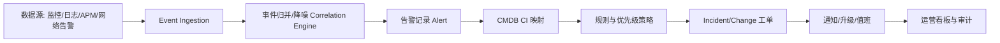

**与 Object Monitor 映射**
- `Object` 对应 CMDB CI（但偏 IT 资产，不是通用业务对象）。
- `Condition/Evaluation` 对应告警规则与事件相关性。
- `Actions` 对应 ITSM 工单/流程自动化。

**适配建议**
- 作为“动作与运营闭环”下游系统（创建事件、工单、审批）。
- 不建议将其作为主 Ontology/规则运行时。

---

### 3.1.2 Datadog Monitors + Workflow Automation

**产品定位**
- Datadog 强于可观测数据聚合、监控规则、异常检测和通知编排。
- 对业务对象语义（对象关系、对象集）表达能力相对有限。

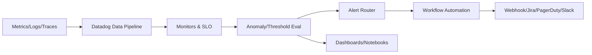

**与 Object Monitor 映射**
- `Evaluation/Notifications` 非常强；
- `Object Model` 与 `Link Type` 需要外部系统补足。

**适配建议**
- 作为外层告警分发与运维自动化；
- 核心对象语义和持续时长状态建议留在本体平台。

---

### 3.1.3 Splunk ITSI / ES

**产品定位**
- 强项是事件关联、风险评分、SOC 分析与调查闭环。
- 适合“安全/运维事件态势”，不是对象本体优先产品。

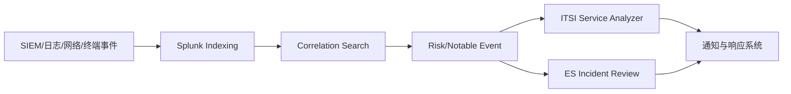

**与 Object Monitor 映射**
- `Activity/Audit` 与事件调查链路较强。
- `Object-centric` 规则需要额外对象语义层。

**适配建议**
- 作为安全分析下游；
- 不替代本体对象监控核心引擎。

---

### 3.1.4 Dynatrace（Davis AI + Automation）

**产品定位**
- 以应用拓扑和性能根因为主，适合技术栈异常诊断。

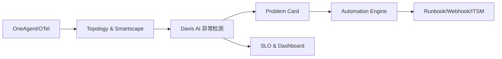

**与 Object Monitor 映射**
- 技术对象（服务/主机）监控强；
- 业务对象和跨域关系需外部建模。

**适配建议**
- 作为技术运行态监控并行能力；
- 与业务对象监控分层协同。

---

### 3.1.5 Elastic Watcher / Kibana Alerting

**产品定位**
- 面向查询型告警：基于索引和 DSL 查询进行条件评估。

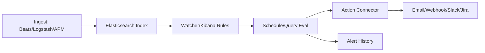

**与 Object Monitor 映射**
- 能覆盖部分 `condition/evaluation`；
- 复杂关系规则、持续状态机通常需外置流式引擎。

**适配建议**
- 中等复杂场景可快速落地；
- 对关系密集规则建议配合图或流计算组件。

---

### 3.1.6 云厂商告警（AWS/Azure/GCP）

**产品定位**
- 托管监控告警与自动化触发能力成熟，适合云原生体系。

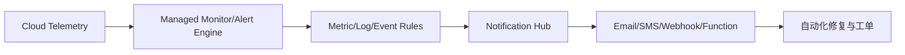

**与 Object Monitor 映射**
- 机制可借鉴；
- 私有云主部署场景下不宜作为核心依赖。

**适配建议**
- 借鉴其规则治理、告警路由、可靠性工程实践。

---

### 3.1.7 多产品组合成“Object Monitor 对标方案”的整体逻辑视图

> 组合思路：本体平台负责对象语义与规则引擎，企业产品负责下游动作闭环与安全运营。

```mermaid
flowchart TB
    subgraph Core[本体监控核心平台]
      A[Ontology/Object Store]
      B[Rule Engine
(阈值+持续时长)]
      C[Activity Ledger]
    end

    subgraph Ops[企业产品域]
      D[ServiceNow
工单/流程]
      E[Datadog
告警分发]
      F[Splunk ES/ITSI
安全分析]
      G[Dynatrace
技术根因]
      H[Elastic
检索告警]
    end

    A --> B
    B --> C
    B --> D
    B --> E
    C --> F
    B --> G
    C --> H
```

**说明**
- 核心平台保持“对象语义 + 规则执行 + 审计”主权；
- 外部产品按长板接入，避免把核心对象语义分散到多个产品。

## 3.2 开源组合方案（扩展，超出此前两种）

> 本节每套方案都给出 Mermaid 逻辑图、关键交互与可行性判断。

### 方案 A：Kafka + Flink CEP + Temporal + PostgreSQL + OpenSearch + Keycloak（首选）

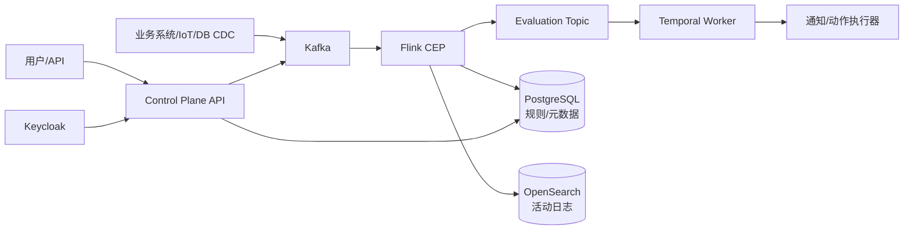

**交互与分工**
- Kafka：事件总线与回放基础；
- Flink CEP：持续时长、序列模式等复杂评估；
- Temporal：动作重试/补偿/幂等；
- OpenSearch：活动检索与审计查询。

**可行性**：高（功能完整、可扩展、私有云成熟）。

---

### 方案 B：Kafka + Kafka Streams + Drools + Argo Workflows + PostgreSQL

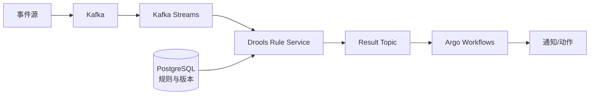

**交互与分工**
- Kafka Streams 处理轻量状态；
- Drools 负责规则执行；
- Argo 管理流程动作。

**可行性**：中高（团队 Java 强时优势明显）。

---

### 方案 C：Pulsar + Flink + OPA/CEL + Temporal + ClickHouse

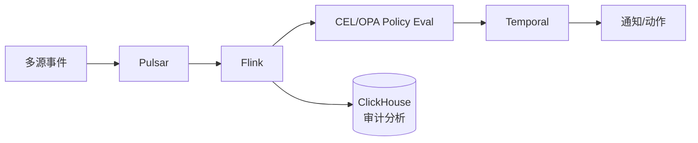

**交互与分工**
- Pulsar 负责多租户 topic/订阅；
- OPA/CEL 负责策略表达；
- ClickHouse 提供高压缩分析存储。

**可行性**：中（吞吐强，但整合门槛高）。

---

### 方案 D：Debezium + PostgreSQL + NATS JetStream + CEL + Prefect

```mermaid
flowchart LR
    DB[(业务DB)] --> D[Debezium CDC]
    D --> NATS[NATS JetStream]
    NATS --> E[Eval Service
(CEL)]
    E --> P[Prefect Flows]
    P --> X[通知/动作]
    E --> A[(PostgreSQL
活动日志)]
```

**交互与分工**
- Debezium 提供低侵入 CDC；
- NATS 提供轻量消息中枢；
- Prefect 承担工作流执行。

**可行性**：中（MVP 快，但超大规模弹性偏弱）。

---

### 方案 E：Neo4j + Kafka + Flink + Temporal（图中心）

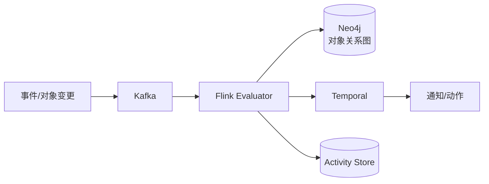

**交互与分工**
- Neo4j 提供关系查询与路径规则；
- Flink 维护持续时长状态机，避免图库热点击穿。

**可行性**：中高（关系密集场景很优，但成本高）。

---

### 方案 F：JanusGraph + Cassandra + Kafka + Flink（全开源横向扩展）

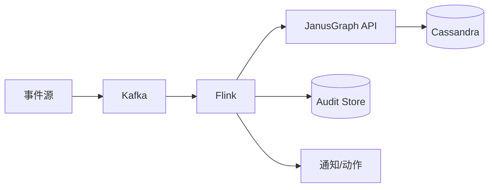

**交互与分工**
- JanusGraph + Cassandra 提供大规模图扩展；
- Flink 负责主评估路径。

**可行性**：中（超大规模潜力强，但研发/运维门槛高）。

---

### 3.2.7 开源方案对比结论

- **首选**：方案 A（能力完整与工程可控性平衡最佳）。
- **成本敏感 MVP**：方案 D。
- **关系密集行业（反欺诈/供应链）**：方案 E。
- **超大规模长期路线**：方案 F（需强平台团队）。

---

## 4. Palantir OSv2 存储模式分析（推断型）

> 说明：公开文档对 OSv2 内部实现细节披露有限。以下为基于常见企业数据平台架构、Palantir 文档语义和工程实践的“高可信推断”，用于设计决策。

## 4.1 两类数据模式

### 模式 1：Non-copy / Virtualized（非复制）
- 核心思想：对象层不复制完整原始数据，依赖外部源（湖仓/DB）映射或按需读取。
- 优势：避免数据冗余、减少存储成本、与源系统一致性高。
- 挑战：查询延迟与可用性受源系统影响；评估时要做缓存与快照策略。

### 模式 2：Copy / Materialized（复制）
- 核心思想：对象后端持有投影/副本（全量或增量）。
- 优势：评估性能好、规则计算稳定、可重放与审计更容易。
- 挑战：数据同步延迟、存储成本、去重与版本治理复杂。

---

## 5. 不同数据模式下的 Object Monitor 机制设计

## 5.1 复制模式（Copy/Materialized）详细设计

### 5.1.1 适用场景与核心原则
- 适用于高频评估、低延迟要求、审计要求高的金融和制造核心流程。
- 原则：**评估不回源、对象投影就近读取、事件驱动增量更新**。

### 5.1.2 架构逻辑视图（复制模式）

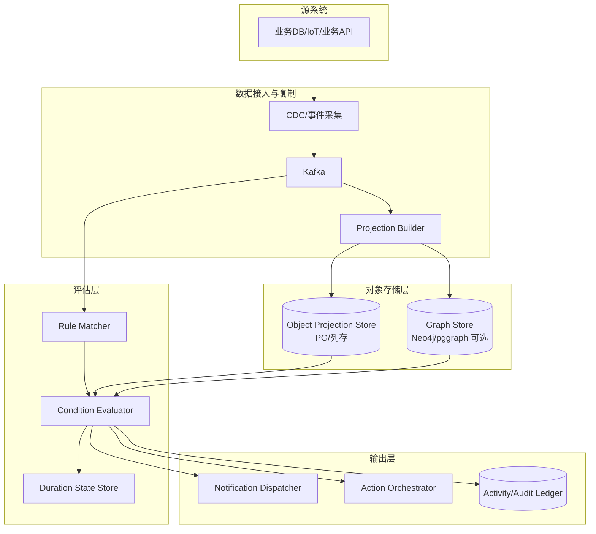

### 5.1.3 关键实现细节
1. **投影构建**：按对象类型构建宽表/列存投影，关系类规则走图库查询。
2. **一致性策略**：`at-least-once` 事件 + 投影幂等更新（source_version 去重）。
3. **状态管理**：持续时长规则状态保存在流式状态库，定期 checkpoint。
4. **审计**：每次评估写 `evaluation_id/monitor_version/input_snapshot_hash`。

### 5.1.4 可行性评估
- **性能可行**：评估不依赖源系统，P95 延迟更可控。
- **可靠性可行**：Kafka 重放 + 投影重建可实现 RTO <= 1h。
- **风险**：复制链路延迟导致“新鲜度”问题。
- **缓解**：引入 freshness SLI（如投影延迟秒数）并触发降级策略。

---

## 5.2 非复制模式（Non-copy/Virtualized）详细设计

### 5.2.1 适用场景与核心原则
- 适用于数据主权强、复制受限、成本敏感或跨系统数据不易集中复制的场景。
- 原则：**按需回源 + 快照一致性 + 回源失败补偿**。

### 5.2.2 架构逻辑视图（非复制模式）

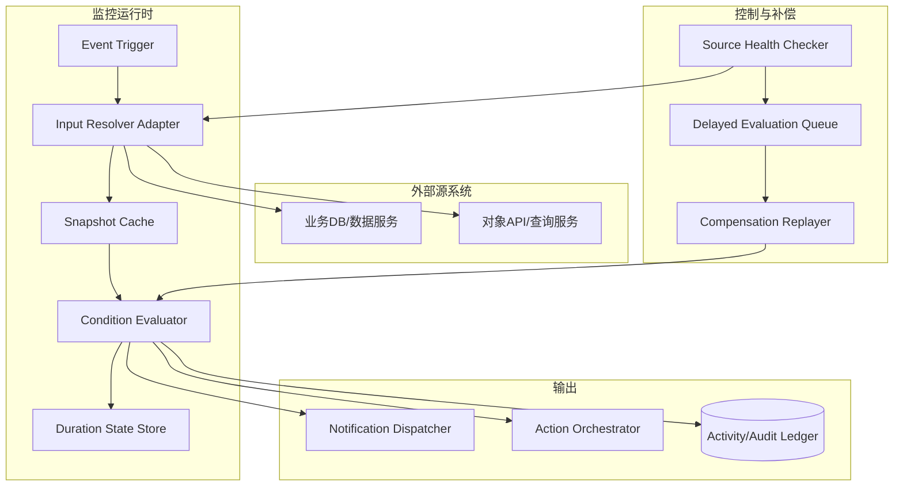

### 5.2.3 关键实现细节
1. **输入快照**：评估时生成 `input_snapshot_hash`，并记录 `source_version(lsn/watermark)`。
2. **缓存策略**：对象输入短 TTL 缓存，避免重复回源。
3. **容错补偿**：源不可用时把事件送入延迟队列，恢复后补评估。
4. **持续时长规则**：仍由平台状态机维护，避免“每次回源重算持续时间”。

### 5.2.4 可行性评估
- **合规可行**：最小化复制，符合数据主权要求。
- **成本可行**：减少存储成本，但增加回源调用成本。
- **风险**：源系统抖动影响评估稳定性与延迟。
- **缓解**：
  - 引入 source SLA 监控与熔断；
  - 关键规则可切换到“半复制热缓存”模式；
  - 审计链路始终保留原始来源版本戳。

## 5.3 混合模式（推荐）

- 高频监控字段复制（hot projection）。
- 低频/大字段虚拟化访问（cold virtualized）。
- 同时获得低延迟和低存储成本。

---

## 6. 对标 Object Monitor 的目标架构（建议）

```text
[Source Systems]
   | CDC/Event API
   v
[Ingestion Bus: Kafka/Pulsar]
   |--> [Projection Builder] --> [Object Store: PG + Graph(optional)]
   |--> [Stream Evaluator: Flink CEP]

[Monitor Service]
   |- Monitor DSL / Versioning / RBAC
   |- Input Resolver
   |- Condition Engine (CEL/Drools)
   |- Evaluation Orchestrator (stream + batch)

[Action & Notification]
   |- Temporal/Argo workflows
   |- Email/SMS/IM/Webhook/ITSM connector

[Activity & Audit]
   |- Immutable logs (OpenSearch/ClickHouse)
   |- Replay & Forensics
```

### 6.1 关键模块
- `MonitorDefinitionService`
- `InputBindingService`
- `ConditionCompiler`
- `EvaluationRuntime`
- `DurationStateStore`
- `NotificationRouter`
- `ActionOrchestrator`
- `ActivityLedger`
- `TenantQuotaService`

### 6.2 关键能力
- 流式 + 批量双引擎。
- 持续时长规则（duration windows）。
- 幂等动作执行与失败补偿。
- 私有云部署与多租户隔离。

---

## 7. 规格建议（按当前规模）

### 7.1 目标规格（首版）
- 对象：100 万。
- 规则：1000。
- 峰值评估吞吐：建议按 300~800 eval/s 设计。
- 持续时长规则状态键：按 100 万对象 * 活跃规则比例估算状态容量。

### 7.2 SLO/SRE
- 可用性：建议从 95% 逐步提升到 99.5%。
- RTO：<=1 小时（通过分层恢复 + 重放队列实现）。
- RPO：建议 <= 5 分钟（关键元数据强一致备份）。

---

## 8. 风险与治理

1. **规则爆炸风险**：规则组合指数增长导致评估风暴。
   - 对策：规则分层、租户配额、复杂度评分、熔断。
2. **动作风暴风险**：同一事件触发大量下游动作。
   - 对策：去重键、抑制窗口、最大并发限制。
3. **非复制模式可用性风险**：外部源不稳定导致漏评估。
   - 对策：快照缓存 + 回补重算 + source watermark 审计。
4. **图数据库热点风险**：高频规则全打到图查询。
   - 对策：图关系预计算 + 缓存 + 流式状态化。

---

## 9. 分阶段实施计划

### Phase 1（8~10 周）
- Monitor DSL、规则管理、基础流式评估、通知、活动日志。

### Phase 2（8~12 周）
- 动作编排、持续时长高级规则、批量回补、审计回放。

### Phase 3（持续）
- 混合存储优化（复制/非复制协同）、行业模板（金融/制造）、智能规则推荐。

---

## 10. 下一步（用于 PR 持续迭代，已展开为可执行设计）

本节将上一版“后续任务”落地为可以直接进入研发排期的设计产物。

### 10.1 竞品矩阵（产品 / 组合 / 开源）

> 目标：从“功能可比”升级到“实现可比 + 可落地可运维可迁移”。

| 类别 | 方案 | Object Model | Rule/Eval | Duration Rule | Action Orchestration | Audit/Replay | 私有云适配 | 与 Palantir Object Monitor 关系 |
|---|---|---|---|---|---|---|---|---|
| 厂商产品 | ServiceNow Event Mgmt + CMDB | 强（CI） | 中 | 弱-中 | 强（工单/流程） | 中 | 强 | 运维对象闭环近似，但通用本体语义不足 |
| 厂商产品 | Datadog Monitors + Workflow | 中 | 强 | 中 | 强 | 中 | 中 | 执行层强，Ontology 层弱 |
| 厂商产品 | Splunk ITSI/ES | 中 | 强 | 中 | 中 | 强 | 中 | 事件关联强，业务对象语义需外置 |
| 厂商产品 | Dynatrace + AutomationEngine | 中 | 强 | 中 | 中-强 | 中 | 中 | 技术拓扑监控强，不是业务本体中心 |
| 厂商产品 | Elastic Alerting/Watcher | 弱-中 | 中-强 | 弱-中 | 中 | 中 | 强 | 可构建 condition/eval，复杂关系表达有限 |
| 云原生 | AWS/Azure/GCP Alerting | 弱 | 强 | 中 | 中 | 中 | 弱（私有云） | 可借鉴机制，不是私有化首选 |
| 开源组合 | Kafka + Flink CEP + Temporal + PG | 中-强 | 强 | 强 | 强 | 强 | 强 | 能力面最接近，可工程化复刻 |
| 开源组合 | Kafka Streams + Drools + Argo | 中 | 中-强 | 中 | 强 | 中 | 强 | 轻量可行，复杂 CEP 不如 Flink |
| 开源组合 | Pulsar + Flink + ClickHouse | 中 | 强 | 强 | 中-强 | 强 | 中-强 | 高吞吐强，整合复杂 |
| 开源组合 | Debezium + NATS + CEL + Prefect | 中 | 中 | 中 | 中 | 中 | 强 | MVP 速度快，峰值弹性一般 |
| 图中心 | Neo4j + Kafka + Flink + Temporal | 强 | 强 | 强 | 强 | 强 | 中-强 | 关系规则最佳，成本与运维较高 |
| 图中心 | JanusGraph + Cassandra + Flink | 强 | 强 | 强 | 中 | 中-强 | 中 | 超大规模扩展强，工程门槛高 |

**结论**：当前约束（金融/制造 + 私有云 + 100w 对象 + 1000 规则）下，首选仍是 `Kafka + Flink CEP + Temporal + PostgreSQL(+可选图库)`。

### 10.2 Object Monitor DSL 草案（可进入 PoC）

#### 10.2.1 语法草案（简化 BNF）

```bnf
monitor          ::= "monitor" IDENT "{" scope input condition schedule action notify policy "}"
scope            ::= "scope" "{" object_type object_filter? "}"
object_type      ::= "objectType" ":" IDENT
object_filter    ::= "filter" ":" EXPR
input            ::= "input" "{" binding+ "}"
binding          ::= IDENT ":" source_expr
condition        ::= "condition" ":" bool_expr
schedule         ::= "schedule" ":" ("event"|cron_expr)
action           ::= "action" "{" action_call* "}"
notify           ::= "notify" "{" channel_rule* "}"
policy           ::= "policy" "{" dedup cooldown severity retry "}"
dedup            ::= "dedupKey" ":" EXPR
cooldown         ::= "cooldown" ":" DURATION
severity         ::= "severity" ":" ("P1"|"P2"|"P3"|"P4")
retry            ::= "retry" ":" retry_spec
```

#### 10.2.2 示例 1：状态变化触发

```yaml
monitor HighTempSpike {
  scope {
    objectType: Boiler
    filter: region == "CN-NORTH"
  }
  input {
    t: object.temperature
    threshold: object.maxSafeTemperature
  }
  condition: t > threshold
  schedule: event
  action {
    call CreateMaintenanceTicket(priority="P2")
  }
  notify {
    channel email(to="ops@company.com") when severity in ["P1","P2"]
    channel webhook(url="https://alert-gw/internal")
  }
  policy {
    dedupKey: object.id + ":" + monitor.name
    cooldown: 10m
    severity: P2
    retry: exp(backoff=5s,max=5)
  }
}
```

#### 10.2.3 示例 2：持续时长规则（高温持续 1 小时）

```yaml
monitor HighTempFor1h {
  scope {
    objectType: Furnace
  }
  input {
    t: object.temperature
  }
  condition: duration(t > 120, "1h")
  schedule: event
  action {
    call StopProductionLine(lineId=object.lineId)
  }
  notify {
    channel sms(to=object.ownerPhone)
    channel im(room="manufacture-warroom")
  }
  policy {
    dedupKey: object.id + ":high-temp-1h"
    cooldown: 30m
    severity: P1
    retry: exp(backoff=10s,max=8)
  }
}
```

### 10.3 复制 / 非复制 模式 API 与一致性策略（详细）

#### 10.3.1 控制面 API（两种模式通用）
- `POST /v1/monitors`：创建监控规则（返回 monitorId + version）。
- `POST /v1/monitors/{id}/publish`：发布到运行态。
- `POST /v1/monitors/{id}/pause`：暂停。
- `GET /v1/monitors/{id}/activity?from=&to=`：查询评估活动。
- `POST /v1/monitors/{id}/replay`：按时间窗重放评估。

#### 10.3.2 数据面 API（复制模式）
- `POST /v1/object-events`：接收 CDC/事件。
- `GET /v1/object-projection/{objectType}/{objectId}`：读取投影快照。
- 一致性：`at-least-once event + idempotent projection + version watermark`。

#### 10.3.3 数据面 API（非复制模式）
- `POST /v1/evaluation/pull`：触发回源评估。
- `POST /v1/input-resolver/cache/refresh`：刷新输入缓存。
- 一致性：`snapshot-hash + source-version(lsn/watermark) + delayed-compensation`。

#### 10.3.4 关键一致性约束
1. 每次评估必须写 `evaluation_id`、`monitor_version`、`input_snapshot_hash`。
2. 每次动作执行必须写 `action_idempotency_key`。
3. 回放评估不得覆盖原活动记录，只能 append 新纪录并链路关联。

### 10.4 性能与可靠性验证设计（压测 / 演练）

#### 10.4.1 基线压测场景
- 对象 100w，规则 1000，活跃规则比例 20%。
- 变更事件峰值：2000 events/s，持续 30 分钟。
- 目标：评估延迟 P95 < 3s；通知成功率 > 99.9%。

#### 10.4.2 故障注入场景
- Kafka Broker 故障（单点/双点）。
- Flink TaskManager 重启。
- 图数据库热点查询超时。
- 外部通知网关不可用 15 分钟。

#### 10.4.3 验收门槛（首期）
- 可用性 >= 95%（建议冲刺 99.5%）。
- RTO <= 1h。
- 关键事件零丢失（允许延迟，不允许无审计漏记）。

### 10.5 研发拆解（可直接进 Jira）

1. **M1 - DSL 与编译器**：语法、静态检查、版本化。
2. **M2 - 流式运行时**：duration 状态机、去重、冷却窗口。
3. **M3 - 批量回补**：日/小时重算、结果对账。
4. **M4 - Action 编排**：幂等、重试、补偿、死信。
5. **M5 - 审计与回放**：活动账本、法务导出、可追溯。
6. **M6 - 多租户治理**：配额、限流、权限边界。
7. **M7 - 观测与 SRE**：SLI/SLO、看板、告警、演练。

### 10.6 下一轮文档增量（PR-2 目标）

- 增加《Object Monitor DSL 规范（v0.1）》独立文档。
- 增加《Copy/Non-copy 一致性协议》时序图与状态机图。
- 增加《竞品矩阵 CSV》可排序版本（含成本/运维评分）。
- 增加《压测与故障演练报告模板》。

---

## 11. Phase 1（8~10 周）详细设计方案

> 目标：在 8~10 周内交付“可上线试运行”的第一版能力：Monitor DSL、规则管理、基础流式评估、通知、活动日志。

### 11.1 Phase 1 范围边界（In Scope / Out of Scope）

#### In Scope
1. Monitor DSL v0.1（阈值 + 持续时长条件，含基础去重/冷却策略）。
2. 规则管理控制台/接口（创建、发布、暂停、版本回滚）。
3. 基础流式评估引擎（事件驱动 + 状态机）。
4. 通知通道（Email/Webhook/企业IM 三选二起步）。
5. 活动日志（评估记录、命中记录、通知记录，支持审计检索）。

#### Out of Scope（Phase 2+）
1. 复杂动作编排（多步补偿、跨系统事务）。
2. 批量全量回补与高级对账。
3. AI 规则推荐、复杂图推理。

### 11.2 逻辑架构（Phase 1）

```text
[Object Event Sources]
   -> [Ingestion Adapter]
   -> [Kafka Topic: object-events]
   -> [Rule Matcher]
   -> [Input Resolver]
   -> [Condition Evaluator + Duration State Store]
   -> [Evaluation Result Topic]
   -> [Notification Dispatcher]
   -> [Activity Log Writer]

[Monitor Control Plane]
   -> [DSL Parser/Validator]
   -> [Rule Registry + Versioning]
   -> [Publish/Pause API]
```

### 11.3 数据模型详细设计

#### 11.3.1 控制面表
- `monitor_definition`
  - `monitor_id`、`tenant_id`、`name`、`dsl_text`、`status`、`created_by`、`created_at`。
- `monitor_version`
  - `version_id`、`monitor_id`、`version`、`compiled_plan`、`checksum`、`published_at`。
- `monitor_publish_history`
  - `id`、`monitor_id`、`version`、`operation(publish/pause/rollback)`、`operator`、`ts`。

#### 11.3.2 运行面表
- `evaluation_activity`
  - `evaluation_id`、`tenant_id`、`monitor_id`、`monitor_version`、`object_ref`、`event_time`、`result`、`latency_ms`、`input_snapshot_hash`。
- `notification_activity`
  - `id`、`evaluation_id`、`channel`、`payload_hash`、`status`、`retry_count`、`sent_at`。
- `duration_state`
  - `state_key(tenant+monitor+object)`、`entered_at`、`last_seen_at`、`state_payload`。

### 11.4 API 详细设计（Phase 1）

#### 控制面
- `POST /v1/monitors`
  - 输入：DSL 文本 + 元数据。
  - 校验：语法、字段类型、引用对象类型存在性。
  - 输出：`monitor_id`。
- `POST /v1/monitors/{id}/publish`
  - 动作：冻结当前版本并下发到运行时缓存。
- `POST /v1/monitors/{id}/pause`
  - 动作：运行时停用，不删除历史。
- `POST /v1/monitors/{id}/rollback?version=x`
  - 动作：回滚到历史稳定版本。
- `GET /v1/monitors/{id}/activities`
  - 支持按时间窗、对象、结果筛选。

#### 数据面
- `POST /v1/object-events`
  - 字段：`tenant_id`、`object_type`、`object_id`、`event_type`、`event_ts`、`payload`、`source_version`。
  - 幂等键：`tenant_id + source + source_event_id`。

### 11.5 核心执行流程与状态机

#### 11.5.1 阈值规则
1. 事件进入 Rule Matcher。
2. 按 object_type + filter 命中规则集合。
3. Input Resolver 提取输入。
4. Condition Evaluator 计算布尔结果。
5. 命中后写 evaluation_activity，异步触发通知。

#### 11.5.2 持续时长规则（duration）
状态机：`IDLE -> ENTERED -> FIRING -> COOLDOWN -> IDLE`
- `IDLE`: 条件不满足。
- `ENTERED`: 首次满足条件，记录 `entered_at`。
- `FIRING`: `now - entered_at >= duration`，触发一次。
- `COOLDOWN`: 冷却期内抑制重复通知。

### 11.6 非功能设计（Phase 1）

#### 性能预算（100w 对象 / 1000 规则）
- 事件摄入目标：>= 1000 events/s（可突发 2000）。
- 评估延迟：P95 < 3s，P99 < 8s。
- 通知投递成功率：> 99.9%（重试后）。

#### 可用性与恢复
- 运行时无状态组件多副本。
- 状态存储（duration_state）使用高可用后端（Redis Cluster 或 RocksDB + checkpoint）。
- RTO <= 1h：基于 Kafka 重放 + 规则版本恢复。

#### 安全与审计
- 租户隔离：所有主键包含 `tenant_id`。
- 审计：发布/暂停/回滚、规则变更、通知发送均落审计日志。
- 权限：`monitor.admin`、`monitor.editor`、`monitor.viewer`。

### 11.7 交付拆解（按周）

- **W1-W2**：DSL 语法、Parser、静态校验、对象类型联调。
- **W3-W4**：规则注册中心、发布/暂停/回滚 API、运行时规则缓存。
- **W5-W6**：流式评估 + duration 状态机 + 活动日志。
- **W7**：通知通道（Email/Webhook/IM）+ 重试与去重。
- **W8**：端到端联调、压测、故障演练。
- **W9-W10（缓冲）**：性能优化、问题修复、试运行验收。

### 11.8 验收标准（Definition of Done）

1. 支持 200+ 条 DSL 规则稳定发布与执行。
2. 持续时长规则准确率 >= 99.99%（对照离线回算基准）。
3. 可观测指标齐全：吞吐、延迟、命中率、通知失败率、重试次数。
4. 关键审计链路可查询并可导出。

---

## 12. 作为专业架构师的评估、问题识别与优化方案

本节先对“初版 Phase 1 设计”进行批判性评估，再给出修正后的优化版。

### 12.1 架构评估（评审结论）

#### 评分（5 分制）
- 需求覆盖度：4.5
- 可实现性：4.0
- 可运维性：3.8
- 可扩展性：4.2
- 风险可控性：3.7

**总体结论**：方案可落地，但在“规则爆炸防护、状态存储恢复、通知风暴抑制、配置漂移治理”上需强化。

### 12.2 识别到的问题清单

1. **问题 P1：规则匹配效率风险**
   - 现状：按 object_type/filter 动态筛选，规则数增长后匹配开销变大。
   - 风险：高峰期 evaluation 队列积压。

2. **问题 P2：duration 状态恢复缺口**
   - 现状：仅描述了状态机，未定义 checkpoint 与恢复一致性细节。
   - 风险：重启后持续时长判断偏差。

3. **问题 P3：通知风暴与外部依赖抖动**
   - 现状：仅有重试，缺少分级限流与抑制策略矩阵。
   - 风险：下游网关故障时级联放大。

4. **问题 P4：多租户资源竞争**
   - 现状：配额原则有描述，但缺少强制执行点。
   - 风险：大租户挤占资源影响全局。

5. **问题 P5：变更治理不足**
   - 现状：规则发布流程缺“灰度发布 + 自动回滚”机制。
   - 风险：错误规则全量生效造成误报/漏报。

### 12.3 优化后方案（修订版）

#### O1. 规则索引与分片优化（解决 P1）
- 预编译规则为 `match_plan`，构建二级索引：`object_type -> predicate bucket`。
- 按 `tenant_id + object_type` 做运行时分区，减小单分区规则集。
- 增加“规则复杂度评分”，超过阈值需审批发布。

#### O2. 状态一致性与恢复优化（解决 P2）
- duration 状态采用双写策略：
  - 热状态：本地状态存储（Flink state/RocksDB）。
  - 冷恢复：周期 checkpoint + 外部快照（对象存储）。
- 恢复流程：`load checkpoint -> replay from watermark -> reconcile`。

#### O3. 通知稳态控制（解决 P3）
- 引入通知策略矩阵：`severity x channel x retry_policy x throttle`。
- 增加熔断与退避：当下游故障率 > 阈值，自动切换降级通道。
- 同一 dedupKey 在窗口内只发送一次（窗口可按级别配置）。

#### O4. 多租户 QoS（解决 P4）
- 每租户独立配额：`events/s`、`active_rules`、`notifications/min`。
- 调度采用加权公平队列（WFQ），避免大租户抢占。
- 超配额事件进入延迟队列并打审计标记。

#### O5. 发布治理（解决 P5）
- 规则发布改为三段式：`staging -> canary(5%) -> full`。
- Canary 失败触发自动回滚并阻断全量发布。
- 发布前强制执行“静态规则体检 + 小样本回放测试”。

### 12.4 优化后的 Phase 1 目标值（更新）

- 事件峰值能力：2000 events/s 持续 30 分钟不丢失。
- 评估延迟：P95 < 2.5s（较初版收紧）。
- 误通知率：< 0.1%。
- 规则发布失败自动回滚时间：< 2 分钟。

### 12.5 优化后验收清单（新增）

1. 通过“规则风暴压测”与“通知网关故障演练”。
2. 完成一次生产前灰度发布演练（含自动回滚）。
3. 完成一次租户配额冲突演练并验证 WFQ 生效。
4. 完成一次 checkpoint 恢复演练并验证 duration 连续性。
