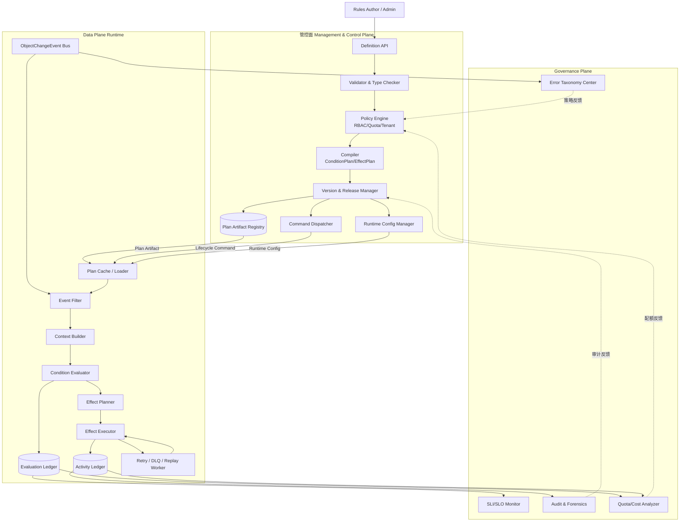
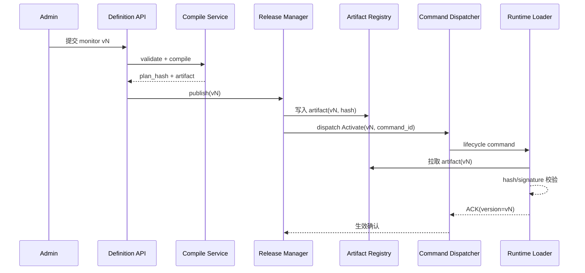
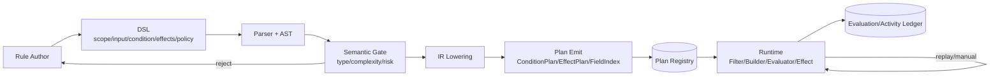

# Object Monitor 总体方案设计文档

> 本文基于调研文档 `object_monitor_palantir_research.md`，给出可落地的总体设计；目标场景为金融/制造、私有化部署、100w 对象、1000 规则、流批一体。

---

## 1. 设计目标与语义模型

### 1.1 设计目标（精简）

- 建立 Object Monitor 的语义闭环、运行闭环、治理闭环。
- 规则执行采用可审计、可回放、可回滚的发布模型。
- 在复制/非复制/混合三模式下保持一致语义与可观测行为。

### 1.2 核心语义（非数据流，避免箭头歧义）

> 以下是“概念分层”，不是数据流时序：

- **Monitor**：规则定义与边界（scope、policy、version）。
- **Input**：评估所需输入绑定（对象属性、关系属性、外部数据）。
- **Condition**：触发条件（阈值、持续时长、窗口聚合、组合逻辑）。
- **Evaluation**：一次条件求值结果（命中/未命中、原因、延迟、触发类型）。
- **Activity**：命中后动作/通知执行轨迹（状态、重试、失败码、审计）。

### 1.3 统一对象模型（最小集合）

- `MonitorDefinition`：规则定义（作用域、输入绑定、条件、输出策略、执行策略、版本）。
- `InputBinding`：输入提取逻辑（对象字段、关系字段、外部适配器）。
- `ConditionPlan`：可执行条件计划（阈值、持续时长、窗口、组合逻辑）。
- `EvaluationRecord`：一次求值记录（match/reason/latency/trigger/version）。
- `ActivityRecord`：动作轨迹（effect_results/retry_trace/error_code/audit）。

### 1.4 兼容性原则

1. 与 Palantir Object Monitor 概念兼容（Monitor/Input/Condition/Evaluation/Activity）。
2. 与 Automate 能力对齐（action/notification/function/logic/fallback）。
3. 回放 append-only，不覆盖历史 activity。

---

## 2. 总体架构（管控面 + 数据面 + 治理面）

### 2.1 逻辑架构图（Mermaid `graph TD`）



### 2.2 管控面职责（精简版）

管控面只负责“定义、校验、编译、发布、分发、鉴权”，不直接处理业务事件。

### 2.3 执行策略与首期核心服务

- **动态编译**：规则变更即时生效但运行时开销更高；**提前编译**：发布前生成不可变 plan，运行确定性更强（主路径推荐提前编译）。

首期 6 个核心服务：
1. `Definition Service`：规则 CRUD（含草稿）。
2. `Validation Service`：语法/类型/复杂度校验。
3. `Compile Service`：生成 `ConditionPlan/EffectPlan` + `plan_hash`。
4. `Release Service`：发布、暂停、回滚、版本切换。
5. `Auth Service`：RBAC 与租户边界校验。
6. `Registry Service`：artifact 元数据与分发索引。

### 2.4 管控面-数据面交互时序（发布与生效）



---

## 3. 核心执行链路设计（事件触发）

### 3.1 端到端执行分层（与 Palantir 语义映射）

| 组件功能 | 本方案组件 | 对应 Palantir 语义 | 关键职责 | 推荐实现（单行单方案） |
|---|---|---|---|---|
| 触发接入 | Trigger Ingress | Input / Condition Trigger | 接收对象、时间、手动触发并统一封装 | Kafka（推荐）+ Quartz |
| 触发接入 | Trigger Ingress | Input / Condition Trigger | 多租户隔离强、topic 治理要求高时替代 | Pulsar + Quartz |
| 候选裁剪 | Event Filter | Input 预筛选 | objectType/scope/field 三层过滤 | Flink Broadcast State |
| 候选裁剪 | Event Filter | Input 预筛选 | 轻量部署替代（中小规模） | Kafka Streams GlobalKTable |
| 上下文组装 | Context Builder | Input 组装 | 快照读取、关系读取、外部回源 | Flink Async I/O + Redis |
| 条件求值 | Condition Evaluator | Condition / Evaluation | 表达式、持续时长、窗口聚合 | Flink SQL/CEP + CEL |
| 效果执行 | Effect Planner/Executor | Actions / Notifications / Fallback | DAG 执行、重试、补偿 | Temporal |
| 效果执行 | Effect Planner/Executor | Actions / Notifications / Fallback | 需 BPMN/人工节点时替代 | Camunda/Zeebe |
| 审计回放 | Evaluation/Activity Ledger | Evaluation / Activity | 审计留痕、检索、回放索引 | PostgreSQL + ClickHouse |
| 审计回放 | Evaluation/Activity Ledger | Evaluation / Activity | 搜索导向替代 | PostgreSQL + OpenSearch |

> 说明：每行是“可选方案之一”，不是必须同时部署。

### 3.1.1 针对 100w/1k 私有化规模的工程化修订（Gemini Review 回应）

> 结论先行：原方案在“理论一致性”上较强，但在私有化场景容易出现**热路径回源瓶颈、状态对齐复杂度过高、组件膨胀**。本节给出保留语义正确性的降复杂改造。

识别到的 4 个高风险点：

1. `Context Builder` 在 Flink 热路径高频查询 Neo4j/HugeGraph，容易形成反压与级联超时。
2. `Flink 状态窗口` 与 `Ontology MVCC 快照` 双状态源并存，恢复/回放时存在状态撕裂风险。
3. 运行栈过重（Neo4j + Flink + Temporal + Kafka + Redis + PostgreSQL + ClickHouse），超出多数私有化团队运维承载。
4. 非复制模式在流算子内部外部回源，导致 slot 长时间阻塞、吞吐断崖。

改造原则：

- **CQRS**：写路径保障事实一致，读路径服务评估吞吐。
- **宽表物化**：评估前置组装 1-hop context，评估阶段避免随机图查询。
- **分级执行**：无状态规则与有状态规则分池运行，降低 Flink 承载面。
- **优雅降级**：MVP 先用 Kafka 重试分层替代重量级编排。

### 3.1.2 改进后的逻辑架构（CQRS + Context Delivery Policy）

```mermaid
graph TD
    subgraph Storage[Ontology Persistent Layer]
      S1[(Graph/Relational Store)]
      S2[MVCC & Tx Log]
    end

    subgraph Prep[Context Materialization]
      P1[CDC/Outbox Relay]
      P2[Materialize Worker]
      P3[(Context KV: Redis/RocksDB)]
    end

    subgraph Runtime[Monitor Runtime]
      R1[Kafka Context Event Topic]
      R2[L1 Stateless Evaluator
CEL/Threshold]
      R3[L2 Stateful Evaluator
Flink CEP/Window]
      R4[Effect Dispatcher]
      R5[Retry Topics + DLQ]
    end

    S1 --> S2 --> P1 --> P2
    P2 --> P3
    P2 -->|Context Event (Fat/Selective/Pointer)| R1
    R1 --> R2 --> R4
    R1 --> R3 --> R4
    R4 --> R5
```

### 3.1.3 关键语义保证（避免“快但不准”）

1. `Context Event` 必须携带版本与可追溯元数据：`object_version`、`materialized_at`、`snapshot_hash`，若为关联读取还需 `relation_version_set`。
2. Evaluator 只消费事件快照，不在热路径回查图库；若发现版本缺口，转入 `reconcile topic` 异步补评估。
3. Duration/Window 规则仅在 L2（Flink）执行，并以 `event_time + source_version` 作为幂等/去重主键。
4. Ledger 持久化 `plan_hash + snapshot_hash + source_version`，保证回放时可精确重建求值输入。

### 3.1.4 Context Delivery Policy（统一上下文交付策略）

为避免“1M 用 FatEvent、1B 用 PointerEvent”形成两套实现，运行时统一采用 `Context Delivery Policy`：

`Trigger -> Candidate Filter -> Context Delivery Policy -> Evaluator(L1/L2) -> Effect -> Ledger`

策略分级：

- **P0 Full-Fat**：事件携带完整上下文（低扇出、高实时关键路径）。
- **P1 Selective-Fat**：事件仅携带高复用字段，其余按需拉取（默认推荐）。
- **P2 Pointer-Only**：事件仅携带指针与增量，全部按需组装（超大规模默认）。

编译期为每类 `object_type x rule_class` 计算 `delivery_score`：

`delivery_score = w1*fanout + w2*event_rate + w3*hotness + w4*join_cost + w5*consistency_risk`

路由建议：
1. `delivery_score <= T1`：走 P0；
2. `T1 < delivery_score <= T2`：走 P1；
3. `delivery_score > T2`：走 P2。

策略切换必须审计落盘：`policy_version/policy_reason/effective_time`。

### 3.2 Trigger Ingress（触发接入层）

#### 实现思路
1. 事件触发：统一接入 `ObjectChangeEvent`（对象语义事件）。
2. 时间触发：cron/interval 与事件触发共用 evaluator。
3. 手动触发：manual-run/replay 进入同一入口。

#### 开源/自研建议
- **推荐开源**：Kafka + Quartz（生态成熟、私有化常见、易运维）。
- **备选开源**：Pulsar + Quartz（多租户与分层存储优势）。
- **自研部分**：`Trigger Envelope` 标准化层（统一 event/time/manual 三类触发字段），核心字段建议：`trigger_id/trigger_type/object_ref/event_time/source_version`。

### 3.3 Event Filter（候选规则筛选）

#### 实现思路
采用“三层索引 + 一次命中”：
1. `objectType -> monitor_ids`
2. `tenant/scope/tag -> monitor_ids`
3. `changedField -> monitor_ids`

输出 `MatchedMonitorCandidates[]`（`monitor_id/version/plan_hash/required_inputs`）。

#### 开源/自研建议
- **推荐开源**：Flink Broadcast State（热更新与一致性控制较好）。
- **备选开源**：Kafka Streams GlobalKTable（轻量场景）。
- **自研部分**：编译期生成 `FieldDependencyIndex` 与稳定裁剪策略（超限时按固定优先级裁剪，防止同输入不同结果）。

### 3.4 Context Builder（评估上下文构建，改为“策略化上下文交付”）

#### 实现思路
按“策略驱动交付、热路径最小 I/O、异常可补偿”构建 `EvaluationContext`：
1. P0/P1 场景：对象写入后通过 `Outbox/CDC -> Materialize Worker` 预组装上下文（全量或选择性字段）。
2. P2 场景：仅发送 `PointerEvent`，由 Hydrator 在“潜在命中”后按需拉取 1-hop 上下文。
3. Evaluator 统一消费 `Context Event`（Fat/Selective/Pointer 三态），保持执行逻辑不分叉。
4. 若快照缺失或版本跳变，写入 `reconcile/delay queue` 异步补齐并追加评估记录。

#### 开源/自研建议
- **推荐开源**：Debezium/CDC + Kafka Streams(or Flink SQL) + Redis（或 RocksDB KV）。
- **备选开源**：Outbox Relay + 自研 Materialize Worker（Go/Java）+ Redis。
- **自研部分**：`Materialize Contract`（上下文字段白名单、1-hop fan-out 限制、版本戳聚合规则）与 `snapshot_hash` 规范。

### 3.5 Condition Evaluator（条件求值引擎，分级执行）

#### 实现思路
按规则特征分两级执行（Rule Routing）：
1. **L1 无状态**：阈值/布尔表达式（预期约 70~90% 规则）；
2. **L2 有状态**：持续时长状态机 `IDLE -> ENTERED -> FIRING -> COOLDOWN`；
3. **L2 有状态**：事件时间窗口聚合 `count/sum/rate`。

输出 `EvaluationRecord(match/reason/latency/trigger_type/version)`。

#### 开源/自研建议
- **推荐开源**：L1 采用 Go/Java Consumer + CEL；L2 采用 Flink SQL/CEP。
- **备选开源**：L1 Kafka Streams + CEL；L2 Flink + Aviator。
- **自研部分**：`Rule Classifier`（编译期识别 duration/window）、跨层一致的幂等键与迟到补评估策略。

### 3.6 Effect Planner / Executor（动作执行与补偿，支持 MVP 降级）

#### 实现思路
1. Planner 生成 effect DAG（串行/并行/条件分支）。
2. Executor 分池执行（notification/action/function）。
3. MVP 阶段采用 `Retry Topic(1m/5m/1h) + DLQ`；复杂补偿场景再升级 Temporal/Camunda。
4. 写 `ActivityRecord(effect_results/retry_trace/error_code)`。

#### 开源/自研建议
- **推荐开源**：Kafka Retry Topics + DLQ（MVP）；Temporal（增强阶段）。
- **备选开源**：Camunda/Zeebe（需要 BPMN 与人工节点时）。
- **自研部分**：effect 路由与幂等键规范（`idempotency_key` 生成规则、外部系统回执归一化、UNKNOWN 状态对账器）。

### 3.7 Ledger / Replay（审计与回放）

#### 实现思路
- Evaluation 与 Activity 双 ledger 分离存储。
- Replay 按历史 plan_hash 回放并 append，不覆盖历史。

#### 开源/自研建议
- **推荐开源**：PostgreSQL + ClickHouse（事务写入 + 分析查询平衡）。
- **备选开源**：PostgreSQL + OpenSearch（检索导向更强）。
- **自研部分**：回放编排器（时间窗切片、限流、在线流量隔离）与审计追踪 ID 贯通。

### 3.8 组件选型决策矩阵（开源 / 部分开源 / 自研）

> 目标：把“能不能全开源堆起来”这个问题讲清楚。结论是：**运行底座可大量复用开源，但 Monitor 的语义核心（编译、策略路由、审计追溯）必须自研**。

| 组件 | 推荐模式 | 适用规模 | 为什么 | 必须自研的最小内核 |
|---|---|---|---|---|
| Trigger Ingress | **部分开源**（Kafka/Pulsar + Quartz） | 全规模 | 接入能力是通用能力，开源成熟 | Trigger Envelope、manual/replay 统一语义、source_version 约束 |
| Event Filter | **部分开源**（Flink Broadcast/KStreams） | 10M~1B | 状态分发可复用，规则语义裁剪不可外包 | FieldDependencyIndex、稳定裁剪策略、超限降级规则 |
| Context Builder / Hydrator | **部分开源**（CDC + KV + 流处理） | 1M~1B | 连接器/状态库可开源，组装语义强业务相关 | Input Resolver 协议、Materialize Contract、snapshot_hash 与 stale 语义 |
| Condition Evaluator L1 | **部分开源**（CEL 引擎） | 全规模 | 表达式引擎可复用，规则生命周期和幂等要自控 | IR lowering、规则路由、去重键与迟到补评估 |
| Condition Evaluator L2 | **开源优先**（Flink CEP/Window） | 10M+、有时序规则 | 状态窗口能力强且成熟 | rule_classifier、窗口状态外置策略、source_version 对齐 |
| Effect Planner/Executor | **部分开源**（Kafka Retry/Temporal） | 全规模 | 编排引擎可买，业务动作语义不可外包 | idempotency_key 规范、回执归一化、UNKNOWN 对账器 |
| Ledger / Replay | **部分开源**（PG/CH/OS） | 全规模 | 存储引擎成熟，回放语义必须自研 | 回放编排器、trace_id 贯通、policy_version 对齐回放 |
| Plan Registry / Release | **自研优先** | 全规模 | 直接决定可回滚、可审计、可灰度 | plan_hash、签名校验、版本切换协议、双写保护 |
| Context Delivery Policy Router | **自研必选** | 10M~1B | 是统一 Fat/Pointer 的核心，不存在通用替代 | delivery_score、T1/T2 门限、策略审计落盘 |

### 3.9 分阶段落地建议（按“自研比例”规划）

1. **MVP（1M~10M）**：开源占比约 70%~80%。
   - 开源：Kafka、Redis、CEL、PostgreSQL。
   - 自研：Definition/Compile/Release、Event Filter 索引、幂等与审计。
2. **增强（10M~100M）**：开源占比约 60%~70%。
   - 新增开源：Flink CEP、ClickHouse。
   - 新增自研：P0/P1/P2 策略路由、Hydrator 限流与补偿、热点隔离策略。
3. **规模化（100M~1B）**：开源占比约 50%~60%。
   - 新增开源：TiKV/Scylla/HBase（择一）、更严格分区治理。
   - 新增自研：Two-Stage Filtering 编译器、风暴熔断、策略自动迁移与回放一致性。

### 3.10 选型红线（避免“全开源拼装”失控）

- 不建议把 `Definition/Compile/Release/Policy Router` 外包给第三方规则引擎：会失去回放一致性与审计可证明性。
- 不建议在 Evaluator 热路径直接读图库或外部 API：无论用何框架都会在高并发下反压。
- 不建议把幂等键设计交给下游 action 系统：必须在 Monitor 侧统一定义与落盘。
- 不建议在 1B 规模仍默认 Full-Fat：仅允许白名单对象类型保留局部物化。

---

## 4. DSL 与规则治理设计

> 目标：把 DSL 从“可写规则”收敛为“可编译、可治理、可审计、可回放”的最小闭环。

### 4.1 逻辑视图（模块与交互）



### 4.2 最小语义与编译产物

1. `scope`：对象范围与对象集。
2. `input`：对象/关系/外部输入绑定（含 freshness、timeout）。
3. `condition`：布尔表达式 + duration + window。
4. `effects`：action/notification/function/logic/fallback。
5. `policy`：dedup/cooldown/retry/rate_limit/severity。

编译产物最小集合：`ConditionPlan`、`EffectPlan`、`FieldDependencyIndex`。

### 4.3 静态门禁（保留核心）

编译期阻断：
1. 条件表达式返回非 `bool`。
2. 输入绑定/关联深度超阈值。
3. 高风险 action 无 fallback。
4. Non-copy 输入未声明 freshness/SLA。

默认门禁参数：
- AST 节点数 <= 200
- 表达式嵌套深度 <= 12
- 输入绑定数 <= 20

### 4.4 开源软件对标结论

| 能力段 | 推荐开源组件 | 是否MVP必要 | 说明 |
|---|---|---|---|
| DSL 解析/编译 | ANTLR + 自定义 AST/IR | 是 | 语法与编译核心能力 |
| 表达式执行 | CEL / Aviator | 是 | 条件求值基础能力 |
| 流式状态与窗口 | Flink SQL/CEP/Stateful | 是 | duration/window/乱序处理 |
| 规则热更新 | Flink Broadcast + Plan Registry | 是 | plan 分发与热加载 |
| effect 编排与补偿 | Temporal（或 Camunda） | 是 | 重试、超时、补偿 |
| 治理策略 | OPA（可选） | 否 | 准入策略增强，不替代执行引擎 |

### 4.5 简要选型建议（首期）

- 首期建议：`ANTLR + CEL + Flink + Temporal + PostgreSQL/ClickHouse`。
- 不追求单产品全包，优先固化 DSL 语义与 Plan 契约。

---

## 5. 技术选型建议（私有化优先）

### 5.1 推荐基线

- 消息总线：Kafka（或 Pulsar）。
- 流式评估：Flink（CEP + 状态管理）。
- 控制与 API：Python/Go 服务。
- 存储：PostgreSQL（定义 + 活动），ClickHouse/OpenSearch（审计检索）。
- 编排：Temporal（动作执行与补偿）。

### 5.2 可替换原则

所有基础设施可替换，但需满足三项不变约束：
1. 事件可重放。
2. 状态可 checkpoint + 恢复。
3. effect 执行可幂等且可追溯。

---

## 6. API 与错误模型（管控面/数据面）

### 6.1 管控面 API

- `POST /api/v1/monitors`
- `POST /api/v1/monitors/{id}/publish`
- `POST /api/v1/monitors/{id}/pause`
- `POST /api/v1/monitors/{id}/rollback`
- `POST /api/v1/monitors/{id}/manual-run`
- `POST /api/v1/monitors/{id}/replay`
- `GET /api/v1/monitors/{id}/activities`

### 6.2 数据面 API

- `POST /api/v1/object-events`
- `POST /api/v1/evaluations/pull`
- `POST /api/v1/input-cache/refresh`

### 6.3 错误码

- `MONITOR_VALIDATION_ERROR`
- `MONITOR_VERSION_CONFLICT`
- `MONITOR_PERMISSION_DENIED`
- `MONITOR_IDEMPOTENCY_CONFLICT`
- `MONITOR_RATE_LIMITED`
- `MONITOR_SOURCE_UNAVAILABLE`
- `MONITOR_EFFECT_EXECUTION_FAILED`

并发写操作要求 `If-Match`/`version`；冲突返回 `409`。

---

## 7. 可观测性与 SRE 设计

### 7.1 核心 SLI

1. `evaluation_latency_p95`
2. `event_to_activity_e2e_latency_p95`
3. `effect_success_rate`
4. `freshness_lag_ms`（复制模式）
5. `source_call_error_rate`（非复制模式）
6. `replay_backlog_size`

### 7.2 SLO 建议

- Phase 1：可用性 >=95%，P95 评估延迟 <3s。
- Phase 2：可用性 >=99.5%，通知成功率 >99.9%。
- RTO <=1h，关键链路“允许延迟，不允许无审计丢失”。

### 7.3 失败恢复机制

- Kafka/Flink/执行器均支持重放与幂等。
- 失败事件进入 DLQ，带错误分类和重试轨迹。
- 回放与在线流量隔离，避免二次风暴。

---

## 8. 不同数据模式下的 Object Monitor 机制设计（重构）

> 本章重构目标：明确“触发从哪里来、上下文从哪里取、一致性如何保证、故障如何补偿”。

### 8.1 复制模式（Copy/Materialized）

#### 8.1.1 适用场景与原则

- 适用于高频评估、低延迟、强审计场景（如核心风控与设备告警）。
- 原则：**源端变更先实例化入本体图存储，再以对象变化事件触发评估；评估主链路不回源业务库**。

#### 8.1.2 架构逻辑视图（修订版：统一变更捕获）

```mermaid
flowchart LR
    subgraph SRC[源系统]
      S1[业务DB / IoT / 业务API]
    end

    subgraph ING[采集与实例化]
      I1[CDC / Collector]
      I2[(Kafka/Pulsar)]
      I3[Ontology Projection Writer
按本体定义 upsert node/relation]
    end

    subgraph OBJ[本体对象层 / 变更采集]
      O0[Graph Mutation API
所有业务写入统一入口]
      O1[(Neo4j Object Graph Store)]
      O2[Graph Change Capture
tx-log/CDC]
      O3[(Object Change Outbox)]
    end

    subgraph EVT[对象事件层]
      E1[Object Change Event Publisher
Outbox -> Event]
      E2[(ObjectChangeEvent Bus)]
    end

    subgraph RT[Monitor Runtime]
      R1[Trigger Ingress
consume ObjectChangeEvent]
      R2[Event Filter]
      R3[Context Builder
主对象 + 一跳关系]
      R4[Condition Evaluator]
      R5[Effect Executor]
    end

    subgraph GOV[治理与审计]
      G1[(Evaluation Ledger)]
      G2[(Activity Ledger)]
      G3[Replay Worker]
    end

    S1 --> I1 --> I2 --> I3 --> O0 --> O1
    O1 --> O2 --> O3 --> E1 --> E2 --> R1
    S1 -. 用户操作/应用写请求 .-> O0
    R1 --> R2 --> R3 --> R4 --> R5
    O1 --> R3
    R4 --> G1
    R5 --> G2
    G1 --> G3
    G2 --> G3
```



#### 8.1.3 关键机制（深入说明）

1. `Ontology Projection Writer` 的职责是“将外部变化投影为本体对象变更”，本质是投影写入器，不负责事件语义裁剪。
2. `Graph Mutation API` 是强约束组件：业务侧对 Neo4j 的写入必须走该入口（避免绕过事件捕获链路）。
3. `Object Change Outbox` 的唯一职责是承接“已提交图变更”的事实，再异步发布 `ObjectChangeEvent`。
4. 对“直写 Neo4j”的兜底：启用 `Graph Change Capture(tx-log/CDC)` 捕获提交后的变更并写入 outbox，保证不漏事件。
5. 一致性建议：`at-least-once + idempotent upsert + ordered-by-object partition + outbox relay exactly-once to bus`。
6. Replay 优先回放 `ObjectChangeEvent`，结果 append 到 ledger。

#### 8.1.4 针对“修改 Neo4j 节点属性是否会漏事件”的结论

- 若允许应用直接连接 Neo4j 并写入，且没有 tx-log/CDC 捕获，则**会漏掉** `ObjectChangeEvent`，你的担心是成立的。
- 修订后的架构通过“两道防线”避免漏采：
  1. **主路径**：所有写入经 `Graph Mutation API`，同事务写图并写 outbox；
  2. **兜底路径**：`Graph Change Capture` 从已提交事务日志补采，写入 outbox。
- 因此事件触发不再依赖 `Ontology Projection Writer` 单点，用户操作导致的图变更也可进入 Monitor Runtime。

#### 8.1.5 组件命名澄清（避免歧义）

- 不建议继续使用 `Ontology Instantiation Writer`：该命名容易让人误解为“只在初始化/建模阶段生效”。
- 建议统一为 `Ontology Projection Writer`：强调它是把多源数据持续投影到本体对象层的运行时组件。
- `Object Change Outbox` 应被视为“对象变更事实日志”，而非“仅由某个 writer 产生”的附属队列。

---

### 8.2 非复制模式（Non-copy/Virtualized）

#### 8.2.1 适用场景与原则

- 适用于数据主权严格、复制受限、跨域数据不便集中落库场景。
- 原则：**变化信号触发 + 回源与计算解耦 + 快照留痕 + 弹性补偿**。

#### 8.2.2 架构逻辑视图（优化版）

```mermaid
flowchart LR
    subgraph SRC[外部源系统]
      S1[业务DB CDC / Binlog]
      S2[业务服务 Webhook]
      S3[查询API / 读库]
    end

    subgraph SIG[变化信号层]
      T1[Change Signal Collector
CDC/Webhook/Poller]
      T2[(Trigger Bus)]
      T3[Trigger Normalizer
ObjectChangeHint]
      T4[Dedup & Ordering Guard]
    end

    subgraph RT[Monitor Runtime]
      R1[Trigger Ingress]
      R2[Event Filter]
      R3[Stateless/Stateful Evaluator]
      R4[Effect Executor]
    end

    subgraph SF[Signal Fetcher Cluster]
      F1[Input Resolver Adapter]
      F2[(Snapshot Cache TTL)]
      F3[Fat Event Builder(stale_flag)]
    end

    subgraph RES[弹性与补偿]
      C1[Source Health Checker]
      C2[Circuit Breaker / Rate Limit]
      C3[(Delayed Evaluation Queue)]
      C4[Compensation Replayer]
    end

    subgraph GOV[治理与审计]
      G1[(Evaluation Ledger)]
      G2[(Activity Ledger)]
      G3[Source SLA Dashboard]
    end

    S1 --> T1
    S2 --> T1
    T1 --> T2 --> T3 --> T4 --> F1
    F1 --> S3
    F1 --> F2 --> F3 --> R1
    C1 --> C2 --> F1
    C1 --> C3 --> C4 --> F3
    R1 --> R2 --> R3 --> R4
    R3 --> G1
    R4 --> G2
    C1 --> G3
```

#### 8.2.3 关键机制（深入说明）

1. 触发来自 `Change Signal`，不是图数据库对象事件。
2. 回源与组装在 `Signal Fetcher` 完成，流式 Evaluator 不阻塞外部网络 I/O。
3. 主线：`Hint -> Fetcher -> Fat Event(stale_flag) -> Evaluate -> Effect`。
4. 每次评估记录 `source_version/pull_time/snapshot_hash(stale)`。
5. 回源失败进入 `Delayed Evaluation Queue`，恢复后补评估并 append。
6. 建议约束：`max_sources/max_related_objects/max_pull_timeout` 与 `stale_context_forbid_action`。

---

### 8.3 混合模式（Hybrid，推荐默认）

- 高频、强时效字段走复制；低频、长尾字段走回源。
- 按规则等级切换：P1/P2 默认复制，P3/P4 可非复制。
- 支持按租户/规则动态迁移（Non-copy -> Hybrid -> Copy）。

---

## 9. 分阶段实施计划（落地版）

### Phase 1（优先落地：复制模式核心能力，6~8 周）

1. Monitor 定义与管理（含 DSL 最小子集）。
2. 对象实例后端采用 Neo4j，支持“主对象 + 一跳关系”。
3. Runtime MVP：`Materialize Worker / Event Filter / L1 Evaluator / Activity`。
4. 触发源采用 `ObjectChangeEvent`（对象层提交后发布）。
5. 执行能力先支持 Action（REST + 幂等 + Retry Topic + DLQ）。

### Phase 2（8~12 周）

1. 管控面增强：回滚、手动执行、配额与复杂度门禁。
2. Runtime 增强：L2 Flink CEP、回放入口、失败补偿、去重与冷却。
3. 扩展 effect：notification/function/logic/fallback。
4. 非复制模式能力：Signal Fetcher 集群、Input Resolver、延迟补偿。
5. 混合模式调度与多租户治理。

### Phase 3（持续演进）

1. 可观测增强：仪表盘、告警规则。
2. 交付增强：运维脚本、部署模板、故障演练。
3. 引入 Temporal/Camunda（如存在复杂审批/人工节点需求）。
4. 行业模板、规则推荐、冲突检测、成本优化与稳定性提升。

---

## 10. 10亿对象规模特化方案（Replication at 1B）

> 本节用于回应“1B 对象 + 1k 规则”场景。核心判断：这不是上一版方案的线性放大，而是从“默认物化”切换到“默认指针 + 按需组装”的范式迁移。

### 10.1 规模跃迁下的约束重定义

当对象规模从 `1M -> 1B`，系统主矛盾变化如下：

1. **写放大风险高于读延迟风险**：高维节点一处变更可能导致海量级联物化。
2. **状态恢复成本高于单次求值成本**：过大 Flink/RocksDB 状态会拖慢 checkpoint 与恢复。
3. **热点倾斜主导资源消耗**：少量热点对象/规则消耗多数算力。

因此在统一 `Context Delivery Policy` 下，1B 场景默认落在 P2（Pointer-Only）：
- 事件只携带增量与引用（`PointerEvent`）；
- 上下文按“可能命中”时再拉取；
- 实时路径限制为 1-hop，`>=2-hop` 图推理转异步/离线。

### 10.2 1B 逻辑架构（Two-Stage Filter + On-demand Hydration）

```mermaid
graph TD
    subgraph SRC[Ingestion]
      A1[Ontology CDC / Tx Log]
      A2[Raw Change Topic]
      A3[Stage-1 Static Predicate Filter]
      A4[Stage-2 Partial Evaluator]
    end

    subgraph IDX[State & Index]
      B1[(Snapshot KV: TiKV/ScyllaDB)]
      B2[(Relation Index KV)]
      B3[Hot Relation Cache]
    end

    subgraph RT[Runtime]
      C1[PointerEvent Topic]
      C2[On-demand Context Hydrator]
      C3[L1 Stateless Evaluator]
      C4[L2 Stateful Engine (Flink CEP)]
      C5[Effect Dispatcher]
    end

    A1 --> A2 --> A3 --> A4 --> C1
    C1 --> C3
    C3 -->|partial match| C2
    C2 --> B3
    C2 --> B2
    C2 --> B1
    C2 --> C4
    C3 -->|direct match| C5
    C4 --> C5
```

### 10.3 事件模型与规则路由（1B 约束）

#### 10.3.1 PointerEvent（替代默认 Fat Event）

建议事件最小字段：
- `tenant_id/object_type/object_id/event_time/source_version`
- `changed_fields[]/changed_values_delta`
- `candidate_rule_bitmap`（由编译期索引生成）
- `need_join`（是否需要上下文回源）

说明：
- 默认不内联大上下文；
- 仅在高价值、低扇出对象类型上允许 `Fat Event` 白名单（局部物化）。

#### 10.3.2 Two-Stage Filtering

1. **Stage-1 静态过滤**：按 `changed_field -> rule_ids` 与常量阈值快速裁剪。
2. **Stage-2 部分求值**：先用本对象增量做表达式部分求值，仅对“潜在命中”事件触发 Hydrator。

目标：在进入 Context Hydrator 前过滤 70%~95% 无效事件。

### 10.4 状态与计算分离（Flink 轻状态化）

1. Flink 仅保留“活跃窗口对象”的中间状态（计数器/时间戳），不承载全量事实快照。
2. 窗口超长（如 24h）时，将冷状态外置到 KV/宽列存储，按需回填。
3. 统一幂等键：`rule_id + object_id + source_version + window_id`。
4. checkpoint 目标：状态体量与活跃对象数线性相关，而非与总对象数相关。

### 10.5 热点与级联控制（必须项）

1. **热点对象分层**：Top-N 热点对象进入独立分区与独立消费组。
2. **关系风暴熔断**：单次变更影响对象数超过阈值时，不做同步级联；改为批次异步展开。
3. **广播快照**：超高复用维表（如区域/组织）变更走广播流 + 本地短 TTL 缓存，减少重复点查。
4. **租户与优先级隔离**：P0/P1 规则独立资源池，避免被 P3 长尾任务阻塞。

### 10.6 一致性与语义边界（辩证约束）

- 1B 方案不追求“全链路强一致 + 全量毫秒级”，而追求“关键规则确定性 + 全局最终一致”。
- 对高风险动作要求 `stale_context_forbid_action=true`；允许告警先发、动作延迟执行。
- 评估记录必须写入：`snapshot_ref/snapshot_time/join_latency_ms/stale_flag`，保障审计与回放。

### 10.7 选型建议（避免绝对化）

- 分布式 KV 推荐 TiKV/ScyllaDB/HBase 等可横向扩展系统；并非唯一解，取决于团队运维能力与云环境。
- 若私有化团队无法承载 TiKV，可先采用“分库分表 + Redis 热缓存 + 强过滤”过渡到 100M，再评估升级。
- 图查询需求若超过 1-hop 且高频实时，建议拆分为专用图计算链路，不强塞入 Monitor 实时主路径。

### 10.8 演进路线（与第 9 章对齐）

1. **10M 以内**：保留局部 Fat Event（白名单）+ L1/L2 分级执行。
2. **10M~100M**：强制 Two-Stage Filter，上下文按需拉取比例逐步提升。
3. **100M~1B**：默认 PointerEvent，Hydrator 成为主路径；Flink 仅保留活跃窗口状态。
4. **1B+**：热点对象专项治理（广播、分区隔离、级联熔断）成为稳定性第一优先级。

---
