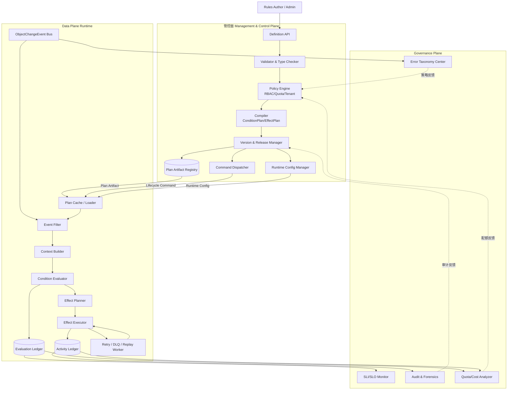
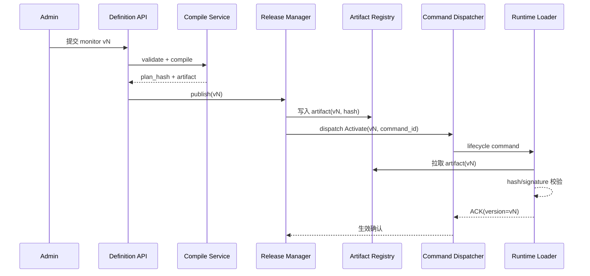
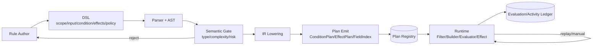
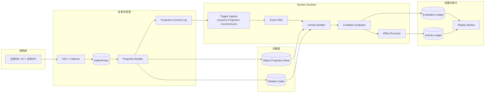
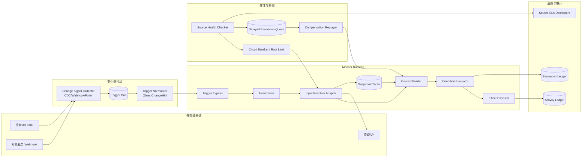

# Object Monitor 总体方案设计文档

> 本文基于最新调研文档 `object_monitor_palantir_research.md` 与既有设计约束，形成当前阶段可落地的总体方案设计；目标是在金融/制造、私有化部署、100w 对象、1000 规则、流批一体场景下，对齐 Palantir Object Monitor / Automate 的关键能力。

---

## 1. 设计输入与目标

### 1.1 已确认设计输入（来自调研 + 原有约束）

1. **能力语义输入（Palantir）**
   - 核心链路应为：`Monitor -> Input -> Condition -> Evaluation -> Activity`。
   - 命中后输出链路应同时覆盖：`Notifications + Actions`。
   - 必须具备治理边界：`Limits / Errors / Retry / Fallback / Manual execution`。

2. **架构输入（OSv2 推断）**
   - Monitor 不是 DB 内置规则，而是“对象状态之上的事件驱动评估运行时”。
   - 评估触发应优先消费 `ObjectChangeEvent`（对象语义事件），而非直接耦合原始 CDC。
   - 评估上下文构建应遵循“对象快照优先，必要时补充关联对象”。

3. **业务与工程输入（本项目目标）**
   - 行业：金融/制造。
   - 规模：100w 对象、1000 规则、数千用户。
   - 模式：流式 + 批量回放。
   - SLO：可用性 >=95%，RTO <=1h，私有云优先。

### 1.2 设计目标

- 从“组件清单”升级为“语义闭环 + 运行闭环 + 治理闭环”的完整设计。
- 保持 DSL 与 API 可演进，明确运行时可替换边界（Flink/Kafka/Temporal 可替换但语义不变）。
- 明确复制/非复制/混合三模式下的一致性协议和降级策略，避免设计停留在原则层。

---

## 2. 目标能力模型（语义层）

### 2.1 统一对象模型

- `MonitorDefinition`：规则定义（作用域、输入绑定、条件表达式、输出策略、执行策略、版本）。
- `InputBinding`：输入提取逻辑（对象属性、关系属性、聚合函数、外部数据适配器）。
- `ConditionPlan`：可执行条件计划（阈值、持续时长、窗口聚合、组合逻辑）。
- `EvaluationRecord`：一次求值结果（命中/未命中 + 原因 + 延迟 + 触发类型）。
- `ActivityRecord`：求值后的执行轨迹（通知/动作结果、失败码、重试轨迹、审计信息）。

### 2.2 语义兼容原则

1. **向 Palantir 概念兼容**：保留 Monitor/Input/Condition/Evaluation/Activity 的语义映射。
2. **向 Automate 能力对齐**：Effects 支持 `action/notification/function/logic/fallback`。
3. **向审计与法务兼容**：任何回放均 append 新 activity，不覆盖历史记录。

---

## 3. 总体架构（管控面 + 数据面 + 治理面）

> 本章目标：回答三个核心问题——
> 1）管控面到底负责什么；2）管控面与数据面是否必须通过 `compiled plan` 交互；3）当前管控面能力哪些是必须、哪些可后置。

### 3.1 逻辑架构图（Mermaid `graph TD`）

> 说明：该图采用 `graph TD` 表达“组件逻辑关系与跨平面契约”，不强调严格执行时序；发布/生效时序请参考 3.5。

### 3.2 管控面的职责边界（建议收敛）

管控面应坚持“**不处理业务事件，只生产运行契约**”。建议拆成三类：

1. **必须能力（MVP 必选）**
   - DSL/API 接入与语义校验。
   - 规则编译（`MonitorDefinition -> ConditionPlan/EffectPlan`）。
   - 版本管理（draft/published/paused/rollback）。
   - 基础权限（RBAC）与租户隔离校验。

2. **建议能力（M1~M2）**
   - 复杂度治理（AST 限额、输入数上限）。
   - 配额策略（每租户规则数、QPS、并发执行上限）。
   - 发布守卫（预检查、灰度发布、双写比对开关）。

3. **可后置能力（M3+）**
   - 规则推荐、冲突智能诊断。
   - 成本预测与自动调参。

> 结论：当前管控面“看起来很多内容”是因为把“必需能力”和“增强能力”混在一起了。建议按上面三层拆分，可显著降低首期复杂度。

### 3.3 执行策略与管控面最小服务（合并）

#### 动态解释 vs 计划编译（简要对比）

- **动态解释执行（管控面只存 DSL，数据面实时解释）**
  - 优点：灵活，规则变更即时生效。
  - 缺点：热路径性能抖动大、难做静态优化；多 runtime 下存在解释器漂移风险；审计与回放难以稳定复现。

- **计划编译执行（推荐主路径）**
  - 方式：发布前将规则编译为不可变 `compiled plan`（含 `plan_hash/version`），数据面按 artifact 执行。
  - 优点：确定性更强、可审计可回滚、便于多 runtime 一致加载。

结论：**主路径采用计划编译执行，动态解释仅用于低频调试/手动验证。**

#### 管控面首期 6 个核心服务

1. `Definition Service`：规则 CRUD（含草稿）。
2. `Validation Service`：语法/类型/复杂度校验。
3. `Compile Service`：生成 `ConditionPlan/EffectPlan` + `plan_hash`。
4. `Release Service`：发布、暂停、回滚、版本切换。
5. `Auth Service`：RBAC 与租户边界校验。
6. `Registry Service`：artifact 元数据与分发索引。

> 非首期可后置：策略推荐、成本优化、高级冲突分析。

### 3.4 组件分层与必要性判定（建议）

| 分层 | 组件 | 是否首期必需 | 说明 |
|---|---|---|---|
| 管控面 | Definition API / Validation / Compile / Release | 必需 | 无法缺省，缺失则无法形成稳定发布链路 |
| 管控面 | Policy Engine（RBAC+Tenant） | 必需 | 多租户与权限安全底线 |
| 管控面 | Registry | 必需 | 统一 artifact 真值源 |
| 管控面 | Command Dispatcher | 建议 | 支撑 pause/rollback/replay 快速控制 |
| 管控面 | Runtime Config Manager | 建议 | 降低“参数变更=重新发布”的成本 |
| 管控面 | 智能推荐/冲突检测 | 可后置 | 不影响核心闭环 |
| 数据面 | Filter/Context/Evaluator/Effect | 必需 | 规则执行主路径 |
| 数据面 | Retry+DLQ+Replay | 必需 | 可靠性与恢复底线 |
| 治理面 | SLI/SLO + Audit | 必需 | 运维与合规底线 |
| 治理面 | 成本分析/高级画像 | 建议 | 优化项，可后置 |

### 3.5 管控面-数据面交互时序（发布与生效）

### 3.6 总体架构优化结论（针对当前疑问）

1. **管控面不是越多越好**：首期应收敛到“定义-校验-编译-发布-鉴权-注册”闭环。
2. **compile plan 需要保留为主通道**：它是确定性、可审计、可回放的基础。
3. **但不应只有 compile plan**：生命周期命令与运行参数快照应独立通道承载。
4. **治理面建议与数据面双向闭环**：治理输出（如超配额、错误分类）应反向驱动管控面策略调整。

---

## 4. 核心执行链路设计（事件触发）

> 本章在既有“Event Filter -> Context Builder -> Evaluator -> Effect”主线基础上，补齐实现细节、边界语义与开源组件匹配，目标是把链路从“概念图”推进到“可实施方案”。

### 4.1 端到端执行分层（与 Palantir 语义映射）

| 本方案组件 | 对应 Palantir 语义 | 关键职责 | 首选开源实现 |
|---|---|---|---|
| Trigger Ingress | Input / Condition Trigger | 接收对象变更与时间触发 | Kafka/Pulsar + Quartz/Argo Events |
| Event Filter | Input 预筛选 | 候选规则裁剪，避免全量求值 | Flink Broadcast State / Kafka Streams |
| Context Builder | Input 组装 | 拼装对象快照、关系、外部输入 | Flink Async I/O + Redis + PostgreSQL/Elastic |
| Condition Evaluator | Condition / Evaluation | 阈值、持续时长、窗口计算 | Flink SQL/CEP/Stateful Functions |
| Effect Planner/Executor | Actions / Notifications / Fallback | 执行 effect、重试、补偿 | Temporal/Camunda + 消息队列 |
| Evaluation/Activity Ledger | Evaluation / Activity | 评估与动作审计留痕 | PostgreSQL + ClickHouse/OpenSearch |

### 4.2 Trigger Ingress（触发接入层）

#### 实现思路

1. **事件触发**：统一接入 `ObjectChangeEvent`（对象语义事件），避免直接消费原始 CDC。
2. **时间触发**：支持 cron/interval，与事件触发共用同一 evaluator。
3. **手动触发**：manual-run/replay 进入同一入口，确保语义一致。

#### 开源软件匹配

- **Kafka / Pulsar**：高吞吐事件总线、可重放、分区有序。
- **Quartz / Argo Events**：时间触发器和周期任务调度。
- **Schema Registry（Confluent/Apicurio）**：事件 schema 演进控制。

### 4.3 Event Filter（候选规则筛选）

#### 实现思路

采用“三层索引 + 一次命中”策略：

1. `objectType -> monitor_ids`（粗筛）。
2. `tenant/scope/tag -> monitor_ids`（租户与作用域筛选）。
3. `changedField -> monitor_ids`（增量字段筛选）。

最终输出 `MatchedMonitorCandidates[]`（带 `monitor_id/version/plan_hash/required_inputs`）。

#### 关键工程点

- 字段索引由编译阶段生成（field dependency index）。
- 使用广播状态热更新规则索引，避免频繁重启作业。
- 候选规则上限保护（每事件 max N），超限进入降级路径并记审计。

#### 开源软件匹配

- **Flink Broadcast State**：规则索引分发与热更新。
- **Kafka Streams GlobalKTable**：轻量场景的规则索引共享。
- **Redis**：极端低延迟场景做二级缓存。

### 4.4 Context Builder（评估上下文构建）

#### 实现思路

按“快照优先、按需补齐、失败可降级”构建 `EvaluationContext`：

1. 读取对象快照（复制模式主路径）。
2. 按 InputBinding 拉取关系对象（限制 fan-out）。
3. 非复制输入通过 Adapter 回源并带版本戳。
4. 生成上下文质量标识：`data_freshness_ms/stale_context/source_version`。

#### 关键工程点

- 通过 `snapshot_hash + source_watermark` 固化评估输入。
- 外部回源采用异步 I/O + TTL 缓存，避免阻塞 evaluator。
- 关系读取设置 `max_join_depth` 与 `max_related_objects` 防止雪崩。

#### 开源软件匹配

- **Flink Async I/O**：异步回源与超时控制。
- **Redis / Caffeine**：输入缓存（分布式 + 进程内）。
- **Debezium + Kafka Connect**：复制模式下的对象投影构建链路。

### 4.5 Condition Evaluator（条件求值引擎）

#### 实现思路

支持三类规则并统一 IR 执行：

1. 阈值/布尔：表达式直接求值。
2. 持续时长：状态机 `IDLE -> ENTERED -> FIRING -> COOLDOWN`。
3. 窗口聚合：基于事件时间窗口计算 `count/sum/rate`。

输出 `EvaluationRecord(match/reason/latency/trigger_type/version)`。

#### 关键工程点

- 以**事件时间**为主，处理时间兜底；明确 watermark 策略。
- 去重键：`monitor_id + object_id + trigger_bucket + plan_hash`。
- 迟到数据策略：可配置“补评估并追加 activity”或“仅审计”。

#### 开源软件匹配

- **Flink CEP/SQL**：持续时长与窗口规则。
- **Drools / Aviator / CEL(Java/Go)**：表达式引擎（离线编译后执行）。
- **RocksDB State Backend（Flink）**：大状态容器。

### 4.6 Effect Planner / Executor（动作执行与补偿）

#### 实现思路

1. Effect Planner 根据策略生成 DAG（串行/并行/条件分支）。
2. Executor 按 effect 类型分池执行（notification/action/function）。
3. 失败走重试策略，超过阈值触发 fallback。
4. 写入 `ActivityRecord(effect_results/retry_trace/error_code)`。

#### 关键工程点

- `idempotency_key` 必填（外部动作防重）。
- effect budget（每规则/租户速率上限）。
- 故障域隔离：通知通道故障不阻断评估主链路。

#### 开源软件匹配

- **Temporal**：有状态重试、补偿、超时与可观测执行。
- **Camunda/Zeebe**：BPMN 编排与人工节点（可选）。
- **Resilience4j**：熔断/限流/重试策略库。

### 4.7 Ledger / Replay（审计与回放）

#### 实现思路

- Evaluation 与 Activity 双 ledger 分离存储：
  - Evaluation 偏写入吞吐与规则分析。
  - Activity 偏审计检索与取证。
- Replay 读取历史事件并按“历史 plan_hash”重放，结果 append 不覆盖。

#### 开源软件匹配

- **PostgreSQL**：事务型定义与关键审计索引。
- **ClickHouse / OpenSearch**：高基数活动检索与聚合分析。
- **Apache Hudi/Iceberg**：历史事件湖仓回放数据源（可选）。

---

## 5. DSL 与规则治理设计（v0.2）

> 目标：把 DSL 从“可写规则”收敛为“可编译、可治理、可审计、可回放”的最小闭环。

### 5.1 逻辑视图（模块与交互）

**交互说明（简化）**
- DSL 仍保持五段式：`scope/input/condition/effects/policy`。
- 编译主链路：`Parser -> Semantic Gate -> IR -> Plan`，失败在门禁阶段直接阻断。
- Runtime 不解释原始 DSL，只消费 Plan；结果写入 Evaluation/Activity 审计账本。

### 5.2 最小语义与编译产物

**DSL 五段式（保留）**
1. `scope`：对象范围与对象集。
2. `input`：对象/关系/外部输入绑定（含 freshness、timeout）。
3. `condition`：布尔表达式 + duration + window。
4. `effects`：action/notification/function/logic/fallback。
5. `policy`：dedup/cooldown/retry/rate_limit/severity。

**编译产物（最小集合）**
- `ConditionPlan`
- `EffectPlan`
- `FieldDependencyIndex`（供 Event Filter 预筛）

### 5.3 静态门禁（保留核心）

编译期必须阻断：
1. 条件表达式返回非 `bool`。
2. 输入绑定/关联深度超阈值。
3. 高风险 action 无 fallback。
4. Non-copy 输入未声明 freshness/SLA。

默认门禁参数：
- AST 节点数 <= 200
- 表达式嵌套深度 <= 12
- 输入绑定数 <= 20

### 5.4 开源软件对标结论（重点）

**结论：目前没有“单一开源软件”可完整 1:1 对标 Palantir Object Monitor/Automate 全栈能力。**

更现实路径是“组合式架构”：

| 能力段 | 推荐开源组件 | 说明 |
|---|---|---|
| DSL 解析/编译 | ANTLR + 自定义 AST/IR | 负责语法与编译，不负责运行态状态管理 |
| 表达式执行 | CEL / Aviator | 负责 condition 求值，需与状态机/窗口引擎配合 |
| 流式状态与窗口 | Flink SQL/CEP/Stateful | 负责 duration/window/乱序处理 |
| 规则热更新 | Flink Broadcast + Plan Registry | 负责 plan 分发与热加载 |
| effect 编排与补偿 | Temporal（或 Camunda） | 负责重试、超时、补偿、可观测流程 |
| 治理策略 | OPA（可选） | 负责准入与租户策略，不替代规则执行引擎 |

### 5.5 简要选型建议（首期）

- 首期建议采用“**ANTLR + CEL + Flink + Temporal + PostgreSQL/ClickHouse**”组合。
- 不建议追求“单产品全包”，重点是先固化 DSL 语义、Plan 契约和审计一致性。
- 若团队语言栈偏 Java，可优先 `Aviator + Flink`；偏多语言安全策略，可优先 `CEL`。

---

## 6. API 与错误模型（管控面/数据面）

### 6.1 管控面 API

- `POST /v1/monitors`：创建规则。
- `POST /v1/monitors/{id}/publish`：发布版本。
- `POST /v1/monitors/{id}/pause`：暂停规则。
- `POST /v1/monitors/{id}/rollback`：回滚版本。
- `POST /v1/monitors/{id}/manual-run`：手动执行。
- `POST /v1/monitors/{id}/replay`：按时间窗回放。
- `GET /v1/monitors/{id}/activities`：活动检索。

### 6.2 数据面 API

- `POST /v1/object-events`：写入对象变更事件。
- `POST /v1/evaluations/pull`：非复制模式触发回源评估。
- `POST /v1/input-cache/refresh`：主动刷新缓存。

### 6.3 错误码

- `MONITOR_VALIDATION_ERROR`
- `MONITOR_VERSION_CONFLICT`
- `MONITOR_PERMISSION_DENIED`
- `MONITOR_IDEMPOTENCY_CONFLICT`
- `MONITOR_RATE_LIMITED`
- `MONITOR_SOURCE_UNAVAILABLE`
- `MONITOR_EFFECT_EXECUTION_FAILED`

并发写操作要求 `If-Match`/`version`；冲突返回 `409`。

---

## 7. 可观测性与 SRE 设计

### 7.1 核心 SLI

1. `evaluation_latency_p95`
2. `event_to_activity_e2e_latency_p95`
3. `effect_success_rate`
4. `freshness_lag_ms`（复制模式）
5. `source_call_error_rate`（非复制模式）
6. `replay_backlog_size`

### 7.2 SLO 建议

- Phase 1：可用性 >=95%，P95 评估延迟 <3s。
- Phase 2：可用性 >=99.5%，通知成功率 >99.9%。
- RTO <=1h，关键链路“允许延迟，不允许无审计丢失”。

### 7.3 失败恢复机制

- Kafka/Flink/执行器均支持重放与幂等。
- 失败事件进入 DLQ，带错误分类和重试轨迹。
- 回放与在线流量隔离，避免二次风暴。

---

## 8. 技术选型建议（私有化优先）

### 8.1 推荐基线

- 消息总线：Kafka（或 Pulsar）。
- 流式评估：Flink（CEP + 状态管理）。
- 控制与 API：Python/Go 服务。
- 存储：PostgreSQL（定义 + 活动），ClickHouse/OpenSearch（审计检索）。
- 编排：Temporal（动作执行与补偿）。

### 8.2 可替换原则

所有基础设施可替换，但需满足三项不变约束：

1. 事件可重放。
2. 状态可 checkpoint + 恢复。
3. effect 执行可幂等且可追溯。

---

## 10. 验收标准（可直接用于里程碑 Gate）

1. **正确性**：同输入快照、同版本下评估结果一致率 100%。
2. **可靠性**：注入 Broker/Flink/通知网关故障后，RTO 满足 <=1h。
3. **审计性**：任一 activity 能追溯到 monitor_version + snapshot_hash + effect_trace。
4. **性能**：在 100w 对象、1000 规则、2000 events/s 峰值下，P95 评估延迟 <3s。
5. **治理性**：复杂规则超阈值可拦截；租户超配额可限流且不影响其他租户。

---

## 12. 不同数据模式下的 Object Monitor 机制设计（重构）

> 本章重构目标：明确“触发从哪里来、上下文从哪里取、一致性如何保证、故障如何补偿”。

### 12.1 复制模式（Copy/Materialized）

#### 12.1.1 适用场景与原则

- 适用于高频评估、低延迟、强审计场景（如核心风控与设备告警）。
- 原则：**事件先复制、快照就近读、评估不回源**。

#### 12.1.2 架构逻辑视图（修正版）

#### 12.1.3 关键机制

1. **触发来源**：以 `Projection Commit Event` 作为评估触发（保证“已落对象快照”再评估）。
2. **一致性协议**：`at-least-once + idempotent projection + watermark`。
3. **输入构建**：Context Builder 优先读对象投影与关系索引，不回源业务库。
4. **恢复策略**：基于 checkpoint + commit log 重放；回放结果 append 到 ledger。

---

### 12.2 非复制模式（Non-copy/Virtualized）

#### 12.2.1 适用场景与原则

- 适用于数据主权严格、复制受限、跨域数据不便集中落库场景。
- 原则：**变化信号触发 + 按需回源 + 快照版本留痕 + 延迟补偿**。

#### 12.2.2 架构逻辑视图（修正版，补齐触发来源）

#### 12.2.3 关键机制

1. **触发来源明确化**：非复制模式不直接依赖对象库事件，触发来自 `Change Signal Collector`（CDC/Webhook/Poller）。
2. **触发语义**：进入 runtime 的是 `ObjectChangeHint`（对象主键+变化字段+时间戳），不是完整快照。
3. **上下文构建**：由 `Input Resolver Adapter` 按规则输入声明回源拉取，并写入短 TTL 缓存。
4. **一致性协议**：每次求值落 `snapshot_hash + source_version + pull_time`，并可标记 `stale_context`。
5. **补偿机制**：源端异常或超时进入 `Delayed Evaluation Queue`，恢复后补评估并追加 activity。

---

### 12.3 混合模式（Hybrid，推荐默认）

#### 12.3.1 策略

- 高频、强时效字段走复制投影；低频、长尾字段走回源。
- 按规则等级切换：P1/P2 默认复制，P3/P4 可非复制。
- 支持按租户/规则动态迁移（Non-copy -> Hybrid -> Copy）。

#### 12.3.2 选型建议

- 首期默认 Hybrid：以复制模式承载核心告警路径，以非复制模式承载长尾查询。
- 所有模式共用同一 DSL/Plan/审计模型，避免多套语义。

---

## 13. 分阶段实施计划（落地版）

> 本章放在文档最后，作为执行清单；Phase 1 仅保留首批必须落地的复制模式核心能力。

### Phase 1（优先落地：复制模式核心能力，6~8 周）

**目标**：先跑通“复制模式下 Object Monitor 最小闭环”，满足首批可用。

1. **Monitor 定义与管理（含 DSL）**
   - 提供 monitor 的创建/更新/发布/暂停能力。
   - 落地 DSL 五段式最小子集：`scope/input/condition/effects/policy`。
   - 编译输出最小 plan：`ConditionPlan/EffectPlan/FieldDependencyIndex`。

2. **对象实例数据后端（Neo4j）**
   - 当前本体实例数据存储后端采用 **Neo4j**。
   - 复制模式下由投影链路把变更写入 Neo4j，并提供 Runtime 读取接口。
   - 优先支持“主对象 + 一跳关系”读取，控制上下文构建复杂度。

3. **Runtime MVP（复制模式）**
   - 实现 `Event Filter / Context Builder / Evaluator / Activity` 主链路。
   - 触发源采用 `Projection Commit Event`，保证“先落快照再评估”。

4. **执行能力（先 Action，后扩展）**
   - Evaluator 命中后仅执行 **Action**。
   - Action 通过 **REST API** 调用外部系统，带幂等键与重试。
   - 本阶段暂不支持 Notification（Email/Webhook 等）。

5. **验收门槛（Phase 1）**
   - 复制模式端到端链路可跑通（定义 -> 编译 -> 发布 -> 评估 -> Action -> Activity）。
   - 关键审计字段可追溯：`monitor_version + plan_hash + snapshot_hash`。
   - 基础可观测可用：评估延迟、Action 成功率、失败重试次数。

### Phase 2（8~12 周）

1. 管控面增强：版本回滚、手动执行、基础配额与复杂度门禁。
2. Runtime 增强：回放入口、DLQ、失败补偿、去重与冷却策略。
3. 扩展 effect 类型：notification/function/logic/fallback。
4. 非复制模式能力：Change Signal Collector、Input Resolver、延迟补偿链路。
5. 混合模式调度：按规则等级与租户策略在 copy/non-copy 间切换。
6. 多租户治理：配额、隔离、限流与成本画像。

### Phase 3（持续演进）

1. 可观测增强：仪表盘与告警规则（延迟、失败率、堆积）。
2. 交付增强：运维脚本、部署模板、故障演练手册。
3. 行业模板（金融风控、制造设备健康）。
4. 规则推荐与冲突检测。
5. 成本优化（冷热分层、状态压缩、弹性扩缩容）。
6. 稳定性提升（跨机房容灾、灰度发布自动化、容量预测）。

---
