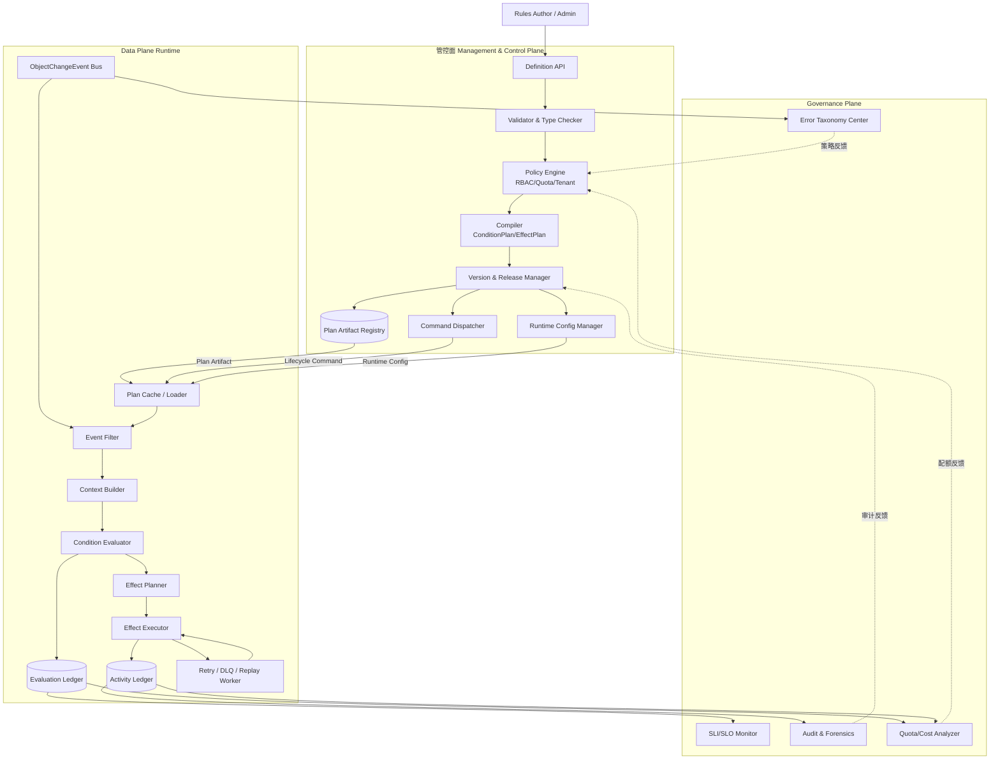
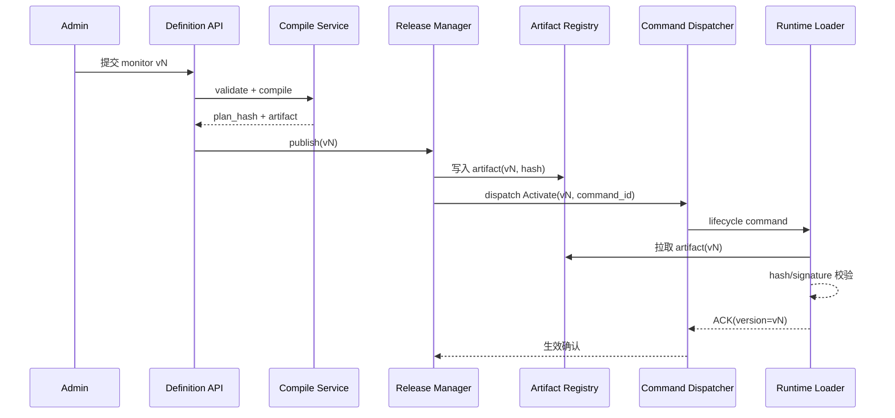
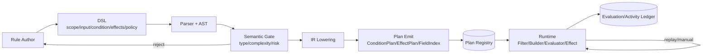
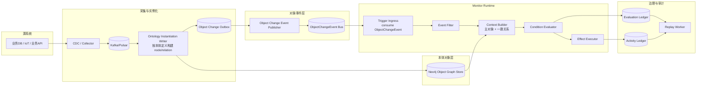
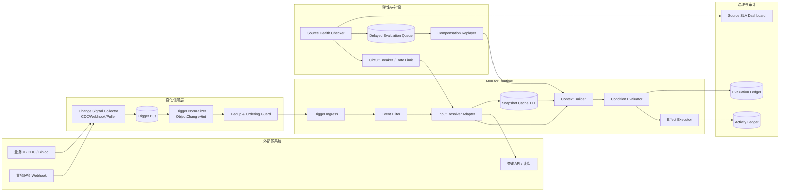

# Object Monitor 总体方案设计文档

> 本文基于调研文档 `object_monitor_palantir_research.md`，给出可落地的总体设计；目标场景为金融/制造、私有化部署、100w 对象、1000 规则、流批一体。

---

## 1. 设计目标与语义模型

### 1.1 设计目标（精简）

- 建立 Object Monitor 的语义闭环、运行闭环、治理闭环。
- 规则执行采用可审计、可回放、可回滚的发布模型。
- 在复制/非复制/混合三模式下保持一致语义与可观测行为。

### 1.2 核心语义（非数据流，避免箭头歧义）

> 以下是“概念分层”，不是数据流时序：

- **Monitor**：规则定义与边界（scope、policy、version）。
- **Input**：评估所需输入绑定（对象属性、关系属性、外部数据）。
- **Condition**：触发条件（阈值、持续时长、窗口聚合、组合逻辑）。
- **Evaluation**：一次条件求值结果（命中/未命中、原因、延迟、触发类型）。
- **Activity**：命中后动作/通知执行轨迹（状态、重试、失败码、审计）。

### 1.3 统一对象模型（最小集合）

- `MonitorDefinition`：规则定义（作用域、输入绑定、条件、输出策略、执行策略、版本）。
- `InputBinding`：输入提取逻辑（对象字段、关系字段、外部适配器）。
- `ConditionPlan`：可执行条件计划（阈值、持续时长、窗口、组合逻辑）。
- `EvaluationRecord`：一次求值记录（match/reason/latency/trigger/version）。
- `ActivityRecord`：动作轨迹（effect_results/retry_trace/error_code/audit）。

### 1.4 兼容性原则

1. 与 Palantir Object Monitor 概念兼容（Monitor/Input/Condition/Evaluation/Activity）。
2. 与 Automate 能力对齐（action/notification/function/logic/fallback）。
3. 回放 append-only，不覆盖历史 activity。

---

## 2. 总体架构（管控面 + 数据面 + 治理面）

### 2.1 逻辑架构图（Mermaid `graph TD`）

### 2.2 管控面职责（精简版）

管控面只负责“定义、校验、编译、发布、分发、鉴权”，不直接处理业务事件。

### 2.3 执行策略与首期核心服务

- **动态编译**：规则变更即时生效但运行时开销更高；**提前编译**：发布前生成不可变 plan，运行确定性更强（主路径推荐提前编译）。

首期 6 个核心服务：
1. `Definition Service`：规则 CRUD（含草稿）。
2. `Validation Service`：语法/类型/复杂度校验。
3. `Compile Service`：生成 `ConditionPlan/EffectPlan` + `plan_hash`。
4. `Release Service`：发布、暂停、回滚、版本切换。
5. `Auth Service`：RBAC 与租户边界校验。
6. `Registry Service`：artifact 元数据与分发索引。

### 2.4 管控面-数据面交互时序（发布与生效）

---

## 3. 核心执行链路设计（事件触发）

### 3.1 端到端执行分层（与 Palantir 语义映射）

| 组件功能 | 本方案组件 | 对应 Palantir 语义 | 关键职责 | 推荐实现（单行单方案） |
|---|---|---|---|---|
| 触发接入 | Trigger Ingress | Input / Condition Trigger | 接收对象、时间、手动触发并统一封装 | Kafka（推荐）+ Quartz |
| 触发接入 | Trigger Ingress | Input / Condition Trigger | 多租户隔离强、topic 治理要求高时替代 | Pulsar + Quartz |
| 候选裁剪 | Event Filter | Input 预筛选 | objectType/scope/field 三层过滤 | Flink Broadcast State |
| 候选裁剪 | Event Filter | Input 预筛选 | 轻量部署替代（中小规模） | Kafka Streams GlobalKTable |
| 上下文组装 | Context Builder | Input 组装 | 快照读取、关系读取、外部回源 | Flink Async I/O + Redis |
| 条件求值 | Condition Evaluator | Condition / Evaluation | 表达式、持续时长、窗口聚合 | Flink SQL/CEP + CEL |
| 效果执行 | Effect Planner/Executor | Actions / Notifications / Fallback | DAG 执行、重试、补偿 | Temporal |
| 效果执行 | Effect Planner/Executor | Actions / Notifications / Fallback | 需 BPMN/人工节点时替代 | Camunda/Zeebe |
| 审计回放 | Evaluation/Activity Ledger | Evaluation / Activity | 审计留痕、检索、回放索引 | PostgreSQL + ClickHouse |
| 审计回放 | Evaluation/Activity Ledger | Evaluation / Activity | 搜索导向替代 | PostgreSQL + OpenSearch |

> 说明：每行是“可选方案之一”，不是必须同时部署。

### 3.2 Trigger Ingress（触发接入层）

#### 实现思路
1. 事件触发：统一接入 `ObjectChangeEvent`（对象语义事件）。
2. 时间触发：cron/interval 与事件触发共用 evaluator。
3. 手动触发：manual-run/replay 进入同一入口。

#### 开源/自研建议
- **推荐开源**：Kafka + Quartz（生态成熟、私有化常见、易运维）。
- **备选开源**：Pulsar + Quartz（多租户与分层存储优势）。
- **自研部分**：`Trigger Envelope` 标准化层（统一 event/time/manual 三类触发字段），核心字段建议：`trigger_id/trigger_type/object_ref/event_time/source_version`。

### 3.3 Event Filter（候选规则筛选）

#### 实现思路
采用“三层索引 + 一次命中”：
1. `objectType -> monitor_ids`
2. `tenant/scope/tag -> monitor_ids`
3. `changedField -> monitor_ids`

输出 `MatchedMonitorCandidates[]`（`monitor_id/version/plan_hash/required_inputs`）。

#### 开源/自研建议
- **推荐开源**：Flink Broadcast State（热更新与一致性控制较好）。
- **备选开源**：Kafka Streams GlobalKTable（轻量场景）。
- **自研部分**：编译期生成 `FieldDependencyIndex` 与稳定裁剪策略（超限时按固定优先级裁剪，防止同输入不同结果）。

### 3.4 Context Builder（评估上下文构建）

#### 实现思路
按“快照优先、按需补齐、失败可降级”构建 `EvaluationContext`：
1. 读取对象快照（复制模式主路径）。
2. 按 InputBinding 拉取关系对象（限制 fan-out）。
3. 非复制输入通过 Adapter 回源并带版本戳。
4. 标识 `data_freshness_ms/stale_context/source_version`。

#### 开源/自研建议
- **推荐开源**：Flink Async I/O + Redis（异步回源 + 缓存成熟）。
- **备选开源**：Caffeine（进程内热点缓存）+ Redis（分布式缓存）。
- **自研部分**：`Input Resolver Adapter` 协议（统一不同数据源读取语义），并实现 `snapshot_hash` 计算与上下文可追溯封装。

### 3.5 Condition Evaluator（条件求值引擎）

#### 实现思路
支持三类规则并统一 IR 执行：
1. 阈值/布尔表达式；
2. 持续时长状态机 `IDLE -> ENTERED -> FIRING -> COOLDOWN`；
3. 事件时间窗口聚合 `count/sum/rate`。

输出 `EvaluationRecord(match/reason/latency/trigger_type/version)`。

#### 开源/自研建议
- **推荐开源**：Flink SQL/CEP + CEL（窗口/状态能力与表达式安全性兼顾）。
- **备选开源**：Flink + Aviator（Java 栈团队上手快）。
- **自研部分**：规则 IR 到执行计划的 lowering、去重键策略、迟到数据补评估策略。

### 3.6 Effect Planner / Executor（动作执行与补偿）

#### 实现思路
1. Planner 生成 effect DAG（串行/并行/条件分支）。
2. Executor 分池执行（notification/action/function）。
3. 失败重试，超过阈值触发 fallback。
4. 写 `ActivityRecord(effect_results/retry_trace/error_code)`。

#### 开源/自研建议
- **推荐开源**：Temporal（重试/超时/补偿/可观测一体）。
- **备选开源**：Camunda/Zeebe（需要 BPMN 与人工节点时）。
- **自研部分**：effect 路由与幂等键规范（`idempotency_key` 生成规则、外部系统回执归一化、UNKNOWN 状态对账器）。

### 3.7 Ledger / Replay（审计与回放）

#### 实现思路
- Evaluation 与 Activity 双 ledger 分离存储。
- Replay 按历史 plan_hash 回放并 append，不覆盖历史。

#### 开源/自研建议
- **推荐开源**：PostgreSQL + ClickHouse（事务写入 + 分析查询平衡）。
- **备选开源**：PostgreSQL + OpenSearch（检索导向更强）。
- **自研部分**：回放编排器（时间窗切片、限流、在线流量隔离）与审计追踪 ID 贯通。

---

## 4. DSL 与规则治理设计

> 目标：把 DSL 从“可写规则”收敛为“可编译、可治理、可审计、可回放”的最小闭环。

### 4.1 逻辑视图（模块与交互）

### 4.2 最小语义与编译产物

1. `scope`：对象范围与对象集。
2. `input`：对象/关系/外部输入绑定（含 freshness、timeout）。
3. `condition`：布尔表达式 + duration + window。
4. `effects`：action/notification/function/logic/fallback。
5. `policy`：dedup/cooldown/retry/rate_limit/severity。

编译产物最小集合：`ConditionPlan`、`EffectPlan`、`FieldDependencyIndex`。

### 4.3 静态门禁（保留核心）

编译期阻断：
1. 条件表达式返回非 `bool`。
2. 输入绑定/关联深度超阈值。
3. 高风险 action 无 fallback。
4. Non-copy 输入未声明 freshness/SLA。

默认门禁参数：
- AST 节点数 <= 200
- 表达式嵌套深度 <= 12
- 输入绑定数 <= 20

### 4.4 开源软件对标结论

| 能力段 | 推荐开源组件 | 是否MVP必要 | 说明 |
|---|---|---|---|
| DSL 解析/编译 | ANTLR + 自定义 AST/IR | 是 | 语法与编译核心能力 |
| 表达式执行 | CEL / Aviator | 是 | 条件求值基础能力 |
| 流式状态与窗口 | Flink SQL/CEP/Stateful | 是 | duration/window/乱序处理 |
| 规则热更新 | Flink Broadcast + Plan Registry | 是 | plan 分发与热加载 |
| effect 编排与补偿 | Temporal（或 Camunda） | 是 | 重试、超时、补偿 |
| 治理策略 | OPA（可选） | 否 | 准入策略增强，不替代执行引擎 |

### 4.5 简要选型建议（首期）

- 首期建议：`ANTLR + CEL + Flink + Temporal + PostgreSQL/ClickHouse`。
- 不追求单产品全包，优先固化 DSL 语义与 Plan 契约。

---

## 5. 技术选型建议（私有化优先）

### 5.1 推荐基线

- 消息总线：Kafka（或 Pulsar）。
- 流式评估：Flink（CEP + 状态管理）。
- 控制与 API：Python/Go 服务。
- 存储：PostgreSQL（定义 + 活动），ClickHouse/OpenSearch（审计检索）。
- 编排：Temporal（动作执行与补偿）。

### 5.2 可替换原则

所有基础设施可替换，但需满足三项不变约束：
1. 事件可重放。
2. 状态可 checkpoint + 恢复。
3. effect 执行可幂等且可追溯。

---

## 6. API 与错误模型（管控面/数据面）

### 6.1 管控面 API

- `POST /api/v1/monitors`
- `POST /api/v1/monitors/{id}/publish`
- `POST /api/v1/monitors/{id}/pause`
- `POST /api/v1/monitors/{id}/rollback`
- `POST /api/v1/monitors/{id}/manual-run`
- `POST /api/v1/monitors/{id}/replay`
- `GET /api/v1/monitors/{id}/activities`

### 6.2 数据面 API

- `POST /api/v1/object-events`
- `POST /api/v1/evaluations/pull`
- `POST /api/v1/input-cache/refresh`

### 6.3 错误码

- `MONITOR_VALIDATION_ERROR`
- `MONITOR_VERSION_CONFLICT`
- `MONITOR_PERMISSION_DENIED`
- `MONITOR_IDEMPOTENCY_CONFLICT`
- `MONITOR_RATE_LIMITED`
- `MONITOR_SOURCE_UNAVAILABLE`
- `MONITOR_EFFECT_EXECUTION_FAILED`

并发写操作要求 `If-Match`/`version`；冲突返回 `409`。

---

## 7. 可观测性与 SRE 设计

### 7.1 核心 SLI

1. `evaluation_latency_p95`
2. `event_to_activity_e2e_latency_p95`
3. `effect_success_rate`
4. `freshness_lag_ms`（复制模式）
5. `source_call_error_rate`（非复制模式）
6. `replay_backlog_size`

### 7.2 SLO 建议

- Phase 1：可用性 >=95%，P95 评估延迟 <3s。
- Phase 2：可用性 >=99.5%，通知成功率 >99.9%。
- RTO <=1h，关键链路“允许延迟，不允许无审计丢失”。

### 7.3 失败恢复机制

- Kafka/Flink/执行器均支持重放与幂等。
- 失败事件进入 DLQ，带错误分类和重试轨迹。
- 回放与在线流量隔离，避免二次风暴。

---

## 8. 不同数据模式下的 Object Monitor 机制设计（重构）

> 本章重构目标：明确“触发从哪里来、上下文从哪里取、一致性如何保证、故障如何补偿”。

### 8.1 复制模式（Copy/Materialized）

#### 8.1.1 适用场景与原则

- 适用于高频评估、低延迟、强审计场景（如核心风控与设备告警）。
- 原则：**源端变更先实例化入本体图存储，再以对象变化事件触发评估；评估主链路不回源业务库**。

#### 8.1.2 架构逻辑视图（优化版）

#### 8.1.3 关键机制（深入说明）

1. 源系统变化先写 Neo4j，再发布 `ObjectChangeEvent`。
2. `Projection Builder` 建议命名为 `Ontology Instantiation Writer`。
3. `Projection Commit Log` 建议命名为 `Object Change Outbox`。
4. 一致性建议：`at-least-once + idempotent instantiation + ordered-by-object partition`。
5. Replay 优先回放 `ObjectChangeEvent`，结果 append 到 ledger。

---

### 8.2 非复制模式（Non-copy/Virtualized）

#### 8.2.1 适用场景与原则

- 适用于数据主权严格、复制受限、跨域数据不便集中落库场景。
- 原则：**变化信号触发 + 按需回源 + 快照留痕 + 弹性补偿**。

#### 8.2.2 架构逻辑视图（优化版）

#### 8.2.3 关键机制（深入说明）

1. 触发来自 `Change Signal`，不是图数据库对象事件。
2. 主线：`Hint -> Filter -> 回源拉取 -> Context -> Evaluate -> Effect`。
3. 每次评估记录 `source_version/pull_time/snapshot_hash(stale)`。
4. 回源失败进入 `Delayed Evaluation Queue`，恢复后补评估并 append。
5. 建议约束：`max_sources/max_related_objects/max_pull_timeout` 与 `stale_context_forbid_action`。

---

### 8.3 混合模式（Hybrid，推荐默认）

- 高频、强时效字段走复制；低频、长尾字段走回源。
- 按规则等级切换：P1/P2 默认复制，P3/P4 可非复制。
- 支持按租户/规则动态迁移（Non-copy -> Hybrid -> Copy）。

---

## 9. 分阶段实施计划（落地版）

### Phase 1（优先落地：复制模式核心能力，6~8 周）

1. Monitor 定义与管理（含 DSL 最小子集）。
2. 对象实例后端采用 Neo4j，支持“主对象 + 一跳关系”。
3. Runtime MVP：`Event Filter / Context Builder / Evaluator / Activity`。
4. 触发源采用 `ObjectChangeEvent`（对象层提交后发布）。
5. 执行能力先支持 Action（REST + 幂等 + 重试）。

### Phase 2（8~12 周）

1. 管控面增强：回滚、手动执行、配额与复杂度门禁。
2. Runtime 增强：回放入口、DLQ、失败补偿、去重与冷却。
3. 扩展 effect：notification/function/logic/fallback。
4. 非复制模式能力：Signal Collector、Input Resolver、延迟补偿。
5. 混合模式调度与多租户治理。

### Phase 3（持续演进）

1. 可观测增强：仪表盘、告警规则。
2. 交付增强：运维脚本、部署模板、故障演练。
3. 行业模板、规则推荐、冲突检测、成本优化与稳定性提升。

---
