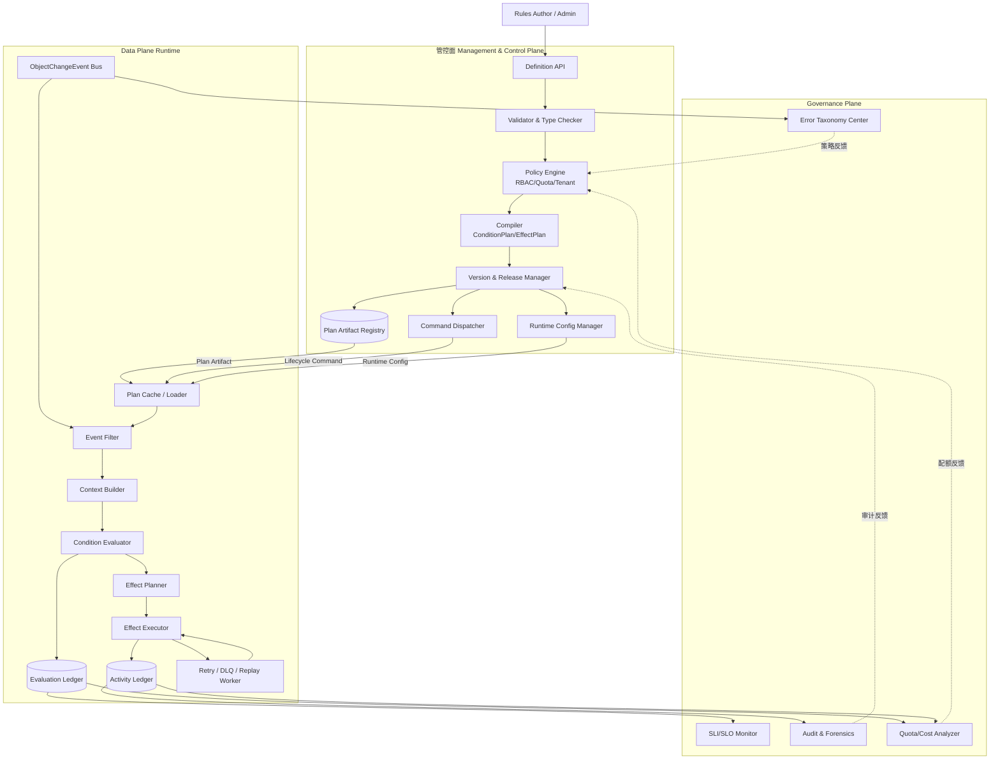
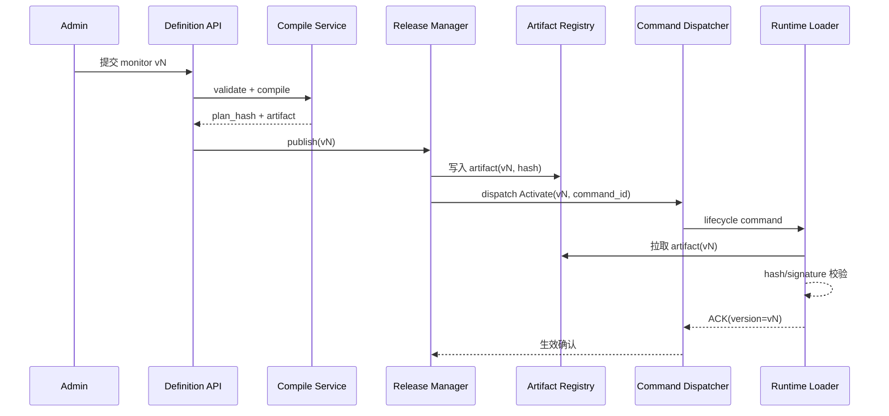
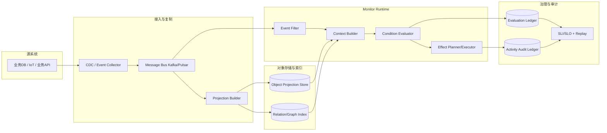
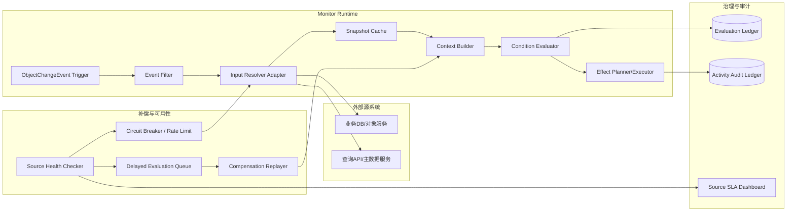

# Object Monitor 总体方案设计文档

> 本文基于最新调研文档 `object_monitor_palantir_research.md` 与既有设计约束，形成当前阶段可落地的总体方案设计；目标是在金融/制造、私有化部署、100w 对象、1000 规则、流批一体场景下，对齐 Palantir Object Monitor / Automate 的关键能力。

---

## 1. 设计输入与目标

### 1.1 已确认设计输入（来自调研 + 原有约束）

1. **能力语义输入（Palantir）**
   - 核心链路应为：`Monitor -> Input -> Condition -> Evaluation -> Activity`。
   - 命中后输出链路应同时覆盖：`Notifications + Actions`。
   - 必须具备治理边界：`Limits / Errors / Retry / Fallback / Manual execution`。

2. **架构输入（OSv2 推断）**
   - Monitor 不是 DB 内置规则，而是“对象状态之上的事件驱动评估运行时”。
   - 评估触发应优先消费 `ObjectChangeEvent`（对象语义事件），而非直接耦合原始 CDC。
   - 评估上下文构建应遵循“对象快照优先，必要时补充关联对象”。

3. **业务与工程输入（本项目目标）**
   - 行业：金融/制造。
   - 规模：100w 对象、1000 规则、数千用户。
   - 模式：流式 + 批量回放。
   - SLO：可用性 >=95%，RTO <=1h，私有云优先。

### 1.2 设计目标

- 从“组件清单”升级为“语义闭环 + 运行闭环 + 治理闭环”的完整设计。
- 保持 DSL 与 API 可演进，明确运行时可替换边界（Flink/Kafka/Temporal 可替换但语义不变）。
- 明确复制/非复制/混合三模式下的一致性协议和降级策略，避免设计停留在原则层。

---


## 2. 目标能力模型（语义层）

### 2.1 统一对象模型

- `MonitorDefinition`：规则定义（作用域、输入绑定、条件表达式、输出策略、执行策略、版本）。
- `InputBinding`：输入提取逻辑（对象属性、关系属性、聚合函数、外部数据适配器）。
- `ConditionPlan`：可执行条件计划（阈值、持续时长、窗口聚合、组合逻辑）。
- `EvaluationRecord`：一次求值结果（命中/未命中 + 原因 + 延迟 + 触发类型）。
- `ActivityRecord`：求值后的执行轨迹（通知/动作结果、失败码、重试轨迹、审计信息）。

### 2.2 语义兼容原则

1. **向 Palantir 概念兼容**：保留 Monitor/Input/Condition/Evaluation/Activity 的语义映射。
2. **向 Automate 能力对齐**：Effects 支持 `action/notification/function/logic/fallback`。
3. **向审计与法务兼容**：任何回放均 append 新 activity，不覆盖历史记录。

---

## 3. 总体架构（管控面 + 数据面 + 治理面）

> 本章目标：回答三个核心问题——
> 1）管控面到底负责什么；2）管控面与数据面是否必须通过 `compiled plan` 交互；3）当前管控面能力哪些是必须、哪些可后置。

### 3.1 逻辑架构图（Mermaid `graph TD`）



> 说明：该图采用 `graph TD` 表达“组件逻辑关系与跨平面契约”，不强调严格执行时序；发布/生效时序请参考 3.8。


### 3.2 管控面的职责边界（建议收敛）

管控面应坚持“**不处理业务事件，只生产运行契约**”。建议拆成三类：

1. **必须能力（MVP 必选）**
   - DSL/API 接入与语义校验。
   - 规则编译（`MonitorDefinition -> ConditionPlan/EffectPlan`）。
   - 版本管理（draft/published/paused/rollback）。
   - 基础权限（RBAC）与租户隔离校验。

2. **建议能力（M1~M2）**
   - 复杂度治理（AST 限额、输入数上限）。
   - 配额策略（每租户规则数、QPS、并发执行上限）。
   - 发布守卫（预检查、灰度发布、双写比对开关）。

3. **可后置能力（M3+）**
   - 规则推荐、冲突智能诊断。
   - 成本预测与自动调参。

> 结论：当前管控面“看起来很多内容”是因为把“必需能力”和“增强能力”混在一起了。建议按上面三层拆分，可显著降低首期复杂度。

### 3.3 管控面与数据面交互：是否只用 compile plan？

不是只能用 `compiled plan`，但**compiled plan 作为主协议仍是最稳妥方案**。建议采用“三通道交互”而不是单通道：

1. **Artifact 通道（主通道）**
   - 传输不可变 `compiled plan`（含 plan_hash/version）。
   - 优点：可审计、可回滚、便于多 runtime 一致加载。

2. **Lifecycle Command 通道（控制通道）**
   - 传输 `publish/pause/resume/rollback/replay` 指令。
   - 目的：避免每次状态变更都重新编译并全量下发 artifact。

3. **Runtime Config Snapshot 通道（配置通道）**
   - 传输运行参数（限流阈值、重试参数、开关策略）。
   - 目的：将“逻辑定义”与“运行参数”解耦，减少频繁发版。

### 3.4 为什么不建议只靠“动态解释执行”

可选替代方案是“管控面只存 DSL，数据面实时解释”。该模式灵活但有明显问题：

- 热路径性能抖动大，且难做静态优化（字段依赖索引、执行计划裁剪）。
- 多 runtime 下一致性风险更高（解释器版本漂移）。
- 审计与回放时，难以稳定复现“当时语义”。

因此建议：**主路径使用编译产物执行**，动态解释仅用于低频调试/手动验证。

### 3.5 管控面最小化落地清单（可直接用于实现）

首期管控面建议仅保留 6 个核心服务：

1. `Definition Service`：规则 CRUD（含草稿）。
2. `Validation Service`：语法/类型/复杂度校验。
3. `Compile Service`：生成 `ConditionPlan/EffectPlan` + hash。
4. `Release Service`：发布、暂停、回滚、版本切换。
5. `Auth Service`：RBAC 与租户边界校验。
6. `Registry Service`：artifact 元数据与分发索引。

非首期可延后：策略推荐、成本优化、高级冲突分析。

### 3.6 关键一致性约束（管控面-数据面契约）

1. 数据面只消费 `published` 且签名/哈希校验通过的 artifact。
2. 任一 Evaluation/Activity 必须落 `monitor_id + version + plan_hash`。
3. `rollback` 语义是“切换生效版本”，不是修改历史版本。
4. 生命周期命令必须幂等（带 command_id）。

### 3.7 组件分层与必要性判定（建议）

| 分层 | 组件 | 是否首期必需 | 说明 |
|---|---|---|---|
| 管控面 | Definition API / Validation / Compile / Release | 必需 | 无法缺省，缺失则无法形成稳定发布链路 |
| 管控面 | Policy Engine（RBAC+Tenant） | 必需 | 多租户与权限安全底线 |
| 管控面 | Registry | 必需 | 统一 artifact 真值源 |
| 管控面 | Command Dispatcher | 建议 | 支撑 pause/rollback/replay 快速控制 |
| 管控面 | Runtime Config Manager | 建议 | 降低“参数变更=重新发布”的成本 |
| 管控面 | 智能推荐/冲突检测 | 可后置 | 不影响核心闭环 |
| 数据面 | Filter/Context/Evaluator/Effect | 必需 | 规则执行主路径 |
| 数据面 | Retry+DLQ+Replay | 必需 | 可靠性与恢复底线 |
| 治理面 | SLI/SLO + Audit | 必需 | 运维与合规底线 |
| 治理面 | 成本分析/高级画像 | 建议 | 优化项，可后置 |

### 3.8 管控面-数据面交互时序（发布与生效）



### 3.9 总体架构优化结论（针对当前疑问）

1. **管控面不是越多越好**：首期应收敛到“定义-校验-编译-发布-鉴权-注册”闭环。
2. **compile plan 需要保留为主通道**：它是确定性、可审计、可回放的基础。
3. **但不应只有 compile plan**：生命周期命令与运行参数快照应独立通道承载。
4. **治理面建议与数据面双向闭环**：治理输出（如超配额、错误分类）应反向驱动管控面策略调整。


---

## 4. 核心执行链路设计（事件触发）

> 本章在既有“Event Filter -> Context Builder -> Evaluator -> Effect”主线基础上，补齐实现细节、边界语义与开源组件匹配，目标是把链路从“概念图”推进到“可实施方案”。

### 4.1 端到端执行分层（与 Palantir 语义映射）

| 本方案组件 | 对应 Palantir 语义 | 关键职责 | 首选开源实现 |
|---|---|---|---|
| Trigger Ingress | Input / Condition Trigger | 接收对象变更与时间触发 | Kafka/Pulsar + Quartz/Argo Events |
| Event Filter | Input 预筛选 | 候选规则裁剪，避免全量求值 | Flink Broadcast State / Kafka Streams |
| Context Builder | Input 组装 | 拼装对象快照、关系、外部输入 | Flink Async I/O + Redis + PostgreSQL/Elastic |
| Condition Evaluator | Condition / Evaluation | 阈值、持续时长、窗口计算 | Flink SQL/CEP/Stateful Functions |
| Effect Planner/Executor | Actions / Notifications / Fallback | 执行 effect、重试、补偿 | Temporal/Camunda + 消息队列 |
| Evaluation/Activity Ledger | Evaluation / Activity | 评估与动作审计留痕 | PostgreSQL + ClickHouse/OpenSearch |

### 4.2 Trigger Ingress（触发接入层）

#### 实现思路

1. **事件触发**：统一接入 `ObjectChangeEvent`（对象语义事件），避免直接消费原始 CDC。
2. **时间触发**：支持 cron/interval，与事件触发共用同一 evaluator。
3. **手动触发**：manual-run/replay 进入同一入口，确保语义一致。

#### 开源软件匹配

- **Kafka / Pulsar**：高吞吐事件总线、可重放、分区有序。
- **Quartz / Argo Events**：时间触发器和周期任务调度。
- **Schema Registry（Confluent/Apicurio）**：事件 schema 演进控制。

### 4.3 Event Filter（候选规则筛选）

#### 实现思路

采用“三层索引 + 一次命中”策略：

1. `objectType -> monitor_ids`（粗筛）。
2. `tenant/scope/tag -> monitor_ids`（租户与作用域筛选）。
3. `changedField -> monitor_ids`（增量字段筛选）。

最终输出 `MatchedMonitorCandidates[]`（带 `monitor_id/version/plan_hash/required_inputs`）。

#### 关键工程点

- 字段索引由编译阶段生成（field dependency index）。
- 使用广播状态热更新规则索引，避免频繁重启作业。
- 候选规则上限保护（每事件 max N），超限进入降级路径并记审计。

#### 开源软件匹配

- **Flink Broadcast State**：规则索引分发与热更新。
- **Kafka Streams GlobalKTable**：轻量场景的规则索引共享。
- **Redis**：极端低延迟场景做二级缓存。

### 4.4 Context Builder（评估上下文构建）

#### 实现思路

按“快照优先、按需补齐、失败可降级”构建 `EvaluationContext`：

1. 读取对象快照（复制模式主路径）。
2. 按 InputBinding 拉取关系对象（限制 fan-out）。
3. 非复制输入通过 Adapter 回源并带版本戳。
4. 生成上下文质量标识：`data_freshness_ms/stale_context/source_version`。

#### 关键工程点

- 通过 `snapshot_hash + source_watermark` 固化评估输入。
- 外部回源采用异步 I/O + TTL 缓存，避免阻塞 evaluator。
- 关系读取设置 `max_join_depth` 与 `max_related_objects` 防止雪崩。

#### 开源软件匹配

- **Flink Async I/O**：异步回源与超时控制。
- **Redis / Caffeine**：输入缓存（分布式 + 进程内）。
- **Debezium + Kafka Connect**：复制模式下的对象投影构建链路。

### 4.5 Condition Evaluator（条件求值引擎）

#### 实现思路

支持三类规则并统一 IR 执行：

1. 阈值/布尔：表达式直接求值。
2. 持续时长：状态机 `IDLE -> ENTERED -> FIRING -> COOLDOWN`。
3. 窗口聚合：基于事件时间窗口计算 `count/sum/rate`。

输出 `EvaluationRecord(match/reason/latency/trigger_type/version)`。

#### 关键工程点

- 以**事件时间**为主，处理时间兜底；明确 watermark 策略。
- 去重键：`monitor_id + object_id + trigger_bucket + plan_hash`。
- 迟到数据策略：可配置“补评估并追加 activity”或“仅审计”。

#### 开源软件匹配

- **Flink CEP/SQL**：持续时长与窗口规则。
- **Drools / Aviator / CEL(Java/Go)**：表达式引擎（离线编译后执行）。
- **RocksDB State Backend（Flink）**：大状态容器。

### 4.6 Effect Planner / Executor（动作执行与补偿）

#### 实现思路

1. Effect Planner 根据策略生成 DAG（串行/并行/条件分支）。
2. Executor 按 effect 类型分池执行（notification/action/function）。
3. 失败走重试策略，超过阈值触发 fallback。
4. 写入 `ActivityRecord(effect_results/retry_trace/error_code)`。

#### 关键工程点

- `idempotency_key` 必填（外部动作防重）。
- effect budget（每规则/租户速率上限）。
- 故障域隔离：通知通道故障不阻断评估主链路。

#### 开源软件匹配

- **Temporal**：有状态重试、补偿、超时与可观测执行。
- **Camunda/Zeebe**：BPMN 编排与人工节点（可选）。
- **Resilience4j**：熔断/限流/重试策略库。

### 4.7 Ledger / Replay（审计与回放）

#### 实现思路

- Evaluation 与 Activity 双 ledger 分离存储：
  - Evaluation 偏写入吞吐与规则分析。
  - Activity 偏审计检索与取证。
- Replay 读取历史事件并按“历史 plan_hash”重放，结果 append 不覆盖。

#### 开源软件匹配

- **PostgreSQL**：事务型定义与关键审计索引。
- **ClickHouse / OpenSearch**：高基数活动检索与聚合分析。
- **Apache Hudi/Iceberg**：历史事件湖仓回放数据源（可选）。

---

## 5. DSL 与规则治理设计（v0.2）

> 目标：把 DSL 从“可写规则”升级为“可编译、可治理、可审计、可回放”的规则工程体系。

### 5.1 DSL 语义模型（与 Palantir Monitor/Input/Condition 对齐）

建议 DSL 结构保持五段式：

1. `scope`：对象类型、对象集、租户范围。
2. `input`：对象属性、关系属性、外部输入绑定。
3. `condition`：布尔表达式、duration、窗口函数。
4. `effects`：action/notification/function/logic/fallback。
5. `policy`：去重、冷却、重试、速率限制、冲突策略。

### 5.2 DSL 编译链路（Parser -> AST -> IR -> Plan）

#### 实现思路

1. **Parser/AST**：完成语法解析与类型标注。
2. **Semantic Check**：字段存在性、类型约束、跨输入一致性。
3. **IR Lowering**：将表达式降级为统一中间表示（便于多引擎执行）。
4. **Plan Emit**：输出 `ConditionPlan + EffectPlan + FieldDependencyIndex`。

#### 开源软件匹配

- **ANTLR**：DSL 语法定义与解析器生成。
- **CEL / JsonLogic / Aviator**：表达式 IR 的执行后端候选。
- **OPA(Rego) / OpenPolicyAgent**：治理策略与准入校验（可选）。

### 5.3 DSL 关键能力深入设计

#### 5.3.1 scope

- 支持 `objectType + predicate`，并可引用对象集（Object Set）。
- 编译后生成 `scope_index`，服务 Event Filter 粗筛。

#### 5.3.2 input

- `from.object`, `from.relation`, `from.external` 三类输入源。
- 每个输入绑定要求声明 freshness 与 timeout。
- 编译后生成输入依赖图，供 Context Builder 并行拉取。

#### 5.3.3 condition

- 基础表达式：比较、逻辑、算术、空值处理。
- duration：`duration(cond, "10m")`，依赖状态机。
- window：`count/sum/rate over tumble/hop/sliding`。

#### 5.3.4 effects

- 支持多 effect DAG 与 fallback 分支。
- effect 声明 side-effect 等级（low/medium/high），决定重试与审批策略。

#### 5.3.5 policy

- `dedup(window)`：去重窗口。
- `cooldown("15m")`：抑制告警风暴。
- `severity`：冲突裁决优先级。
- `retry`/`rate_limit`：动作执行治理。

### 5.4 DSL 语义约束与静态门禁

必须在编译期阻断的高风险规则：

1. 条件表达式返回非 `bool`。
2. 输入绑定过多或 join 深度超阈值。
3. 高风险 action 无 fallback。
4. Non-copy 输入未声明 freshness/sla。

建议默认门禁参数：

- AST 节点数 <= 200
- 表达式嵌套深度 <= 12
- 输入绑定数 <= 20
- 单规则窗口状态 key 上限可配置

### 5.5 冲突裁决与确定性语义

- 默认：`highest-severity-wins`。
- 可选：`multi-fire` / `first-match`。
- 同 `snapshot_hash + plan_hash` 下结果必须确定。
- 回放按历史版本解释，不得按最新 DSL 语义重算。

### 5.6 DSL 示例（面向实现）

```yaml
monitor:
  id: overheat_line_a
  scope:
    object_type: Device
    where: "factory == 'A'"
  input:
    - name: temp
      from: object.temperature
    - name: owner
      from: relation.owner.name
  condition: "duration(temp > 80, '10m') and owner != null"
  effects:
    - type: notification
      channel: webhook
    - type: action
      action_ref: create_incident
      fallback:
        type: notification
        channel: email
  policy:
    severity: P1
    dedup: "5m"
    cooldown: "15m"
```

### 5.7 DSL 工程化开源组合建议

- **语言与编译**：ANTLR + 自定义 AST/IR。
- **表达式执行**：CEL（高安全）或 Aviator（Java 生态成熟）。
- **规则热更新**：Flink Broadcast + Plan Registry。
- **策略治理**：OPA（租户策略、准入策略统一）。
- **规则测试**：内置规则单测框架（golden case + 回放 case）。

---

## 6. API 与错误模型（管控面/数据面）

### 6.1 管控面 API

- `POST /v1/monitors`：创建规则。
- `POST /v1/monitors/{id}/publish`：发布版本。
- `POST /v1/monitors/{id}/pause`：暂停规则。
- `POST /v1/monitors/{id}/rollback`：回滚版本。
- `POST /v1/monitors/{id}/manual-run`：手动执行。
- `POST /v1/monitors/{id}/replay`：按时间窗回放。
- `GET /v1/monitors/{id}/activities`：活动检索。

### 6.2 数据面 API

- `POST /v1/object-events`：写入对象变更事件。
- `POST /v1/evaluations/pull`：非复制模式触发回源评估。
- `POST /v1/input-cache/refresh`：主动刷新缓存。

### 6.3 错误码

- `MONITOR_VALIDATION_ERROR`
- `MONITOR_VERSION_CONFLICT`
- `MONITOR_PERMISSION_DENIED`
- `MONITOR_IDEMPOTENCY_CONFLICT`
- `MONITOR_RATE_LIMITED`
- `MONITOR_SOURCE_UNAVAILABLE`
- `MONITOR_EFFECT_EXECUTION_FAILED`

并发写操作要求 `If-Match`/`version`；冲突返回 `409`。

---

## 7. 可观测性与 SRE 设计

### 7.1 核心 SLI

1. `evaluation_latency_p95`
2. `event_to_activity_e2e_latency_p95`
3. `effect_success_rate`
4. `freshness_lag_ms`（复制模式）
5. `source_call_error_rate`（非复制模式）
6. `replay_backlog_size`

### 7.2 SLO 建议

- Phase 1：可用性 >=95%，P95 评估延迟 <3s。
- Phase 2：可用性 >=99.5%，通知成功率 >99.9%。
- RTO <=1h，关键链路“允许延迟，不允许无审计丢失”。

### 7.3 失败恢复机制

- Kafka/Flink/执行器均支持重放与幂等。
- 失败事件进入 DLQ，带错误分类和重试轨迹。
- 回放与在线流量隔离，避免二次风暴。

---

## 8. 技术选型建议（私有化优先）

### 8.1 推荐基线

- 消息总线：Kafka（或 Pulsar）。
- 流式评估：Flink（CEP + 状态管理）。
- 控制与 API：Python/Go 服务。
- 存储：PostgreSQL（定义 + 活动），ClickHouse/OpenSearch（审计检索）。
- 编排：Temporal（动作执行与补偿）。

### 8.2 可替换原则

所有基础设施可替换，但需满足三项不变约束：

1. 事件可重放。
2. 状态可 checkpoint + 恢复。
3. effect 执行可幂等且可追溯。

---

## 9. 分阶段实施计划

### Phase 1（8~10 周）

- DSL v0.2（阈值 + 持续时长 + 基础窗口）。
- 管控面（创建/发布/暂停/回滚）。
- Runtime MVP（Event Filter/Context Builder/Evaluator/Activity）。
- 通知通道（Email + Webhook）。
- 观测面板与基础告警。

### Phase 2（8~12 周）

- Effect 执行器完善（action/function/logic/fallback）。
- 批量回放与对账。
- Non-copy 适配器、缓存、补偿链路。
- 多租户配额与复杂度治理。

### Phase 3（持续）

- 行业模板（金融风控、制造设备健康）。
- 规则推荐与冲突检测。
- 成本优化（冷热分层、状态压缩、弹性扩缩容）。

---

## 10. 验收标准（可直接用于里程碑 Gate）

1. **正确性**：同输入快照、同版本下评估结果一致率 100%。
2. **可靠性**：注入 Broker/Flink/通知网关故障后，RTO 满足 <=1h。
3. **审计性**：任一 activity 能追溯到 monitor_version + snapshot_hash + effect_trace。
4. **性能**：在 100w 对象、1000 规则、2000 events/s 峰值下，P95 评估延迟 <3s。
5. **治理性**：复杂规则超阈值可拦截；租户超配额可限流且不影响其他租户。

---

## 11. 当前方案关键升级点

1. 从“组件堆叠”升级为“语义模型驱动”的架构设计。
2. 显式引入 `Event Filter + Context Builder` 两级降本机制。
3. 将 fallback/手动执行/错误分类纳入一等公民能力。
4. 将 Copy/Non-copy 的一致性协议从概念描述升级为可实施约束。
5. 补全可观测与验收闭环，支持从 PoC 到生产的治理落地。

---

## 12. 不同数据模式下的 Object Monitor 机制设计

### 12.1 复制模式（Copy/Materialized）下 Object Monitor 总体方案设计

#### 12.1.1 适用场景与原则

- 适用于高频评估、低延迟、强审计要求的核心流程（金融风控、制造设备安全）。
- 原则：**评估不回源、对象投影就近读取、事件驱动增量更新**。

#### 12.1.2 架构逻辑视图（Mermaid）



#### 12.1.3 机制设计（深入）

1. **触发路径**：`CDC/Event -> Projection Builder -> Object Snapshot -> Evaluation`。
2. **一致性协议**：`at-least-once event + idempotent projection + watermark`。
3. **评估上下文构建**：优先读取对象投影快照，关系规则按需读取关系索引，避免高频回源 join。
4. **状态与恢复**：duration/window 状态进入流式状态存储（checkpoint），支持故障后继续评估。
5. **审计约束**：每次评估固化 `monitor_version + snapshot_hash + source_watermark`。

#### 12.1.4 优势、风险与治理

- 优势：延迟低、稳定性高、回放与取证简单。
- 风险：复制链路抖动导致数据新鲜度下降。
- 治理：`freshness_lag_ms` 超阈值时触发降级（暂停高风险动作，仅告警+审计）。

### 12.2 非复制模式（Non-copy/Virtualized）Object Monitor 总体方案设计

#### 12.2.1 适用场景与原则

- 适用于数据主权严格、复制受限、跨域数据难以集中落库的场景。
- 原则：**按需回源 + 快照一致性 + 回源失败补偿**。

#### 12.2.2 架构逻辑视图（Mermaid）



#### 12.2.3 机制设计（深入）

1. **触发路径**：`ObjectChangeEvent -> Input Resolver Adapter -> Source Pull -> Evaluation`。
2. **一致性协议**：`snapshot_hash + source_version + delayed compensation`。
3. **上下文质量控制**：每次回源记录数据来源与版本，必要时标注 `stale_context` 防止误触发高风险动作。
4. **可用性策略**：短 TTL 缓存、源端熔断、延迟队列与恢复补评估。
5. **审计约束**：记录回源来源、版本戳、拉取耗时、失败分类与补偿轨迹。

#### 12.2.4 优势、风险与治理

- 优势：合规友好、降低复制存储成本。
- 风险：上游源系统 SLA 抖动影响评估时效与稳定性。
- 治理：按规则等级设策略，P1/P2 规则建议强制热缓存或切换半复制模式。

### 12.3 混合模式（Hybrid，推荐默认）

- 高频字段与关键对象走复制热投影。
- 低频大字段与长尾对象按需虚拟化回源。
- 选择策略：P1/P2 优先复制；P3/P4 可回源；支持按租户/规则动态切换。

---
