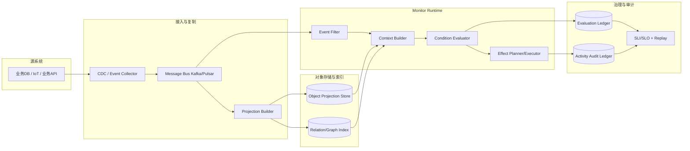
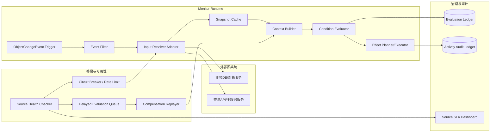

# Object Monitor 总体方案设计文档

> 本文基于最新调研文档 `object_monitor_palantir_research.md` 与既有设计约束，形成当前阶段可落地的总体方案设计；目标是在金融/制造、私有化部署、100w 对象、1000 规则、流批一体场景下，对齐 Palantir Object Monitor / Automate 的关键能力。

---

## 1. 设计输入与目标

### 1.1 已确认设计输入（来自调研 + 原有约束）

1. **能力语义输入（Palantir）**
   - 核心链路应为：`Monitor -> Input -> Condition -> Evaluation -> Activity`。
   - 命中后输出链路应同时覆盖：`Notifications + Actions`。
   - 必须具备治理边界：`Limits / Errors / Retry / Fallback / Manual execution`。

2. **架构输入（OSv2 推断）**
   - Monitor 不是 DB 内置规则，而是“对象状态之上的事件驱动评估运行时”。
   - 评估触发应优先消费 `ObjectChangeEvent`（对象语义事件），而非直接耦合原始 CDC。
   - 评估上下文构建应遵循“对象快照优先，必要时补充关联对象”。

3. **业务与工程输入（本项目目标）**
   - 行业：金融/制造。
   - 规模：100w 对象、1000 规则、数千用户。
   - 模式：流式 + 批量回放。
   - SLO：可用性 >=95%，RTO <=1h，私有云优先。

### 1.2 设计目标

- 从“组件清单”升级为“语义闭环 + 运行闭环 + 治理闭环”的完整设计。
- 保持 DSL 与 API 可演进，明确运行时可替换边界（Flink/Kafka/Temporal 可替换但语义不变）。
- 明确复制/非复制/混合三模式下的一致性协议和降级策略，避免设计停留在原则层。

---

## 2. 不同数据模式下的 Object Monitor 机制设计

### 2.1 复制模式（Copy/Materialized）下 Object Monitor 总体方案设计

#### 2.1.1 适用场景与原则

- 适用于高频评估、低延迟、强审计要求的核心流程（金融风控、制造设备安全）。
- 原则：**评估不回源、对象投影就近读取、事件驱动增量更新**。

#### 2.1.2 架构逻辑视图（Mermaid）



#### 2.1.3 机制设计（深入）

1. **触发路径**：`CDC/Event -> Projection Builder -> Object Snapshot -> Evaluation`。
2. **一致性协议**：`at-least-once event + idempotent projection + watermark`。
3. **评估上下文构建**：优先读取对象投影快照，关系规则按需读取关系索引，避免高频回源 join。
4. **状态与恢复**：duration/window 状态进入流式状态存储（checkpoint），支持故障后继续评估。
5. **审计约束**：每次评估固化 `monitor_version + snapshot_hash + source_watermark`。

#### 2.1.4 优势、风险与治理

- 优势：延迟低、稳定性高、回放与取证简单。
- 风险：复制链路抖动导致数据新鲜度下降。
- 治理：`freshness_lag_ms` 超阈值时触发降级（暂停高风险动作，仅告警+审计）。

### 2.2 非复制模式（Non-copy/Virtualized）Object Monitor 总体方案设计

#### 2.2.1 适用场景与原则

- 适用于数据主权严格、复制受限、跨域数据难以集中落库的场景。
- 原则：**按需回源 + 快照一致性 + 回源失败补偿**。

#### 2.2.2 架构逻辑视图（Mermaid）



#### 2.2.3 机制设计（深入）

1. **触发路径**：`ObjectChangeEvent -> Input Resolver Adapter -> Source Pull -> Evaluation`。
2. **一致性协议**：`snapshot_hash + source_version + delayed compensation`。
3. **上下文质量控制**：每次回源记录数据来源与版本，必要时标注 `stale_context` 防止误触发高风险动作。
4. **可用性策略**：短 TTL 缓存、源端熔断、延迟队列与恢复补评估。
5. **审计约束**：记录回源来源、版本戳、拉取耗时、失败分类与补偿轨迹。

#### 2.2.4 优势、风险与治理

- 优势：合规友好、降低复制存储成本。
- 风险：上游源系统 SLA 抖动影响评估时效与稳定性。
- 治理：按规则等级设策略，P1/P2 规则建议强制热缓存或切换半复制模式。

### 2.3 混合模式（Hybrid，推荐默认）

- 高频字段与关键对象走复制热投影。
- 低频大字段与长尾对象按需虚拟化回源。
- 选择策略：P1/P2 优先复制；P3/P4 可回源；支持按租户/规则动态切换。

---

## 3. 目标能力模型（语义层）

### 3.1 统一对象模型

- `MonitorDefinition`：规则定义（作用域、输入绑定、条件表达式、输出策略、执行策略、版本）。
- `InputBinding`：输入提取逻辑（对象属性、关系属性、聚合函数、外部数据适配器）。
- `ConditionPlan`：可执行条件计划（阈值、持续时长、窗口聚合、组合逻辑）。
- `EvaluationRecord`：一次求值结果（命中/未命中 + 原因 + 延迟 + 触发类型）。
- `ActivityRecord`：求值后的执行轨迹（通知/动作结果、失败码、重试轨迹、审计信息）。

### 3.2 语义兼容原则

1. **向 Palantir 概念兼容**：保留 Monitor/Input/Condition/Evaluation/Activity 的语义映射。
2. **向 Automate 能力对齐**：Effects 支持 `action/notification/function/logic/fallback`。
3. **向审计与法务兼容**：任何回放均 append 新 activity，不覆盖历史记录。

---

## 4. 总体架构（控制面 + 数据面 + 治理面）

```text
            ┌──────────────────── Control Plane ────────────────────┐
            │  Monitor DSL/API | Compiler | Versioning | RBAC       │
            │  Publish/Pause/Rollback | Quota | Tenant Policies     │
            └─────────────────────────────────────────────────────────┘
                                  │ compiled plan
                                  ▼
┌────────────────────── Data Plane (Runtime) ───────────────────────────────┐
│ Source -> Ingestion -> ObjectChangeEvent Bus                              │
│         -> Event Filter -> Context Builder -> Condition Evaluator         │
│         -> Evaluation Writer -> Effect Planner -> Effect Executor         │
│         -> Activity Ledger + Retry/DLQ + Replay                           │
└─────────────────────────────────────────────────────────────────────────────┘
                                  │
                                  ▼
                    ┌──────── Governance & Observability ────────┐
                    │ SLI/SLO | Limits | Error Taxonomy | Audit  │
                    │ Trace/Metric/Log | Manual Run | Forensics  │
                    └─────────────────────────────────────────────┘
```

### 4.1 关键分层职责

1. **控制面（Control Plane）**
   - 提供 DSL 校验、版本发布、租户策略、配额与权限。
   - 输出编译后的 `ConditionPlan` 与 `EffectPlan` 到运行面。

2. **运行面（Runtime/Data Plane）**
   - 消费对象变更事件并做候选规则过滤。
   - 构建评估上下文并执行条件求值。
   - 命中后执行 effect 链路，失败按 fallback 与重试策略处理。

3. **治理面（Governance）**
   - 统一 errors/limits 模型与可观测指标。
   - 支持手动执行、回放、法务审计导出。

---

## 5. 核心执行链路设计（事件触发）

### 5.1 Event Filter（候选规则筛选）

三段式过滤，避免全量规则求值：

1. `objectType` 预过滤。
2. `scope/tenant/tag` 过滤。
3. `changedFields` 增量过滤（仅字段相关规则进入候选集）。

输出：`MatchedMonitorCandidates[]`，包含 `monitorId/version/requiredInputsRef`。

### 5.2 Context Builder（评估上下文构建）

按优先级读取：

1. 对象快照（复制模式优先）。
2. 关系对象（按 InputBinding 声明拉取）。
3. 外部输入（非复制模式按适配器拉取并缓存）。

输出：`EvaluationContext`（含 `snapshot_hash`、`source_watermark`、`data_freshness_ms`）。

### 5.3 Condition Evaluator（条件求值）

支持三类规则：

1. 阈值/布尔规则（即时判断）。
2. 持续时长规则（状态机维护：`IDLE->ENTERED->FIRING->COOLDOWN`）。
3. 窗口聚合规则（count/sum/rate over window）。

输出：`EvaluationRecord(match/reason/latency/triggerType)`。

### 5.4 Effect Execution（动作与通知执行）

执行策略：

- 主 effect 并行或串行（按策略配置）。
- 失败重试：指数退避 + 最大重试次数。
- 主 effect 失败后触发 fallback effect。
- 所有 effect 写 `idempotency_key` 保障幂等。

输出：`ActivityRecord(effect_results/retry_trace/error_code)`。

---

## 6. DSL 与规则治理设计（v0.2）

### 6.1 DSL 必备能力

1. `scope`：对象类型 + 过滤器。
2. `input`：多输入绑定（对象属性、关系属性、外部适配器）。
3. `condition`：布尔表达式 + `duration()` + 窗口函数。
4. `effects`：action/notification/function/logic/fallback。
5. `policy`：dedup、cooldown、severity、retry、rate-limit。

### 6.2 语义约束

- 条件表达式必须返回 `bool`。
- 单规则 AST 节点数、嵌套深度、输入绑定数设上限。
- 编译期必须生成 `field dependency index`（服务 Event Filter）。

### 6.3 冲突裁决

默认策略：`highest-severity-wins`。
可选：`multi-fire` / `first-match`。

同快照、同版本下结果必须确定性一致。

---

## 7. API 与错误模型（控制面/数据面）

### 7.1 控制面 API

- `POST /v1/monitors`：创建规则。
- `POST /v1/monitors/{id}/publish`：发布版本。
- `POST /v1/monitors/{id}/pause`：暂停规则。
- `POST /v1/monitors/{id}/rollback`：回滚版本。
- `POST /v1/monitors/{id}/manual-run`：手动执行。
- `POST /v1/monitors/{id}/replay`：按时间窗回放。
- `GET /v1/monitors/{id}/activities`：活动检索。

### 7.2 数据面 API

- `POST /v1/object-events`：写入对象变更事件。
- `POST /v1/evaluations/pull`：非复制模式触发回源评估。
- `POST /v1/input-cache/refresh`：主动刷新缓存。

### 7.3 错误码

- `MONITOR_VALIDATION_ERROR`
- `MONITOR_VERSION_CONFLICT`
- `MONITOR_PERMISSION_DENIED`
- `MONITOR_IDEMPOTENCY_CONFLICT`
- `MONITOR_RATE_LIMITED`
- `MONITOR_SOURCE_UNAVAILABLE`
- `MONITOR_EFFECT_EXECUTION_FAILED`

并发写操作要求 `If-Match`/`version`；冲突返回 `409`。

---

## 8. 可观测性与 SRE 设计

### 8.1 核心 SLI

1. `evaluation_latency_p95`
2. `event_to_activity_e2e_latency_p95`
3. `effect_success_rate`
4. `freshness_lag_ms`（复制模式）
5. `source_call_error_rate`（非复制模式）
6. `replay_backlog_size`

### 8.2 SLO 建议

- Phase 1：可用性 >=95%，P95 评估延迟 <3s。
- Phase 2：可用性 >=99.5%，通知成功率 >99.9%。
- RTO <=1h，关键链路“允许延迟，不允许无审计丢失”。

### 8.3 失败恢复机制

- Kafka/Flink/执行器均支持重放与幂等。
- 失败事件进入 DLQ，带错误分类和重试轨迹。
- 回放与在线流量隔离，避免二次风暴。

---

## 9. 技术选型建议（私有化优先）

### 9.1 推荐基线

- 消息总线：Kafka（或 Pulsar）。
- 流式评估：Flink（CEP + 状态管理）。
- 控制与 API：Python/Go 服务。
- 存储：PostgreSQL（定义 + 活动），ClickHouse/OpenSearch（审计检索）。
- 编排：Temporal（动作执行与补偿）。

### 9.2 可替换原则

所有基础设施可替换，但需满足三项不变约束：

1. 事件可重放。
2. 状态可 checkpoint + 恢复。
3. effect 执行可幂等且可追溯。

---

## 10. 分阶段实施计划

### Phase 1（8~10 周）

- DSL v0.2（阈值 + 持续时长 + 基础窗口）。
- 控制面（创建/发布/暂停/回滚）。
- Runtime MVP（Event Filter/Context Builder/Evaluator/Activity）。
- 通知通道（Email + Webhook）。
- 观测面板与基础告警。

### Phase 2（8~12 周）

- Effect 执行器完善（action/function/logic/fallback）。
- 批量回放与对账。
- Non-copy 适配器、缓存、补偿链路。
- 多租户配额与复杂度治理。

### Phase 3（持续）

- 行业模板（金融风控、制造设备健康）。
- 规则推荐与冲突检测。
- 成本优化（冷热分层、状态压缩、弹性扩缩容）。

---

## 11. 验收标准（可直接用于里程碑 Gate）

1. **正确性**：同输入快照、同版本下评估结果一致率 100%。
2. **可靠性**：注入 Broker/Flink/通知网关故障后，RTO 满足 <=1h。
3. **审计性**：任一 activity 能追溯到 monitor_version + snapshot_hash + effect_trace。
4. **性能**：在 100w 对象、1000 规则、2000 events/s 峰值下，P95 评估延迟 <3s。
5. **治理性**：复杂规则超阈值可拦截；租户超配额可限流且不影响其他租户。

---

## 12. 当前方案关键升级点

1. 从“组件堆叠”升级为“语义模型驱动”的架构设计。
2. 显式引入 `Event Filter + Context Builder` 两级降本机制。
3. 将 fallback/手动执行/错误分类纳入一等公民能力。
4. 将 Copy/Non-copy 的一致性协议从概念描述升级为可实施约束。
5. 补全可观测与验收闭环，支持从 PoC 到生产的治理落地。
