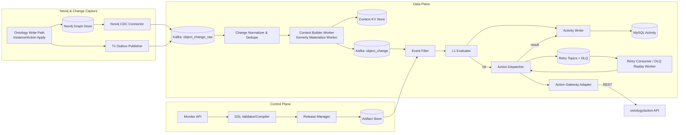
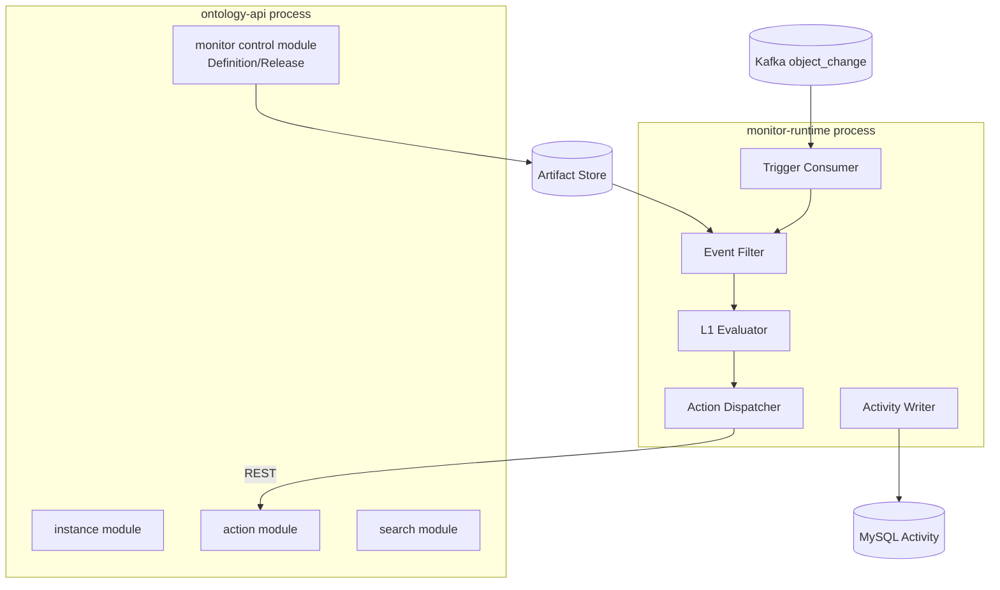

# Object Monitor Phase 1 详细设计文档（基于总体方案细化）

> 适用范围：`docs/object_monitor/object_monitor_design_general.md` 第 9 章中 **Phase 1（6~8 周）**。  
> 目标：在不引入过重技术栈的前提下，交付“可上线、可追溯、可扩展”的第一阶段能力，并为 Phase 2 的 L2/回放/复杂 effect 预留接口。

---

## 1. 设计输入与边界

## 1.1 输入文档结论摘要

结合调研文档与总体方案，Phase 1 应继承以下确定性结论：

1. 语义模型采用 `Monitor -> Input -> Condition -> Evaluation -> Activity`，并保留通知/动作闭环能力。
2. 运行时优先“复制模式”与 CQRS 思路，避免在热路径中高频回源图存储。
3. 动作链路在第一阶段走 MVP 轻量路线：`REST + Retry Topics + DLQ`，暂不强依赖 Temporal。
4. 触发入口统一：对象变更触发、时间触发、手动触发在入口层统一建模。
5. 对象后端为 Neo4j 时，Monitor 必须同时覆盖“数据源同步写入 Neo4j”与“直接写 Neo4j”两类变更来源。

## 1.2 本阶段强约束

- **仅支持复制模式（Copy）**：上下文由物化层前置准备，Evaluator 不做图库随机查询。
- **后端以 Neo4j 为事实源**：变更采集必须支持“双通道接入+去重归并”。
- **规则能力最小子集**：只做 L1（无状态）条件，不做 CEP 持续时长窗口（进入 Phase 2）。
- **对象关系范围**：`主对象 + 一跳关系`。
- **effect 最小集**：仅 Action（HTTP/REST），支持幂等、重试、DLQ、人工补偿入口。
- **多租户隔离基础版**：租户级 topic 分区键 + 规则配额门禁（简版）。

---

## 2. 对现有方案的辩证分析与 Phase 1 修订

## 2.1 保留点（正确且应立即落地）

1. **将 Input/Condition 编译前移**：减少运行时表达式解释开销，降低抖动。
2. **Activity/Ledger 全链路留痕**：保证排障、审计、回放输入可重构。
3. **Context Delivery Policy 思路**：虽 Phase 1 不做完整策略引擎，但需落地其“可演进接口”。

## 2.2 风险点（总体方案在第一阶段会过重/过早）

1. 若第一阶段就引入 `L1+L2+Temporal+多模式`，交付复杂度与排障复杂度过高。
2. 若规则 DSL 一次性支持过多函数/跨对象聚合，编译器与测试矩阵会失控。
3. 若在 Phase 1 尝试“全自动策略切换（P0/P1/P2）”，会引入过多运行时分支，压缩稳定性验证窗口。

## 2.3 Phase 1 折中策略

- 功能上“窄而深”：只做高价值链路端到端稳定闭环。
- 架构上“接口先行”：为 Phase 2 预留 `L2Evaluator`、`ReplayService`、`EffectOrchestrator` SPI。
- 运维上“先可控后智能”：先人工可观测可补偿，再推进自动优化。

---

## 3. Phase 1 目标与非目标

## 3.1 目标（Must Have）

1. Monitor 生命周期：创建、校验、发布、停用、版本化。
2. 触发与评估：消费 `ObjectChangeEvent`，完成候选规则过滤与 L1 条件求值。
3. 活动记录：持久化 Evaluation/Activity，可按 monitor/object/time 查询。
4. 动作执行：命中后调用 Action API，具备幂等、重试、DLQ。
5. 基础可观测：延迟、命中率、失败率、堆积、DLQ 量等指标可见。

## 3.2 非目标（Won't Have）

- CEP 窗口、持续时长条件（例如“连续 1 小时高温”）。
- 多 effect DAG、fallback 编排、人工审批节点。
- 非复制模式（Signal Fetcher）与 Two-Stage Filtering 自动迁移。
- 跨租户规则编排与高级成本优化。

---

## 4. 总体逻辑架构（Phase 1）



**关键解释**：
- 编译产物（artifact）由 Data Plane 拉取并热更新，避免把规则文本直接放在运行时解释。
- Context Builder Worker 与 Evaluator 解耦，确保评估主链路不依赖实时图查询。
- Action 结果（成功/失败/重试）都写回 Activity，保证闭环审计。

### 4.1 Neo4j 变更感知策略（Phase 1 必做）

为满足“同步写入 + 直接改库”两类路径，Phase 1 采用双通道采集并在归一化层去重：

1. **通道 A：Outbox 事件**（应用内写路径）
   - 适用于 `InstanceService/ActionService` 驱动的写入。
   - 在写 Neo4j 事务提交后发布 `ObjectChangeRawEvent` 到 `object_change_raw`。

2. **通道 B：Neo4j CDC 事件**（库级变更路径）
   - 适用于外部同步任务、运维脚本、人工直接修改 Neo4j。
   - 通过 Neo4j CDC connector 捕获节点/关系变更并投递到同一 raw topic。

3. **去重与归并**
   - `Change Normalizer` 生成统一事件键：`tenant_id + object_type + object_id + object_version`。
   - 若同一版本在短窗口重复出现（Outbox+CDC 双发），仅保留一条进入物化链路。
   - 归并后补齐 `change_source` 字段（`outbox` / `neo4j_cdc`）用于审计。

4. **一致性护栏**
   - 规则：`object_version` 必须单调递增；出现版本回退进入 `reconcile_queue`。
   - 规则：CDC 延迟超过阈值时，触发滞后告警并自动降级为“仅 Outbox 可见范围”。

### 4.2 图中关键组件释义（补充）

1. `Change Normalizer & Dedupe` 属于 **Data Plane 流处理节点**，不回写 Neo4j；其职责是把 raw 事件统一为标准事件。
2. `object_change_raw` 是原始事件总线（来源混杂、可能重复）；`object_change` 是标准化后总线（供评估主链路消费）。
3. `Context Builder Worker` 是“上下文构建器”，名称比 `Materialize Worker` 更直观；功能不变。
4. `Retry Consumer / DLQ Replay Worker` 负责把重试队列重新投递到 `Action Dispatcher`，以及处理死信重放。

### 4.3 Neo4j APOC Trigger vs Neo4j CDC 选型对比（Phase 1）

为避免后续对“Neo4j trigger 能力”与“CDC connector”概念混淆，补充如下对比：

> 说明：APOC Trigger（如 `apoc.trigger.add`）是数据库内触发机制；Neo4j CDC 是事务日志/变更流捕获机制。二者都可感知变更，但定位不同。

| 对比维度 | APOC Trigger | Neo4j CDC |
|---|---|---|
| 机制层级 | 库内触发器（事务钩子） | 日志级/流式变更捕获 |
| 语义特征 | 可直接写条件逻辑、侵入 DB 侧 | 关注变更事实，语义在流处理层补齐 |
| 对直写 Neo4j 覆盖 | 可覆盖 | 可覆盖 |
| 运维复杂度 | 高（触发器版本、权限、回滚复杂） | 中（连接器与流平台运维） |
| 与现架构耦合度 | 高（逻辑下沉 DB） | 低（契合 `raw -> normalize -> evaluate`） |
| 推荐角色 | 受限场景临时补洞 | 兜底主方案（配合 Outbox） |

Phase 1 推荐策略：

1. **主路径**：应用写入口 + Tx Outbox（语义最完整）。
2. **兜底路径**：Neo4j CDC 捕获直写变更并汇入 `object_change_raw`。
3. **统一归一化**：`Change Normalizer & Dedupe` 统一 schema 与去重，输出 `object_change`。
4. **APOC Trigger 使用边界**：仅在无法启用 CDC 且必须快速覆盖直写场景时作为临时方案，且仅做“轻触发投递”，不承载复杂业务规则。

落地约束建议：

- 无论采用 CDC 或 APOC Trigger，均必须走统一 `Trigger Envelope` 与去重键：`tenant_id + object_type + object_id + object_version`。
- 统一落审计字段：`change_source`（`outbox`/`neo4j_cdc`/`neo4j_apoc_trigger`），便于后续质量评估与迁移。
- 若 APOC Trigger 与 CDC 同时启用，必须强制开启短窗口去重，防止重复触发 Action。

---

## 5. 核心模块详细设计

## 5.1 Monitor API + DSL Compiler

### 5.1.1 DSL 最小子集（Phase 1）

```yaml
monitor:
  id: m_high_temp
  objectType: Device
  scope: "plant_id in ['P1','P2']"
input:
  fields: [temperature, status, updated_at]
condition:
  expr: "temperature >= 80 && status == 'RUNNING'"
effect:
  action:
    endpoint: "action://ticket/create"
    idempotencyKey: "${monitorId}:${objectId}:${sourceVersion}"
```

支持能力：
- 比较、布尔、in-list、空值判断、简单字符串函数（`startsWith`）。
- 字段只允许来自主对象或一跳关系的已物化字段。

不支持能力：
- 聚合函数（sum/avg over window）、跨多跳 join、自定义脚本。

### 5.1.2 编译产物

编译结果输出 `MonitorArtifact`：
- `monitor_version`
- `plan_hash`
- `field_projection`
- `predicate_ast`
- `action_template`
- `limits`（max_qps/retry_policy 等）

发布前校验：
1. 字段存在性（Schema Registry / Ontology 元数据）。
2. 表达式复杂度（AST 节点数、函数白名单）。
3. Action 模板完整性与幂等键模板合法性。

## 5.2 Context Builder Worker（复制模式，原 Materialize Worker）

职责：将对象变更增量更新到 `Context KV Store`，形成“评估可直接读取”的扁平上下文。

设计要点：
1. 输入：Ontology 的 Tx Log / CDC。
2. 输出：
   - `Context KV` 最新快照（key=`tenant:objectType:objectId`）
   - `ObjectChangeEvent`（含 changed_fields/source_version/object_version）
3. 一跳关系在写入期展开：例如 `device.owner.name` -> `owner_name`。
4. 失败写入走 `context_build_retry` 队列，超过阈值告警。

## 5.3 Event Filter

两层过滤：
1. **静态过滤**：按 `objectType + changed_fields` 从索引快速定位候选 monitor。
2. **Scope 过滤**：执行编译后的 scope predicate（仅使用事件头 + context kv 基础字段）。

数据结构建议：
- `field_to_monitors` 倒排索引（内存 + 周期增量刷新）。
- `monitor_runtime_cache`（artifact + 限流配置 + action 模板）。

## 5.4 L1 Evaluator

职责：无状态表达式求值。

执行流程：
1. 从过滤结果获取候选 monitor。
2. 从 Context KV 拉取对象当前快照（同 object_version）。
3. 使用 `predicate_ast` 求值。
4. 产出 `EvaluationRecord`：hit/miss + reason + latency + snapshot_hash。

幂等键：`tenantId:monitorId:objectId:sourceVersion`。

## 5.5 Activity Writer

存储模型（MySQL）：
- `monitor_evaluation`：每次求值一条。
- `monitor_activity`：命中/动作结果聚合视图。
- `action_delivery_log`：动作调用明细（含重试次数、错误码）。

索引：
- `(tenant_id, monitor_id, event_time desc)`
- `(tenant_id, object_id, event_time desc)`
- `(tenant_id, status, updated_at desc)`

## 5.6 Action Dispatcher（MVP）

### 5.6.1 调用模型

- 同步调用 Action Gateway（HTTP）。
- 超时/5xx 进入 `retry_1m -> retry_5m -> retry_1h -> DLQ`。
- 4xx 按策略直接终止并记录不可重试失败。

### 5.6.2 幂等与去重

请求头携带 `Idempotency-Key`。
Action Gateway 或目标系统需保证同 key 幂等。

### 5.6.3 失败处理

- 可重试：指数退避 + 最大次数。
- 不可重试：写 Activity 并触发告警。
- DLQ：支持按 `activity_id` 人工重放。

---

### 5.7 对接当前仓库 Action 能力（代码现状 -> Phase 1 接入）

基于 `ontology/action` 现有实现，Phase 1 不需要新建动作引擎，直接复用现有 API + 执行状态模型：

1. **可直接调用的 API**
   - `POST /api/v1/actions/{action_id}/apply`：一体化提交+执行+应用（推荐 Monitor 命中后调用）。
   - `GET /api/v1/actions/executions/{execution_id}`：查询执行状态（用于异步补偿/回查）。
   - 兼容接口 `POST /actions/submit` 仅提交不执行，不建议 Monitor 主路径使用。

2. **请求映射规范（Monitor -> ActionApplyRequest）**
   - `submitter`：固定 `monitor-system` 或 `monitor:{monitor_id}`。
   - `input_payload`：来自命中上下文裁剪（禁止透传敏感字段）。
   - `input_instances`：当 action 依赖实例定位时，填 `{alias:{object_type,primary_key,version}}`。
   - `version`：可选，默认走 action 最新版本；关键规则可锁定版本。

3. **执行状态对齐**
   - Action 侧状态：`queued/validating/executing/applying/succeeded/failed`。
   - Monitor Activity 侧新增 `action_status/action_execution_id` 字段，周期回查并更新最终态。

4. **幂等与重试协同**
   - Monitor 生成 `Idempotency-Key = monitorId:objectId:sourceVersion:actionId`。
   - Action 侧已有 `execution_id` 和日志流水，可作为去重与审计锚点。
   - Monitor 的 Retry Topic 仅对网络超时/5xx 生效，业务 4xx 直接落失败并告警。

5. **与 Neo4j 的闭环关系**
   - Action 最终通过 `ApplyEngine -> GraphStore` 修改实例，当前仓库已支持 `Neo4jGraphStore`。
   - Action 写入对象时会推进对象版本并写 `last_modified_by_action_id`，可被 Monitor 反向识别，避免动作触发风暴。

## 6. 关键数据契约

## 6.1 ObjectChangeEvent

```json
{
  "event_id": "uuid",
  "tenant_id": "t1",
  "object_type": "Device",
  "object_id": "D1001",
  "source_version": 982133,
  "object_version": 2201,
  "changed_fields": ["temperature", "status"],
  "event_time": "2026-03-09T10:00:00Z",
  "trace_id": "..."
}
```

## 6.2 EvaluationRecord

```json
{
  "evaluation_id": "uuid",
  "tenant_id": "t1",
  "monitor_id": "m_high_temp",
  "monitor_version": 3,
  "object_id": "D1001",
  "source_version": 982133,
  "result": "HIT",
  "reason": "temperature(86)>=80 && status=RUNNING",
  "snapshot_hash": "sha256:...",
  "latency_ms": 34,
  "event_time": "2026-03-09T10:00:00Z"
}
```

---

## 7. 一致性、可靠性与性能设计

## 7.1 一致性策略

1. **至少一次处理 + 幂等写入**：消息消费端允许重复，但依赖幂等键防重。
2. **版本对齐**：Evaluator 读取 `object_version` 不低于事件版本；否则进入 `reconcile_queue`。
3. **发布一致性**：monitor 版本切换采用“命令生效确认”机制（新旧版本切换有明确生效点）。

## 7.2 可靠性策略

- Kafka consumer group 按租户分区键确保局部有序。
- Retry Topic 分层防止瞬时故障放大。
- Activity 写库失败走本地缓冲 + 重试（上限后告警）。

## 7.3 性能预算（Phase 1 SLO）

- 规则规模：`<= 1k`
- 对象规模：`<= 1M`
- 吞吐目标：`2k events/s`（可扩展至 5k）
- 评估延迟：P95 `< 3s`
- 系统可用性：`>= 95%`

---

## 8. 安全与治理

1. 租户隔离：`tenant_id` 全链路透传，缓存/消息/DB 分逻辑命名空间。
2. 权限：Monitor 发布与停用要求 RBAC `monitor_admin`。
3. 配额：每租户 monitor 数、QPS、并发 action 限制。
4. 审计：记录 monitor 变更人、变更前后 diff、发布时间、生效版本。

---

## 9. 可观测性与运维

## 9.1 指标

- Ingress：event lag、消费速率、丢弃率。
- Evaluator：候选数、命中率、求值耗时、reconcile 比例。
- Action：成功率、重试率、DLQ 量。
- Storage：Activity 写入延迟、失败率。

## 9.2 日志与追踪

- 统一 `trace_id` 贯穿 `event -> evaluation -> action`。
- 结构化日志至少包含：tenant/monitor/object/source_version/result/error_code。

## 9.3 运维动作

- 提供 `DLQ replay` 命令行工具。
- 提供 `monitor dry-run`（只求值不触发 action）。

---

## 10. Phase 1 实施拆解（6~8 周）

在结合调研结论、总体设计约束与当前仓库（Python 主体、现有 action 可复用）后，原拆解方向总体正确：主干顺序应为“编译发布 -> 评估链路 -> 活动存储 -> action 闭环 -> 压测上线”。
但实施时必须把以下内容前置到原计划中同步执行，避免后续返工：

1. 前两周冻结三类契约：`ObjectChangeEvent`、`MonitorArtifact`、`Evaluation/Activity` 数据模型。
2. 将 Outbox + CDC 归一化去重单列为前置里程碑，不与 Context Builder 混做一个任务包。
3. Action 联调必须覆盖失败矩阵（4xx/5xx/超时/幂等冲突），不能只验证成功路径。
4. 灰度上线必须量化门禁（流量比例、回滚阈值、DLQ 警戒线）。
5. Python runtime 需显式纳入性能治理（多进程消费、批量提交、序列化复用）。

## 10.1 里程碑

1. **W1：契约与骨架**
   - 完成 DSL 最小子集校验与 artifact 原型。
   - 冻结核心契约与 Python 包结构（`monitor/api`、`monitor/compiler`、`monitor/runtime`、`monitor/storage`）。
   - 出口：样例规则 `plan_hash` 稳定，契约评审通过。

2. **W2：发布链路与变更归一化**
   - 打通 monitor definition/publish API（含版本切换与回滚元数据）。
   - 落地 `object_change_raw -> normalize/dedupe -> object_change`，覆盖 Outbox+CDC 双发去重。
   - 出口：重复事件不造成重复评估，版本回退进入 reconcile 队列。

### 10.1.1 为什么当前先实现 InMemory 版本（工程决策说明）

W2 代码实现中先提供 `InMemoryMonitorReleaseService` 与内存态 `ChangeNormalizer`，这是 **刻意的阶段化实现**，不是最终生产形态，核心原因如下：

1. **契约先行，降低返工风险**
   - W2 的首要目标是冻结发布链路契约与归一化语义（版本切换、回滚元数据、去重键、版本回退分流）。
   - 在契约未稳定前直接绑定 MySQL/Kafka/Redis，会把“语义问题”混入“基础设施问题”，导致排障与迭代成本显著增加。

2. **验证语义正确性优先于基础设施完备性**
   - Phase 1 里程碑要求先验证“重复事件不重复评估、回退进 reconcile”，这是业务语义正确性问题。
   - InMemory 形态能在单元测试中快速覆盖双发去重/版本回退等边界场景，缩短反馈回路。

3. **与实施节奏一致（W2 -> W3/W4）**
   - W2 关注发布链路和归一化；W3/W4 才会引入 KV 物化、求值与 ledger。
   - 若 W2 过早重投入持久化与消息中间件，会挤占后续主链路开发与联调窗口。

4. **为后续“实现替换不改接口”做铺垫**
   - 当前实现通过清晰的数据契约与服务边界，保证后续从 InMemory 切换到持久化/流式实现时，上层调用方最小改动。

### 10.1.2 后续生产化的正常实现路径（从 InMemory 到可上线）

生产化不应推翻现有 W2 语义，而应按“同契约替换实现”推进：

1. **发布链路（Release Service）生产化**
   - 存储层：将 monitor definition/artifact/version metadata 落到 MySQL（建议表：`monitor_definition`、`monitor_artifact`、`monitor_release_log`）。
   - 并发控制：发布/回滚引入乐观锁（`version` 字段）或事务锁，避免并发发布导致双 active。
   - 命令一致性：发布命令写入 `command_outbox`，由异步分发器推送 runtime loader，形成“写库成功 -> 命令分发 -> ACK 生效”的闭环。
   - 审计增强：落 `operator`、`command_id`、`plan_hash`、`rollback_from_version`、`effective_time`，满足审计与追溯。

2. **变更归一化（Normalizer）生产化**
   - 输入总线：消费 `object_change_raw`（Outbox + Neo4j CDC 汇流）。
   - 去重状态：将短窗口去重状态下沉到可恢复状态存储（Kafka Streams state store / Redis / Flink keyed state），支持进程重启不丢窗口语义。
   - 输出分流：
     - 正常事件 -> `object_change`；
     - 版本回退/异常 -> `reconcile_queue`。
   - 质量指标：暴露 dedupe rate、reconcile rate、source lag（outbox vs cdc）等指标。

3. **故障与恢复机制补齐**
   - 语义模型：至少一次消费 + 幂等写入；
   - 失败重试：normalize 处理失败进入 retry topic，超阈值告警；
   - 冷启动恢复：加载最近去重窗口状态与对象最新版本水位，避免重启后重复触发。

4. **与 W3/W4 的接口衔接**
   - `object_change` 作为 Event Filter 唯一输入，避免后续链路直接读 raw topic；
   - `reconcile_queue` 提供给补偿 worker 与回放流程；
   - 发布链路与 artifact loader 对接，保证规则版本切换在 evaluator 侧有明确生效点。

### 10.1.3 生产化完成判定（W2 Exit+）

当满足以下条件，可认为 W2 从“开发态 InMemory”进入“可上线态实现”：

1. 发布 API 与 runtime 生效点可追踪（command_id 全链路可查）。
2. 双发事件去重在重启/故障后仍保持语义一致（无重复评估放大）。
3. 版本回退事件稳定进入 reconcile 队列，并具备处理 SLA 与告警。
4. 灰度期间 dedupe/reconcile 指标可观测，并纳入回滚门禁。

3. **W3：Context Builder + Event Filter**
   - 完成主对象 + 一跳关系物化入 KV。
   - 完成 `objectType + changed_fields + scope` 两层过滤与 artifact 热加载。
   - 出口：候选筛选正确率达标，KV 快照版本与事件版本对齐。

4. **W4：L1 Evaluator + Evaluation Ledger**
   - 打通无状态表达式求值、幂等写入、`monitor_evaluation` 查询。
   - 统一 `hit/miss` reason 编码。
   - 出口：端到端（事件->求值）可运行，重复消费不重复记账。

5. **W5：Action Dispatcher + Activity 闭环**
   - 复用 action apply API，完成 `retry_1m/5m/1h + DLQ`。
   - 建立错误分类（网络/5xx/4xx/幂等冲突）与 `activity_id` 手工重放能力。
   - 出口：action 成功/失败/重试状态可追踪。

6. **W6：联调与故障演练**
   - 进行 Kafka 堵塞、KV 抖动、Action 超时、DB 慢写故障注入。
   - 完成降级策略与 runbook（堆积、DLQ 暴涨、规则误发回滚）。
   - 出口：典型故障可在 30 分钟内定位止血。

7. **W7-W8：灰度与上线验收**
   - 影子流量建议 5% -> 20% -> 50% 渐进灰度。
   - 达标后全量；未达标按阈值自动回滚。
   - 出口：连续 72h 稳定并完成复盘。

实施依赖顺序固定为：**契约冻结 -> 归一化去重 -> 上下文物化/过滤 -> 求值 -> 动作闭环 -> 灰度上线**。若跳过前两步直接推进 Evaluator，返工成本最高。

## 10.2 验收标准

- 功能验收：至少 5 类规则模板（阈值/状态组合/scope 过滤/空值/字符串匹配）。
- 稳定性验收：连续 72h 压测无堆积失控。
- 可追溯验收：任一 Activity 可追溯至事件、规则版本、动作日志。
- 灰度门禁：`evaluation_latency_p95 < 3s`、`action_success_rate >= 99%`（可重试后）、`dlq_ratio < 0.1%`。
- 运行治理：Python consumer 并发采用“多进程 + 分区粘性”，Activity 写入采用批量提交与异步 flush。

---

## 11. 向 Phase 2 演进的接口预留

为避免 Phase 2 大改，Phase 1 必须预埋以下接口：

1. `Evaluator SPI`：`evaluateL1()` 已上线，保留 `evaluateL2(windowSpec)` 接口。
2. `Effect SPI`：当前 `ActionExecutor`，预留 `NotificationExecutor/FunctionExecutor/FallbackExecutor`。
3. `Replay SPI`：Activity 与 Event 可按 `time-range + monitor-version` 重新驱动。
4. `Policy SPI`：当前固定 P1（Selective-Fat），未来可接 Context Delivery Policy 自动路由。

---

## 12. 主要风险与应对

1. **CDC 延迟导致评估上下文旧**：增加 `object_version` 对齐检查 + reconcile 补偿队列。
2. **规则激增导致过滤退化**：倒排索引分片 + 热规则缓存 + 发布时复杂度门禁。
3. **动作端不幂等**：接入网关强制 `Idempotency-Key` 校验，不满足则禁止绑定。
4. **Activity 写库瓶颈**：批量写 + 分区表（按天/租户） + 归档策略。

---

## 13. 结论

Phase 1 的最佳策略不是“功能覆盖最大化”，而是“监控闭环稳定上线最小化”：
- 以复制模式保障确定性与性能下限；
- 以 L1 + Action MVP 打通业务价值闭环；
- 以 artifact、SPI、审计结构为后续 Phase 2/3 提前铺路。

该方案在 6~8 周内具备现实交付可行性，同时不牺牲中长期架构演进空间。


## 14. 阶段一运行形态设计（独立进程 vs 嵌入现有服务）

### 14.1 候选形态定义

1. **嵌入式（Monolithic-Module）**
   - 将 monitor runtime 作为 `ontology` 进程内新模块（类似 `action/instance/search`）。
   - API、消费、评估、action 调用在同一服务二进制/进程中。

2. **独立式（Dedicated-Service）**
   - monitor 作为独立进程（`ontology-monitor`）部署。
   - 与 `ontology API`、`ontology/action API` 通过 REST/Kafka 交互。

### 14.2 关键维度对比（Phase 1 视角）

| 维度 | 嵌入式 | 独立式 |
|---|---|---|
| 交付速度 | 快（复用现有框架） | 中（需新服务脚手架/运维对象） |
| 故障隔离 | 弱（评估风暴影响主 API） | 强（资源、崩溃、流量可隔离） |
| 弹性扩展 | 弱（随主服务一起扩） | 强（可单独水平扩展消费者） |
| 运维复杂度 | 低 | 中 |
| 架构演进（Phase2+） | 受限（L2/回放/重计算会侵入主服务） | 好（天然适配流式与异步扩展） |
| 多语言可行性 | 较弱（受主服务语言约束） | 强（可独立技术栈） |

### 14.3 推荐结论

**Phase 1 推荐“控制面嵌入 + 运行面独立”的折中拓扑**：

- `ontology API` 内新增 monitor definition/control API（便于权限、租户、模型管理复用）。
- `monitor-runtime` 独立进程负责 Kafka 消费、过滤、L1 求值、动作派发、Activity 写入。

该形态兼顾：
1. 首期交付效率（控制面不新起炉灶）；
2. 故障与资源隔离（评估链路与在线 API 解耦）；
3. Phase 2 平滑升级（L2/Replay/复杂 effect 可在独立 runtime 内迭代）。

### 14.4 推荐部署拓扑（Phase 1）



### 14.5 进程边界与接口建议

1. 控制面（嵌入 `ontology-api`）
   - `POST /api/v1/monitors` 创建/校验
   - `POST /api/v1/monitors/{id}/publish` 发布版本
   - `POST /api/v1/monitors/{id}/disable` 停用

2. 运行面（独立 `monitor-runtime`）
   - 仅暴露健康/指标端点：`/healthz`、`/metrics`
   - 配置来源：artifact pull + 配置中心 + 环境变量

3. 关键边界约束
   - runtime 不直接写 Neo4j（避免职责串扰）；
   - runtime 只读 Context KV 并调用 action API；
   - 所有监控活动写 Activity DB，API 通过查询接口读取。

---

## 15. Phase 1 语言选型分析（Python vs Java）

### 15.1 结论先行

- **若目标是最快落地并最大化复用当前仓库：优先 Python**。
- **若明确 6-12 个月内进入高吞吐/复杂流式（L2 CEP 为主）：可在 Phase 2 引入 Java runtime，采用“控制面 Python + 运行面 Java”双栈演进。**

### 15.2 结合当前仓库现状的事实依据

1. 当前 `ontology` 主体是 Python/FastAPI 风格模块组织（`action/instance/search`）。
2. `action` 能力已在 Python 内成型，Monitor 若用 Python 可以最短路径复用 API/模型与部署体系。
3. Neo4j 读写与对象版本语义已在 Python 层沉淀，减少跨语言协议摩擦。

### 15.3 Python 方案分析

**优势**
1. 与现有代码一致，团队迁移成本低。
2. DSL 编译、规则表达式、控制面 API 开发效率高。
3. 与现有 action API 调用/数据模型对齐成本最低。

**劣势**
1. CPU 密集求值场景受 GIL 与解释器开销影响。
2. 高吞吐长稳态下，单实例性能与 GC 可预测性弱于 JVM。
3. Flink/CEP 等生态若深度引入，最终仍偏向 JVM 栈。

**Phase 1 实现思路（Python）**
- `ontology/monitor/api`：定义/发布/查询接口。
- `ontology/monitor/runtime`：Kafka consumer + filter + evaluator + dispatcher。
- `ontology/monitor/compiler`：DSL 校验与 artifact 生成。
- 部署：`ontology-api` + `monitor-runtime` 两个 Python 进程。

### 15.4 Java 方案分析

**优势**
1. 并发与吞吐上限高，适合后续 L2/窗口/CEP 扩展。
2. Kafka/Flink/流处理生态成熟，类型系统与性能可预测性更强。
3. 长时间运行的 runtime 服务稳定性通常更优。

**劣势**
1. 与当前 Python 仓库割裂，Phase 1 集成成本高。
2. 需要新增跨语言契约（artifact schema、activity schema、error code）。
3. 团队工具链（构建、发布、观测）复杂度上升。

**Phase 1 实现思路（Java）**
- Python 仅保留 monitor control API 与 artifact 发布。
- Java 新建 `monitor-runtime`（Kafka/Flink-lite/HTTP client）。
- 通过 REST 调用 `ontology/action`，通过 JDBC/HTTP 写 Activity。

### 15.5 推荐路线（分阶段）

1. **Phase 1：Python 全栈（控制面+运行面）**
   - 目标：6~8 周交付确定性闭环。
   - 结果：快速验证规则模型、动作闭环、运维流程。

2. **Phase 2：按瓶颈演进为双栈**
   - 若瓶颈在 runtime 吞吐/延迟，优先将 runtime 迁移或重写为 Java；
   - 控制面继续保留 Python，减少迁移范围。

3. **迁移触发阈值（建议）**
   - 持续 4 周 P95 延迟 > 3s 且扩容收益不足；
   - 单租户规则 > 3k 且事件吞吐 > 10k/s；
   - L2 规则占比 > 30%，需要稳定 CEP/窗口语义。

### 15.6 技术决策记录（ADR）建议

建议新增 ADR 文档沉淀以下决策：
1. Phase 1 选择 Python 的原因与退出条件；
2. runtime 独立进程边界与 SLO；
3. 何时触发 Java 迁移以及兼容策略（灰度/双写/回放校验）。

---


## 16. 当前代码实现与 Phase 1 设计对照（复核结论）

> 目的：基于当前 `ontology/object_monitor` 代码状态，逐章对照本设计文档，明确“已实现 / 部分实现 / 未实现”边界，避免将 MVP 误判为上线完成态。

### 16.1 对照范围与结论摘要

1. **已实现（MVP）**：W1~W8 的主链路语义已具备可测试实现（DSL/发布/归一化/物化/过滤/L1求值/动作重试与DLQ/灰度门禁评估）。
2. **部分实现**：P0 已补齐版本对齐 + reconcile 分流、Action API HTTP 适配器、SQLite 持久化选项，但默认运行形态仍以内存实现为主。
3. **未实现（上线关键）**：真实 Kafka 流水线、MySQL 正式表结构与索引策略、控制面 RBAC/配额、全链路指标与运维工具化仍缺失。

### 16.2 按章节对照清单（设计 -> 现状）

#### A. 5.1 Monitor API + DSL Compiler

- **已实现**
  - DSL 最小子集解析与校验（比较、布尔、in-list、startsWith、字段白名单、复杂度门禁）。
  - artifact 生成（`plan_hash`、`field_projection`、`predicate_ast`、`action_template`）。
- **未实现/待补**
  1. Schema Registry 的真实在线校验（当前为传入字段集合）。
  2. 发布前配额/复杂度审计落库与审批流程。

#### B. 5.2 Context Builder Worker（复制模式）

- **已实现**
  - 主对象 + 一跳关系字段扁平化（`owner_name` 形态）。
  - KV 快照键模型 `tenant:objectType:objectId`。
- **未实现/待补**
  1. 对接真实 Tx Log/CDC 消费入口。
  2. `context_build_retry` 重试队列及阈值告警。

#### C. 5.3 Event Filter

- **已实现**
  - `objectType + changed_fields + scope` 两层过滤逻辑。
- **未实现/待补**
  1. `field_to_monitors` 倒排索引结构（当前仍是 specs 线性扫描）。
  2. artifact 增量热更新机制（当前是全量替换）。

#### D. 5.4 L1 Evaluator

- **已实现**
  - L1 无状态求值。
  - 幂等写入键：`tenantId:monitorId:objectId:sourceVersion`。
  - 版本一致性护栏：快照缺失/版本落后进入 reconcile。
- **未实现/待补**
  1. reason 编码规范化（当前仍偏字符串描述）。
  2. 更完整表达式引擎（空值语义、类型提升策略）。

#### E. 5.5 Activity Writer

- **已实现**
  - `monitor_evaluation` / `monitor_activity` / `action_delivery_log` 的内存与 SQLite 版本。
- **未实现/待补**
  1. MySQL 正式 DDL、索引与分区策略（按租户/时间）。
  2. 批量提交 + 异步 flush + 失败缓冲策略。

#### F. 5.6 / 5.7 Action Dispatcher + Action API 对接

- **已实现**
  - 4xx 不重试、5xx/超时重试、`1m/5m/1h/DLQ`、手工重放。
  - HTTP 适配器对接 `POST /api/v1/actions/{action_id}/apply`。
- **未实现/待补**
  1. 与真实 action 执行状态回查闭环（`GET /actions/executions/{execution_id}` 定时补齐）。
  2. 与 action 侧错误分类码表统一（当前为基础 HTTP 映射）。

#### G. 7.x 一致性/可靠性/性能

- **已实现**
  - 至少一次 + 幂等消费语义的核心链路测试。
  - 灰度门禁计算器（p95 / success_rate / dlq_ratio）。
- **未实现/待补**
  1. 发布“命令生效确认”分发链（command dispatch + ACK）。
  2. 真实吞吐压测与 72h 稳定性验证证据。

#### H. 8.x 安全与治理

- **未实现/待补（关键缺口）**
  1. 控制面 RBAC（`monitor_admin`）校验。
  2. 租户配额（monitor 数、QPS、并发 action）限流门禁。
  3. 审计 diff 落盘与操作追溯查询接口。

#### I. 9.x 可观测性与运维

- **部分实现**
  - 有 rollout gate 评估逻辑。
- **未实现/待补**
  1. metrics 实际暴露（ingress/evaluator/action/storage 四类）。
  2. 统一 trace/log 字段贯通。
  3. `DLQ replay` CLI 与 `monitor dry-run` 命令化。

### 16.3 与 10.2 验收标准的差距说明

按 10.2 验收口径，当前实现属于“**可开发验证**”而非“**可上线验收完成**”。

- 已具备：功能模板级验证能力（规则、过滤、求值、动作、DLQ）。
- 尚缺：
  1. 72h 稳态压测证据；
  2. 生产级持久化与索引策略（MySQL）；
  3. 实际可观测体系与灰度回滚自动化闭环。

### 16.4 后续落地建议（按优先级）

1. **P1（上线前必须）**
   - Kafka 真链路接入（raw/normalized/retry/dlq）；
   - MySQL Activity Writer 正式化（DDL+索引+批写）；
   - action execution 回查任务与状态收敛。

2. **P2（稳定性与治理）**
   - RBAC + 配额 + 审计 diff；
   - 指标与日志追踪标准化；
   - 72h 灰度门禁自动化执行。

3. **P3（规模优化）**
   - 倒排索引与热规则缓存；
   - Context Builder 的重试与恢复策略工程化；
   - 为 Phase 2（L2/Replay）补充回放驱动器。


## 17. CDC + Outbox 双通道实现细化（代码落地版）

> 本节补充“如何在当前 Python 仓库里把双通道真正打通到可执行代码”，用于指导 Phase 1 的工程实现与验收。

### 17.1 落地组件清单

1. **Outbox 持久化（关系型数据库，SQLAlchemy）**
   - 表：`object_monitor_change_outbox`。
   - 字段：`event_id`（唯一）、`payload(JSON)`、`source`、`status(pending/published)`、`created_at`、`published_at`。
   - 实现：`SqlAlchemyChangeOutboxRepository`。

2. **CDC 映射器（Neo4j CDC -> Trigger Envelope）**
   - 实现：`Neo4jCdcMapper.from_cdc_payload`。
   - 输入：CDC 事务行（`txId/tenantId/label/primaryKey/objectVersion/changedFields/eventTime`）。
   - 输出：统一 `ObjectChangeEvent(change_source='neo4j_cdc')`。

3. **双通道归并流水线**
   - 实现：`DualChannelIngestionPipeline`。
   - 输入：`outbox_events + cdc_events`。
   - 处理：先写 raw sink，再经 `ChangeNormalizer` 去重/版本回退分流。
   - 输出：`PipelineResult(normalized_events, deduped_count, reconcile_events)`。

### 17.2 端到端执行顺序（实现层）

1. **应用写路径**：`Instance/Action` 成功写 Neo4j 后，将标准 `ObjectChangeEvent` 写入 outbox 表（状态 `pending`）。
2. **Outbox Relay**：轮询 `pending` 事件，标记为 `published`，送入双通道流水线。
3. **CDC Connector**：读取 Neo4j CDC 记录，经 `Neo4jCdcMapper` 映射后送入双通道流水线。
4. **Normalize & Dedupe**：
   - 同版本双发（Outbox+CDC）只保留一条；
   - 版本回退写入 `reconcile_events`。
5. **Runtime 主链路**：`ContextBuilder -> EventFilter -> L1Evaluator -> ActionDispatcher`。
6. **Ledger 持久化**：`Evaluation/Activity/DeliveryLog` 统一写 SQLAlchemy Ledger（可挂 MySQL/SQLite）。

### 17.3 验收测试建议

1. **双发去重测试**：同对象同版本 outbox+cdc 输入，断言仅 1 条 normalized。
2. **版本回退测试**：先送 v9 再送 v8，断言进入 reconcile。
3. **E2E 命中测试**：normalized 事件进入评估链路后，命中规则并写入 Evaluation/Activity。
4. **数据库切换测试**：同一套 SQLAlchemy 代码在 SQLite 与 MySQL URL 下可运行（MySQL 用 smoke/CI 环境变量门控）。

