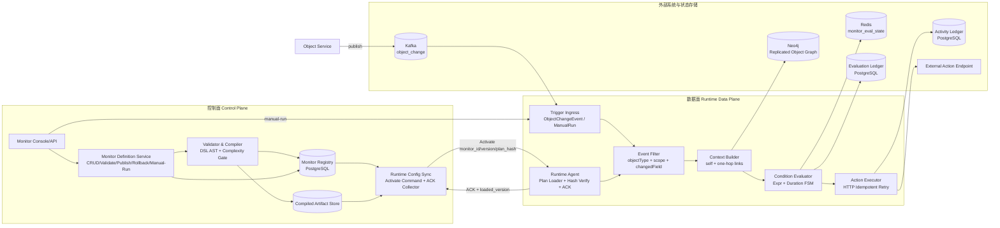

# Object Monitor Phase 1 详细设计文档（复制模式，工程可落地版）

> 文档定位：基于 `object_monitor_design_general.md` 的 Phase 1 范围，给出可直接用于研发拆解、联调与上线的详细设计。
>
> 设计目标：避免“Demo 化”，将规则定义、编译发布、运行时链路、数据模型、可靠性、可观测、验收标准一次性讲透。

---

## 1. 背景与问题澄清

### 1.1 输入文档结论（继承）

从调研与总体方案可确认以下方向正确：

1. Object Monitor 的核心语义应保持 `Monitor -> Input -> Condition -> Evaluation -> Activity` 主链路。
2. Phase 1 应优先采用“复制模式”，避免非复制回源在首期引入过高系统复杂度。
3. Runtime MVP 应包含 `Event Filter / Context Builder / Evaluator / Activity`，并先打通 Action effect。

### 1.2 当前方案仍需细化的关键缺口

基于现有文档，存在以下“正确但不够落地”的空白：

1. **DSL 子集边界不够明确**：哪些表达式能写、哪些在 Phase 1 禁止，缺少语法和复杂度约束。
2. **版本发布与运行时一致性机制未定**：缺少 monitor 版本生效协议、编译产物结构、运行时 ACK/回滚规则。
3. **Context Builder 数据约束不足**：一跳关系如何裁剪、并发拉取如何限流、快照一致性如何定义尚未落锤。
4. **持续时长与去抖机制未工程化**：状态机持久化键、冷却（cooldown）与去重键策略未给出。
5. **Action 执行可靠性策略不完整**：幂等键、重试策略、回执归一化、未知态对账缺失。
6. **验收标准偏抽象**：需要可测试的 SLO/SLI 和逐项验收用例。

本设计文档的核心工作就是填补上述缺口。

---

## 2. Phase 1 目标、范围与非目标

### 2.1 目标（必须达成）

1. 支持 monitor 的创建、校验、编译、发布、启停、版本化。
2. 支持基于 `ObjectChangeEvent` 的实时评估链路（事件触发）。
3. 支持“主对象 + 一跳关系”的上下文组装（数据来自复制存储）。
4. 支持三类条件：
   - 布尔/阈值表达式；
   - 持续时长（for duration）；
   - 简单计数窗口（近 N 分钟 count）。
5. 支持 Action（HTTP REST）执行，具备幂等、重试、超时控制。
6. 全链路可审计：Evaluation 与 Activity 可检索、可追踪。

### 2.2 范围（Phase 1 内）

- 数据模式：**复制模式**（Neo4j 为对象实例后端，Redis 做运行时缓存/状态）。
- 触发模式：事件触发（ObjectChangeEvent）；手动执行支持单 monitor 调试触发。
- Effect：仅 Action effect。
- UI：基础管理页（CRUD + 发布 + 基础运行态查看）可后补，但 API 能力必须完备。

### 2.3 非目标（Phase 1 明确不做）

1. 非复制模式（外部数据源回源、延迟补偿队列）。
2. 多 effect DAG、fallback/logic/function。
3. 跨两跳以上关系展开。
4. 复杂窗口聚合（sum/rate/distinct）与 CEP 模式检测。
5. 自动规则推荐、冲突自动修复。

---

## 3. 总体架构（Phase 1 实装视图）

### 3.0 Phase 1 逻辑架构图（准确版）



### 3.1 组件职责

1. **Monitor Definition API**：规则管理、版本管理、发布生命周期。
2. **Validator & Compiler**：DSL 校验、复杂度门禁、编译产物生成。
3. **Runtime Config Sync**：将已发布版本同步到 Event Filter 本地索引。
4. **Event Filter**：候选 monitor 快速筛选与去重。
5. **Context Builder**：按输入绑定拉取主对象及一跳关联。
6. **Condition Evaluator**：执行表达式与持续时长状态机。
7. **Action Executor**：调用外部 action API，保证幂等与重试。
8. **Ledger**：记录评估过程与动作执行轨迹。

---

## 4. 数据模型设计

## 4.1 Monitor 定义模型（控制面）

### monitor_definition

- `monitor_id` (PK)
- `tenant_id`
- `name`
- `object_type`
- `status` (`draft|published|disabled`)
- `current_version`
- `created_by/created_at/updated_at`

### monitor_version

- `monitor_id`
- `version` (联合唯一)
- `dsl_source` (JSON/YAML 文本)
- `compiled_plan` (JSON)
- `plan_hash` (SHA256)
- `complexity_score`
- `publish_status` (`pending|active|rolled_back|failed`)
- `published_by/published_at`

### compiled_plan 核心结构

```json
{
  "meta": {"monitor_id": "m_123", "version": 7, "plan_hash": "..."},
  "scope": {"tenant_id": "t1", "object_type": "Device"},
  "inputs": [
    {"name": "self.temperature", "source": "self", "field": "temperature"},
    {"name": "site.alertLevel", "source": "link", "link_type": "LOCATED_IN", "field": "alertLevel", "max_cardinality": 1}
  ],
  "condition": {
    "type": "duration",
    "expr": "self.temperature > 80 && site.alertLevel >= 2",
    "for": "60m",
    "cooldown": "10m"
  },
  "action": {
    "method": "POST",
    "url": "https://xxx/actions/high-temp",
    "timeout_ms": 3000,
    "retry": {"max_attempts": 3, "backoff_ms": [200, 1000, 3000]}
  }
}
```

## 4.2 Runtime 状态模型（数据面）

### monitor_eval_state（Redis Hash 或 PostgreSQL 热表）

Key: `tenant:monitor_id:object_pk`

- `fsm_state`: `IDLE|ENTERED|FIRING|COOLDOWN`
- `entered_at`
- `last_fire_at`
- `last_eval_at`
- `last_eval_result` (`true|false`)
- `last_event_id`

### evaluation_ledger

- `eval_id` (ULID)
- `tenant_id/monitor_id/version/plan_hash`
- `object_ref` (type + pk)
- `trigger_event_id`
- `context_hash`
- `condition_result`
- `fsm_transition` (`IDLE->ENTERED`)
- `latency_ms`
- `created_at`

### activity_ledger

- `activity_id` (ULID)
- `eval_id`
- `action_endpoint`
- `idempotency_key`
- `attempt`
- `status` (`success|retrying|failed|unknown`)
- `response_code`
- `error_code`
- `duration_ms`
- `created_at`

---

## 5. DSL 子集（Phase 1）

### 5.1 DSL 设计原则

1. 可读优先：偏声明式，不暴露底层执行细节。
2. 可编译：每个字段映射到编译产物，禁止运行时动态解释任意脚本。
3. 可门禁：可计算复杂度分数并在发布前拒绝高风险规则。

### 5.2 语法子集（YAML 示例）

```yaml
monitor:
  id: m_high_temp_01
  tenant: t1
  objectType: Device
  scope:
    tags: ["factory-a"]

input:
  self:
    - temperature
    - status
  links:
    - linkType: LOCATED_IN
      alias: site
      cardinality: one
      fields: [alertLevel]

condition:
  expr: "self.temperature > 80 and self.status == 'RUNNING' and site.alertLevel >= 2"
  for: 60m
  cooldown: 10m

action:
  type: http
  method: POST
  url: https://example/action/device_alert
  timeoutMs: 3000
  retry:
    maxAttempts: 3
    backoffMs: [200, 1000, 3000]
```

### 5.3 能力限制（发布门禁）

1. `expr` 最大长度：1024 字符。
2. 条件操作符仅支持：`== != > >= < <= and or not`。
3. 函数白名单（Phase 1）：`isNull`, `coalesce`, `abs`。
4. links 最大数量：2；每个 link 最大返回对象：1（cardinality=one）。
5. `for` 最小 1m，最大 24h；`cooldown` 最小 1m，最大 24h。

超限即 compile fail，并返回可读错误码（如 `DSL_LINK_CARDINALITY_EXCEEDED`）。

---

## 6. 编译与发布流程

### 6.1 状态机

`draft -> validated -> compiled -> published(active)`

发布失败支持：`active(vN) -> rollback(vN-1)`。

### 6.2 编译流程

1. 语法校验（schema + 字段合法性）。
2. 语义校验（字段存在性、类型兼容、link 可达性）。
3. 复杂度评分（expr 长度、link 数、持续时长、窗口大小）。
4. 产出 `compiled_plan + plan_hash`。
5. 落库并写入 artifact store。

### 6.3 运行时生效协议（避免配置漂移）

1. 发布服务发送 `Activate(monitor_id, version, plan_hash, command_id)`。
2. Runtime 拉取 artifact 并校验 hash。
3. Runtime 返回 ACK（含本地加载时间戳）。
4. 超时未 ACK 则发布状态 `degraded`，告警但不阻塞已激活节点。
5. 回滚复用同协议：`Activate(old_version)`。

---

## 7. 运行时详细设计

### 7.1 Event Filter

#### 输入
- `ObjectChangeEvent`：`event_id/tenant/object_type/object_id/changed_fields/event_time/version`。

#### 索引
1. `object_type -> monitor_ids`
2. `scope_tag -> monitor_ids`
3. `changed_field -> monitor_ids`

#### 筛选算法
- 先取三类索引交集，再按 monitor_id 排序输出，保证稳定性。
- 结果上限（默认 200）触发裁剪：按 `priority desc, monitor_id asc`。

### 7.2 Context Builder

#### 拉取策略
1. 读取主对象快照。
2. 按 compiled_plan 的 link binding 拉取一跳对象。
3. 生成 `context_hash = sha256(self_snapshot + link_snapshots + source_version)`。

#### 失败策略
- 主对象缺失：评估失败并记 `CTX_MAIN_OBJECT_NOT_FOUND`。
- 关联对象缺失：按 `cardinality` 规则填充 null 并继续评估。
- Neo4j 超时：返回 `CTX_SOURCE_TIMEOUT`，进入可重试队列（最多 2 次，间隔 2s/5s）。

### 7.3 Condition Evaluator

#### 表达式执行
- 使用 CEL（或等价安全表达式引擎）执行 AST，不允许动态代码。

#### 持续时长状态机
- `IDLE`：条件 false。
- `ENTERED`：条件首次 true，记录 `entered_at`。
- `FIRING`：`now - entered_at >= for` 且不在 cooldown。
- `COOLDOWN`：触发后进入冷却，`now - last_fire_at < cooldown`。

#### 状态转移
1. false -> `IDLE`（清除 entered_at）。
2. true 且 IDLE -> ENTERED。
3. true 且 ENTERED 达到 for -> FIRING（产生 action）。
4. FIRING 后 -> COOLDOWN。
5. COOLDOWN 到期且仍 true -> FIRING（再次触发）。

### 7.4 Action Executor

#### 幂等键

`idempotency_key = sha256(tenant_id + monitor_id + version + object_id + fire_window_start)`

#### 调用策略
1. 请求头携带 `X-Idempotency-Key` 与 `X-Monitor-Eval-Id`。
2. 超时默认 3s；可配置 1s~10s。
3. 重试仅针对 `5xx/timeout/network`，最多 3 次，指数退避。
4. `4xx` 默认不重试（除 429）。

#### UNKNOWN 对账
- 请求发送成功但响应丢失时标记 `unknown`。
- 异步对账任务基于 idempotency_key 查询外部回执（若接入方支持）。

---

## 8. API 设计（Phase 1 必需）

1. `POST /api/monitors`：创建 monitor（draft）。
2. `PUT /api/monitors/{id}/draft`：更新 DSL。
3. `POST /api/monitors/{id}/validate`：校验并返回门禁报告。
4. `POST /api/monitors/{id}/publish`：编译并发布新版本。
5. `POST /api/monitors/{id}/rollback`：回滚到指定版本。
6. `POST /api/monitors/{id}/manual-run`：手动触发单对象评估。
7. `GET /api/evaluations`：查询评估记录。
8. `GET /api/activities`：查询动作执行记录。

错误码规范建议：`OM_DSL_* / OM_CTX_* / OM_EVAL_* / OM_ACT_*` 分域管理。

---

## 9. 可观测与运维

### 9.1 核心指标（SLI）

1. `eval_latency_p95`：事件入队到评估结束。
2. `action_success_rate`：动作最终成功率。
3. `config_apply_latency_p95`：发布到 runtime 生效延迟。
4. `dropped_events_total`：因超限/异常被丢弃事件数。
5. `eval_state_store_hit_rate`：状态存储命中率。

### 9.2 Phase 1 SLO（可验收）

1. 可用性 >= 95%。
2. `eval_latency_p95 < 3s`。
3. Action 执行成功率 >= 99%（可重试后）。
4. 发布生效 p95 < 30s。

### 9.3 日志与追踪

- Trace 贯通 ID：`trace_id = event_id`。
- 关键日志字段：`tenant_id/monitor_id/version/object_id/eval_id/activity_id`。
- 必须支持从 activity 反查 evaluation，再反查 source event。

---

## 10. 安全与治理

1. 多租户隔离：monitor 查询与运行态必须带 `tenant_id` 强约束。
2. 权限模型：`monitor:read`, `monitor:write`, `monitor:publish`, `monitor:operate`。
3. Action 出站白名单：域名/IP 段双重白名单，禁止任意外呼。
4. Secrets 管理：Action 鉴权信息走密钥管理服务，不落 DSL 明文。
5. 审计：所有 publish/rollback/manual-run 必须记录操作人和变更 diff。

---

## 11. 测试与验收方案

### 11.1 测试分层

1. **单元测试**：DSL parser、复杂度评分、状态机转移、幂等键生成。
2. **组件测试**：Event Filter 索引更新、Context Builder 拉取失败重试。
3. **集成测试**：Kafka -> Runtime -> Action Mock -> Ledger 全链路。
4. **回归测试**：版本发布/回滚一致性与配置漂移检测。

### 11.2 验收场景（必须全过）

1. 单条件阈值规则准确触发（含边界值）。
2. 持续时长规则在 `for` 到达前不触发，到达后只触发一次并进入 cooldown。
3. cooldown 期间重复事件不重复触发。
4. 发布新版本后，旧版本停止生效；回滚后旧逻辑恢复。
5. Action endpoint 返回 500 时按策略重试并最终落 activity 轨迹。
6. 下游超时导致 unknown 状态可被对账任务收敛。

---

## 12. 研发拆解建议（6~8 周）

### 里程碑 M1（第 1~2 周）
- DSL schema + validator + compile artifact。
- monitor_definition/monitor_version 表结构与 API 草版。

### 里程碑 M2（第 3~4 周）
- Event Filter + Context Builder + Evaluator（含状态机）打通。
- Evaluation Ledger 入库与查询 API。

### 里程碑 M3（第 5~6 周）
- Action Executor（幂等、重试、超时、unknown）完成。
- Activity Ledger 与联调。

### 里程碑 M4（第 7~8 周）
- 发布/回滚协议、可观测看板、压测与故障演练。
- Phase 1 验收与上线评审。

---

## 13. 风险与应对

1. **Neo4j 查询放大风险**：通过 link cardinality=one + 查询超时 + 热点缓存规避。
2. **规则爆炸导致评估抖动**：发布门禁 + Event Filter 裁剪 + 优先级队列。
3. **下游 Action 不幂等**：强制接入幂等键协议，不满足则限制接入等级。
4. **版本漂移**：plan_hash 校验 + runtime ACK + 周期性对账任务。

---

## 14. Phase 1 完成定义（DoD）

满足以下全部条件才可宣告完成：

1. 上述 8 个核心 API 可用且具备权限与审计。
2. 至少 20 条典型规则在预发稳定运行 7 天。
3. SLO 连续 7 天达标：`可用性>=95%, eval p95<3s`。
4. 发布、回滚、手动执行、全链路追踪均通过演练。
5. 形成运维手册（故障处理、扩容、回放、对账）。
