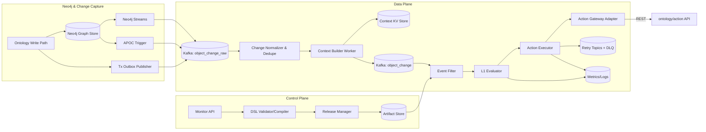

# Object Monitor Phase 1 详细设计文档

> 适用范围：`docs/object_monitor/object_monitor_design_general.md` 第 9 章 **Phase 1（6~8 周）**。  
> 目标：在不引入过重技术栈的前提下，交付“可上线、可追溯、可扩展”的第一阶段能力，并为 Phase 2 预留演进接口。

---

## 1. 设计输入与范围边界

### 1.1 输入结论

结合调研与总体方案，Phase 1 继承以下约束：

1. 语义模型采用 `Monitor -> Input -> Condition -> Evaluation -> Activity`，保留通知/动作闭环能力。
2. 运行时优先复制模式与 CQRS 思路，避免评估热路径频繁回源图存储。
3. 动作链路采用 MVP 方案：`REST + 幂等 + 重试 + DLQ`，不强依赖 Temporal。
4. 触发入口统一建模：对象变更触发、时间触发、手动触发。
5. 对象后端为 Neo4j 时，必须覆盖“应用写入 Neo4j”与“直接写 Neo4j”两类变更来源。

### 1.2 Phase 1 强约束

- **仅支持复制模式（Copy）**：上下文由物化层前置准备，Evaluator 不做随机图库查询。
- **后端以 Neo4j 为事实源**：变更采集支持双通道接入并在归一化层去重。
- **规则能力最小子集**：仅 L1（无状态）条件，不做 CEP 时窗。
- **对象关系范围**：`主对象 + 一跳关系`。
- **Effect 最小集**：仅 Action（HTTP/REST），具备幂等、重试、DLQ、人工补偿入口。
- **部署前提**：Phase 1 面向私有云/本体环境单环境部署，隔离与配额机制按单环境版本实现。

---

## 2. Phase 1 目标与非目标

### 2.1 目标（Must Have）

1. Monitor 生命周期：创建、校验、发布、停用、版本化。
2. 触发与评估：消费 `ObjectChangeEvent`，完成候选规则过滤与 L1 条件求值。
3. 活动记录：持久化 Evaluation/Activity，支持按 monitor/object/time 查询。
4. 动作执行：命中后调用 Action API，具备幂等、重试、DLQ。
5. 基础可观测：延迟、命中率、失败率、堆积、DLQ 量可观测。

### 2.2 非目标（Won't Have）

- CEP 持续时长/窗口条件（例如“连续 1 小时高温”）。
- 多 effect DAG、fallback 编排、人工审批节点。
- 非复制模式（Signal Fetcher）与 Two-Stage Filtering 自动迁移。
- 跨环境规则编排与高级成本优化。

---

## 3. 总体架构与主流程



主流程顺序：**变更采集 -> 归一化去重 -> 上下文更新 -> 规则过滤 -> L1 求值 -> Action 执行 -> 结果记录与可观测**。

---

## 4. Neo4j 变更采集策略

### 4.1 双通道与补偿通道

1. **通道 A：Outbox 事件（应用写路径）**
   - `InstanceService/ActionService` 写入提交后发布 `ObjectChangeRawEvent`。
   - 语义最完整（actor/trace/业务上下文）。

2. **通道 B：库级采集事件（直写路径）**
   - Enterprise/Aura 优先 Neo4j CDC。
   - Community 优先 `Neo4j Streams`，不可用时降级 `APOC Trigger`。

3. **通道 C：Reconcile 补偿（最终一致）**
   - 周期扫描 `updated_at > watermark` 与 tombstone/delete_audit。
   - 输出统一 raw 事件进入同一归一化链路。

### 4.2 Community 4.4.48 适配

Community 4.4.48 不具备 `db.cdc.*`，采用：

- **主通道**：Outbox（必须）
- **副通道 A**：Neo4j Streams（推荐）
- **副通道 B**：APOC Trigger（次选）
- **副通道 C**：Reconcile Scanner（兜底）

统一去重键：`object_type + object_id + object_version`。  
统一审计字段：`change_source`（`outbox`/`neo4j_cdc`/`neo4j_streams`/`neo4j_apoc_trigger`）。

### 4.3 端到端验证用例（User money -> tag）

1. 初始化 `User(U100)`：`money=50, tag='poor'`。
2. 更新 `money=150`（模拟直写/外部同步路径）。
3. Streams 映射为 `ObjectChangeEvent(change_source='neo4j_streams')`。
4. 规则 `money > 100` 命中。
5. 执行 `action://user/tag-rich`。
6. 断言：`User(U100).tag == 'rich'`，Activity 为 `succeeded`。

---

## 5. 核心模块设计

### 5.1 Monitor API 与 DSL Compiler

#### DSL 最小子集

```yaml
monitor:
  id: m_high_temp
  objectType: Device
  scope: "plant_id in ['P1','P2']"
input:
  fields: [temperature, status, updated_at]
condition:
  expr: "temperature >= 80 && status == 'RUNNING'"
effect:
  action:
    endpoint: "action://ticket/create"
    idempotencyKey: "${monitorId}:${objectId}:${sourceVersion}"
```

支持：比较、布尔、in-list、空值判断、简单字符串函数（`startsWith`）。  
不支持：聚合窗口、多跳 join、自定义脚本。

#### 编译产物

`MonitorArtifact`：
- `monitor_version`
- `plan_hash`
- `field_projection`
- `predicate_ast`
- `action_template`
- `limits`（max_qps/retry_policy）

发布前校验：字段存在性、表达式复杂度、Action 模板完整性、幂等键模板合法性。

### 5.2 Context Builder Worker

职责：对象变更增量更新到 `Context KV Store`，形成评估可直接读取的快照。

- 输入：Tx Log / CDC / Streams 归一化事件
- 输出：
  - `Context KV` 快照（key=`objectType:objectId`）
  - `ObjectChangeEvent`（含 changed_fields/source_version/object_version）
- 一跳关系写入期展开：`device.owner.name -> owner_name`
- 失败写入进入 `context_build_retry`

### 5.3 Event Filter

两层过滤：
1. 静态过滤：按 `objectType + changed_fields` 定位候选 monitor。
2. Scope 过滤：执行编译后的 scope predicate。

核心结构：
- `field_to_monitors` 倒排索引
- `monitor_runtime_cache`（artifact + 限流 + action 模板）

### 5.4 L1 Evaluator

流程：
1. 读取候选 monitor。
2. 从 Context KV 拉取快照。
3. 使用 `predicate_ast` 求值。
4. 产出 `EvaluationRecord`（hit/miss + reason + latency + snapshot_hash）。

幂等键：`monitorId:objectId:sourceVersion`。

### 5.5 Action Executor

调用模型：
- 同步调用 Action Gateway（HTTP）。
- 失败按策略写入 Retry Topic，超过阈值进入 DLQ。
- 业务 4xx 直接失败记录并告警；网络异常/5xx 可重试。

与 Action 体系对齐：
- `action_ref`：指向 action ID 或 URI。
- `triggered_by`：`monitor-system` 或 `monitor:{monitor_id}`。
- `input_payload`：命中上下文裁剪结果（敏感字段禁止透传）。
- `Idempotency-Key`：`monitorId:objectId:sourceVersion:actionId`。

### 5.6 对接当前仓库 Action 能力（Phase 1 必保）

为避免 Monitor 与 Action 两套系统脱节，Phase 1 保留最小但可落地的对接方案：

1. **调用入口统一**
   - Monitor 只通过 `ActionGatewayAdapter` 调用仓库现有 Action API，不直接操作 ApplyEngine。
   - 规则里使用 `action://<action_key>`，在发布时解析到 Action 实际 ID/版本。

2. **请求载荷映射**
   - 固定传递字段：`triggered_by`、`idempotency_key`、`trace_id`、`source_event_id`。
   - 业务载荷由 `input_payload` 提供，仅允许白名单字段（避免 Context 全量透传）。
   - 当 Action 依赖实例定位时，追加 `input_instances`（`object_type`、`primary_key`、`version`）。

3. **结果状态对齐**
   - Action 执行状态按 `queued/validating/executing/applying/succeeded/failed` 回传。
   - Monitor 侧 Activity 至少记录：`action_execution_id`、`action_status`、`error_code`、`error_message`。
   - 对长耗时 Action，支持通过 execution_id 轮询补齐最终状态。

4. **重试边界约定**
   - Monitor 仅重试网络超时与 5xx，4xx 视为业务失败直接落库告警。
   - 所有重试保持相同 `Idempotency-Key`，由 Action 侧幂等去重。

5. **闭环防风暴约束**
   - Action 回写 Neo4j 时必须带 `last_modified_by_action_id`。
   - Monitor 在事件归一化阶段识别该标记，并结合规则配置决定是否抑制“动作触发动作”回环。

---

## 6. 关键数据契约

### 6.1 ObjectChangeEvent

```json
{
  "event_id": "uuid",
  "object_type": "Device",
  "object_id": "D1001",
  "source_version": 982133,
  "object_version": 2201,
  "changed_fields": ["temperature", "status"],
  "event_time": "2026-03-09T10:00:00Z",
  "trace_id": "..."
}
```

### 6.2 EvaluationRecord

```json
{
  "evaluation_id": "uuid",
  "monitor_id": "m_high_temp",
  "monitor_version": 3,
  "object_id": "D1001",
  "source_version": 982133,
  "result": "HIT",
  "reason": "temperature(86)>=80 && status=RUNNING",
  "snapshot_hash": "sha256:...",
  "latency_ms": 34,
  "event_time": "2026-03-09T10:00:00Z"
}
```

---

## 7. 一致性、可靠性与性能

### 7.1 一致性

1. 至少一次处理 + 幂等写入。
2. 版本对齐：`object_version` 不低于事件版本；否则进入 reconcile。
3. 发布一致性：monitor 版本切换有明确生效点。

### 7.2 可靠性

- Kafka 消费按 `object_type/object_id` 分区键确保同对象局部有序。
- Retry Topic 分层削峰。
- Activity/执行日志写入失败可重试并告警。

### 7.3 性能预算（Phase 1 SLO）

- 规则规模：`<= 1k`
- 对象规模：`<= 1M`
- 吞吐目标：`2k events/s`（可扩展至 5k）
- 评估延迟：P95 `< 3s`
- 系统可用性：`>= 95%`

---

## 8. 安全、可观测与运维

### 8.1 安全与治理

1. Monitor 发布/停用受 RBAC（`monitor_admin`）保护。
2. 配额控制：monitor 数、QPS、并发 action。
3. 审计记录：变更人、diff、发布时间、生效版本。

### 8.2 可观测指标

- Ingress：event lag、消费速率、丢弃率。
- Evaluator：候选数、命中率、求值耗时、reconcile 比例。
- Action：成功率、重试率、DLQ 量。
- Storage：写入延迟、失败率。

### 8.3 运维能力

- `DLQ replay` 工具。
- `monitor dry-run`（只求值不触发 action）。
- 全链路 `trace_id`：`event -> evaluation -> action`。

---

## 9. 实施计划（6~8 周）

### W1：契约与骨架

- 完成 DSL 最小子集校验与 artifact 原型。
- 冻结包结构：`monitor/api`、`monitor/compiler`、`monitor/runtime`、`monitor/storage`。
- 出口：样例规则 `plan_hash` 稳定，契约评审通过。

### W2：发布链路与归一化

- 打通 definition/publish API（含版本切换与回滚元数据）。
- 落地 `object_change_raw -> normalize/dedupe -> object_change`。
- 出口：重复事件不重复评估，版本回退进入 reconcile。

### W3-W4：评估与执行闭环

- 完成 `Event Filter + L1 Evaluator + Action Executor` 主链路。
- 接入 Activity 记录、重试与 DLQ。
- 出口：端到端用例通过，故障矩阵覆盖 4xx/5xx/超时。

### W5-W6：压测、灰度、上线

- 压测与性能调优（并发消费、批量提交、序列化复用）。
- 灰度发布与回滚门禁（流量比例、DLQ 警戒线、失败阈值）。
- 出口：满足 Phase 1 SLO，具备上线条件。
