# Object Monitor 对标调研文档（Palantir / 竞品 / 存储模式）

本文件聚焦 Object Monitor 的调研部分：包含 Palantir 能力拆解、OSv2 架构下方案分析、竞品全景对比与存储模式分析。
方案设计与实施内容已拆分至 `object_monitor_design_general.md`。

---

## 2. Palantir Object Monitor 能力拆解与关联模型

> 注：Palantir 文档页面显示 `Object Monitors [Sunset]`，因此对标应聚焦“能力与机制”而非界面/名词 1:1 复刻。

### 2.1 核心能力域

1. **Ontology 域**：Object Type、Link Type、Object Set、属性模型。
2. **Monitor 定义域**：监控范围、输入（Input）、条件（Condition）、评估（Evaluation）。
3. **执行域**：流式触发、定时触发、批量重算、回放。
4. **结果域**：Activity（评估活动）、告警通知（Notifications）、自动动作（Actions）。
5. **治理域**：权限、配额、审计、限流、失败恢复。

### 2.2 与本项目的映射

- 本体对象状态变化 -> Monitor 输入事件。
- 持续时长（如高温 1 小时） -> 流式状态机/窗口计算。
- 命中后 -> 通知 + Action 编排 + 全链路审计。

### 2.3 基于 Palantir 官方文档的精简能力总结（Object Monitors）

> 本小节基于官方文档做“能力抽取”，重点关注可对标的实现机制，而非 UI 流程细节。

1. **产品状态与演进方向**
   - Object Monitors 被官方标注为 `[Sunset]`，但仍有完整概念与机制文档，且明确由 Automate 作为向后兼容替代入口。
   - 对标建议：将 Object Monitors 视为“概念模型来源”，将 Automate 视为“当前产品形态来源”。

2. **核心对象模型（Monitor -> Input -> Condition -> Evaluation -> Activity）**
   - `Monitor`：定义监控目标与运行边界。
   - `Input`：从对象属性/关联数据中提取评估输入。
   - `Condition`：定义触发条件（阈值、对象状态、时间相关约束等）。
   - `Evaluation`：一次条件求值执行，产生命中/未命中结果。
   - `Activity`：执行历史与结果轨迹，支撑排障和审计。

3. **结果处理链路（Notifications / Actions）**
   - 命中后可进入通知链路（订阅者接收监控活动变更）。
   - 可调用动作（Action）实现系统联动，形成“检测 -> 响应”的闭环。

4. **工程约束与运维要点（Limits / Errors）**
   - 官方提供 limits 与 errors 文档，说明该能力具备明确边界与错误语义。
   - 对标实现应提前固化：规模上限、执行失败分类、重试与降级策略、错误可观测性。

5. **创建流程的可迁移要点**
   - “创建新 monitor”的流程本质是：选择对象范围 -> 配置输入 -> 编写条件 -> 定义通知/动作 -> 验证运行。
   - 对我们而言，可迁移为 DSL/控制面的标准发布流程。

**参考链接（Object Monitors）**
- Overview: https://www.palantir.com/docs/foundry/object-monitors/overview/
- Create new object monitor: https://www.palantir.com/docs/foundry/object-monitors/create_new_object_monitor/
- Monitor: https://www.palantir.com/docs/foundry/object-monitors/monitor/
- Input: https://www.palantir.com/docs/foundry/object-monitors/input/
- Condition: https://www.palantir.com/docs/foundry/object-monitors/condition/
- Evaluation: https://www.palantir.com/docs/foundry/object-monitors/evaluation/
- Activity: https://www.palantir.com/docs/foundry/object-monitors/activity/
- Notifications: https://www.palantir.com/docs/foundry/object-monitors/notifications/
- Actions: https://www.palantir.com/docs/foundry/object-monitors/actions/
- Limits: https://www.palantir.com/docs/foundry/object-monitors/limits/
- Errors: https://www.palantir.com/docs/foundry/object-monitors/errors/

### 2.4 Automate 中与 Object Monitor 对应能力的实现分析

> 结论先行：Automate 可视为 Object Monitor 的能力扩展版，且官方明确其为向后兼容替代入口。对标时应“以 Automate 能力上限设计、以 Object Monitor 概念保持语义兼容”。

1. **Condition 维度能力（对齐 Input/Condition/Evaluation）**
   - 支持时间条件（定时/周期）、对象集条件（对象变化触发）、高级条件设置（队列、对象丢弃、循环行为等）。
   - 支持自动化依赖（父子自动化编排）与流式触发（Streaming），对应我们“批 + 流”混合执行需求。

2. **Effects 维度能力（对齐 Notifications/Actions）**
   - Action effects：触发动作系统。
   - Logic / Function effects：触发逻辑计算与函数执行。
   - Notification effect：通知下发。
   - Fallback effect：主 effect 失败时执行替代动作（很关键，直接对应故障韧性设计）。
   - Effect settings：并发、重试、执行策略等治理配置。

3. **运行治理能力（可直接借鉴）**
   - Manual execution：手动执行，适用于回填与验证。
   - Execution settings：执行参数与队列行为控制。
   - Performance best practices：性能与排障建议，适合映射为平台运维手册。
   - Integrations：与 Foundry 其他能力的原生集成方式，便于我们设计“监控 -> 流程/分析/通知”协同边界。

4. **对本项目的实现启发（聚焦 Object Monitor 范围）**
   - 触发面：必须同时覆盖对象变更触发与时间触发。
   - 执行面：effect 链路应具备失败回退（fallback）与执行设置（并发/重试/限流）。
   - 治理面：需要手动执行、依赖编排、流式模式三类能力，才能覆盖生产回放、跨流程协调与实时性场景。

**参考链接（Automate，聚焦含 Object Monitor 能力部分）**
- Overview: https://www.palantir.com/docs/foundry/automate/overview/
- Getting started: https://www.palantir.com/docs/foundry/automate/getting-started/
- Condition / Time: https://www.palantir.com/docs/foundry/automate/condition-time/
- Condition / Objects: https://www.palantir.com/docs/foundry/automate/condition-objects/
- Condition settings: https://www.palantir.com/docs/foundry/automate/condition-settings/
- Automation dependencies: https://www.palantir.com/docs/foundry/automate/automation-dependencies/
- Streaming: https://www.palantir.com/docs/foundry/automate/streaming/
- Effects overview: https://www.palantir.com/docs/foundry/automate/effects/
- Effect / Actions: https://www.palantir.com/docs/foundry/automate/effect-actions/
- Effect / Logic: https://www.palantir.com/docs/foundry/automate/effect-logic/
- Effect / Function: https://www.palantir.com/docs/foundry/automate/effect-function/
- Effect / Notification: https://www.palantir.com/docs/foundry/automate/effect-notification/
- Effect / Fallback: https://www.palantir.com/docs/foundry/automate/effect-fallback/
- Effect settings: https://www.palantir.com/docs/foundry/automate/effect-settings/
- Manual execution: https://www.palantir.com/docs/foundry/automate/manual-execution/
- Execution settings: https://www.palantir.com/docs/foundry/automate/execution-settings/
- Performance best practices: https://www.palantir.com/docs/foundry/automate/performance-best-practices/
- Integrations: https://www.palantir.com/docs/foundry/automate/integrations/
- Example / weekly report: https://www.palantir.com/docs/foundry/automate/example-weekly-report/
- Example / relative time condition: https://www.palantir.com/docs/foundry/automate/example-relative-time-condition/
- Example / dynamic contract owner: https://www.palantir.com/docs/foundry/automate/example-dynamic-contract-owner/

---

## 3. Palantir OSv2架构下的Object Monitor方案分析（推断型）

> 说明：公开文档对 OSv2 内部实现细节披露有限。以下为基于常见企业数据平台架构、Palantir 文档语义和工程实践的“高可信推断”，用于设计决策。

### 3.1 问题定义：在 OSv2 链路下，Object Monitor/Automate 到底“跑”在哪里

给定你关注的数据链路：`Datasets -> Object Data Funnel -> (Indexing) -> Object Databases (OSv2/OQL)`，可将 Monitor 能力拆成两条主线：

1. **数据主线（对象状态生成）**：把 Dataset 变更持续编织为“可查询对象状态”。
2. **自动化主线（条件评估与动作执行）**：在对象状态变更或时间触发下，执行条件求值并触发 effects（通知、动作、函数、逻辑等）。

因此，Object Monitor（以及被 Automate 替代后的同类能力）本质上不是“单独数据库功能”，而是**构建在 Ontology 对象存储与索引层之上的事件驱动评估运行时**。

### 3.2 结合官方语义的分层实现推导（高可信）

结合 Ontology 与 Monitor/Automate 官方文档语义，可推导出如下分层：

- **L0 数据资产层（Datasets）**：原始或治理后的业务数据。
- **L1 对象构建层（Object Data Funnel）**：将 dataset 记录映射/归并为对象与关系的增量变更流。
- **L2 存储索引层（OSv2 + 索引 + 查询引擎）**：
  - OSv2 持久化对象最新快照与版本信息；
  - 索引层维护按对象类型/属性/关系可检索结构；
  - OQL/查询能力在此层对外提供对象过滤、关联与检索。
- **L3 自动化执行层（Object Monitor / Automate Runtime）**：
  - 订阅 L1/L2 的对象变更事件；
  - 结合时间触发器进行条件评估；
  - 生成 evaluation/activity，并驱动 effects。
- **L4 治理观测层（Activity + Errors + Limits）**：
  - 记录执行轨迹与失败分类；
  - 对并发、队列、重试、吞吐做治理。

### 3.3 关键数据结构推导（实现 Object Monitor 的最小内核）

在 OSv2 架构下，建议把 Monitor 运行时最少抽象为 5 类核心实体：

1. `ObjectChangeEvent`
   - 字段：`objectType`, `objectId`, `changedFields`, `eventTime`, `sourceWatermark`, `snapshotRef`。
   - 来源：Object Data Funnel 或对象索引更新事件。

2. `MonitorDefinition`（或 Automate 定义）
   - 字段：`scope`, `inputBindings`, `conditionExpr`, `effects`, `executionPolicy`, `version`。
   - 对应官方 Monitor/Input/Condition/Effects 语义。

3. `EvaluationRecord`
   - 字段：`monitorId`, `objectId`, `triggerType(event|time|manual)`, `match`, `reason`, `latencyMs`。
   - 对应官方 Evaluation。

4. `ActivityRecord`
   - 字段：`evaluationId`, `effectResults[]`, `errorCode`, `retryTrace`, `createdAt`。
   - 对应官方 Activity/Errors。

5. `EffectExecution`
   - 字段：`effectType(action|notification|logic|function|fallback)`, `idempotencyKey`, `status`。
   - 对应官方 Effects/Fallback。

### 3.4 端到端执行链路（按“对象变化触发”拆解）

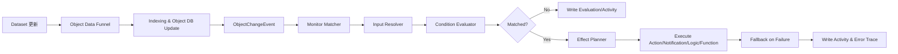

**链路解释（与 OSv2 对齐）**
- `B->C`：对象状态先落在对象数据库/索引，不建议让 Monitor 直接回源 Dataset 做高频 join。
- `D`：评估触发应该消费“对象变更事件”，而不是表级 CDC 原始事件，降低规则层语义耦合。
- `F`：Input Resolver 优先读取对象当前快照 + 必要关联对象，必要时读增量上下文。
- `L`：fallback 是生产可用性的关键机制（官方 Automate 明确提供）。

### 3.5 时间触发、流式触发、手动执行如何统一

结合 Object Monitor 与 Automate 文档，可推导统一触发模型：

- `event trigger`：对象变化触发，低延迟路径。
- `time trigger`：定时/周期评估，适合 SLA 巡检与补偿。
- `manual trigger`：人工执行，适合回填与验证。
- `streaming mode`：高频场景下以流式队列执行 effects（秒级）。

实现上可统一成一个 `TriggerEnvelope`：
- `triggerType`, `triggerTime`, `targetObjectSet`, `reason`, `executionSettingsRef`。

这样可让评估引擎与 effect 引擎共用调度器，避免多套运行时。

### 3.6 在 OSv2 下实现持续时长/状态机规则的建议

持续时长规则（例如“温度 > 120 持续 1h”）是 Object Monitor 的难点，建议分层实现：

1. **对象层（OSv2）只保留事实状态**：当前值、更新时间、关联关系。
2. **规则层（Runtime State Store）维护时长状态**：
   - `enteredAt`, `lastSeenAt`, `accumulatedDuration`, `stateVersion`。
3. **恢复策略**：
   - 从 checkpoint 恢复状态；
   - 使用 `sourceWatermark` 回放对象事件补齐窗口。
4. **判定语义**：
   - 严格按事件时间（event-time）做时长计算；
   - 与处理时间（processing-time）分离，减少乱序误报。

### 3.7 一致性与正确性：如何避免误报、漏报、重复动作

在 `Datasets -> Funnel -> Index -> Runtime` 多段链路下，推荐以下一致性契约：

1. **评估输入快照可追溯**
   - `EvaluationRecord` 写入 `objectSnapshotVersion` 与 `sourceWatermark`。

2. **Effect 幂等**
   - 每个 effect 都使用 `idempotencyKey = monitorId + objectId + conditionWindow + effectType`。

3. **双重去重**
   - 评估去重：防止同一对象同一版本重复评估。
   - 动作去重：防止评估重试导致外部动作重复执行。

4. **延迟补偿**
   - 对乱序/延迟对象事件进入补偿队列重算。

5. **Activity 只追加**
   - 不覆盖历史活动；重算写新记录并关联原始 evaluation。

### 3.8 结合 Limits/Errors 的容量与故障策略推导

基于官方提供 limits/errors 文档的事实，可推导生产策略：

- **配额治理**：按租户、对象类型、automation/monitor 维度设上限。
- **隔离策略**：重型规则与轻型规则分池执行，避免队头阻塞。
- **失败分级**：
  - `input resolve failure`（输入解析失败）
  - `condition eval failure`（表达式/数据类型失败）
  - `effect execution failure`（外部动作失败）
  - `platform throttled`（平台限流）
- **回退策略**：effect 失败触发 fallback；fallback 失败再落审计与告警。

### 3.9 面向 Ontology 私有化实现的“近似 Palantir”落地蓝图

如果在自研 Ontology 里复刻该机制，建议组件化为：

1. **Object Change Bus**：承接 Funnel/Index 产出的对象变更事件。
2. **Monitor Compiler**：将 DSL/规则编译为可执行 plan（scope、input、condition、effects）。
3. **Evaluation Engine**：
   - 支持 event/time/manual 三触发；
   - 支持状态机规则与窗口规则；
   - 输出 evaluation + activity。
4. **Effect Orchestrator**：
   - 支持 action/notification/function/logic/fallback；
   - 内置幂等、重试、限流、熔断。
5. **Activity & Audit Store**：
   - 写入全链路可追溯字段（snapshot/version/watermark/error/retry）。
6. **Operations Plane**：
   - 提供手动执行、重放、队列观察、失败重驱、容量看板。

### 3.10 可信度分层（避免过度推断）

- **高可信（官方直接表达）**
  - Object Monitor 处于 sunset，Automate 为向后兼容替代。
  - 存在 monitor/input/condition/evaluation/activity/notifications/actions 概念。
  - Automate 存在 streaming、effects、fallback、manual execution、performance best practices。

- **中高可信（结合术语与工程常识推导）**
  - OSv2/对象索引层是 Monitor 运行时主要读取面。
  - 评估与 effect 执行应解耦，activity 为审计主线。

- **中可信（实现细节级推导）**
  - 内部 topic/状态存储结构、具体调度器实现、分片策略等。
  - 这些需要通过 PoC 压测与行为实验进一步校准。

### 3.11 参考链接（Ontology + Object Monitor + Automate）

**Ontology（公开入口）**
- Overview: https://www.palantir.com/docs/foundry/ontology/overview/

**Object Monitors / Automate（与实现机制直接相关）**
- Object Monitors overview: https://www.palantir.com/docs/foundry/object-monitors/overview/
- Monitor: https://www.palantir.com/docs/foundry/object-monitors/monitor/
- Input: https://www.palantir.com/docs/foundry/object-monitors/input/
- Condition: https://www.palantir.com/docs/foundry/object-monitors/condition/
- Evaluation: https://www.palantir.com/docs/foundry/object-monitors/evaluation/
- Activity: https://www.palantir.com/docs/foundry/object-monitors/activity/
- Limits: https://www.palantir.com/docs/foundry/object-monitors/limits/
- Errors: https://www.palantir.com/docs/foundry/object-monitors/errors/
- Automate overview: https://www.palantir.com/docs/foundry/automate/overview/
- Automate streaming: https://www.palantir.com/docs/foundry/automate/streaming/
- Effect fallback: https://www.palantir.com/docs/foundry/automate/effect-fallback/
- Performance best practices: https://www.palantir.com/docs/foundry/automate/performance-best-practices/

> 说明：Ontology 下部分 OSv2/OQL/Object Data Funnel 细节页面在公开站点可能存在路径调整或访问限制；本节对这些内部实现采用“公开语义 + 工程推导”的方式给出近似实现方案。

## 4. 竞品全景调研（产品/平台/开源）

本节按“可直接对标”与“组合对标”分类，强调与 Object Monitor 的关联关系。

## 4.1 企业产品（可直接采购或深度集成）

> 本节对每款产品都给出：定位、关键组件、与 Object Monitor 的映射、集成方式、局限性，并附逻辑视图。

### 4.1.1 ServiceNow Event Management + CMDB

**产品定位**
- ServiceNow 以 CMDB（配置项/CI）为对象中心，Event Management 负责事件归并、告警生成与工单闭环。
- 在“对象-事件-动作”链路上，与 Object Monitor 目标最接近的是运营闭环而非本体语义建模。

**典型逻辑视图（ServiceNow 单产品）**

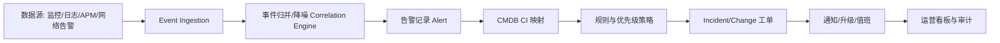

**与 Object Monitor 映射**
- `Object` 对应 CMDB CI（但偏 IT 资产，不是通用业务对象）。
- `Condition/Evaluation` 对应告警规则与事件相关性。
- `Actions` 对应 ITSM 工单/流程自动化。

**适配建议**
- 作为“动作与运营闭环”下游系统（创建事件、工单、审批）。
- 不建议将其作为主 Ontology/规则运行时。

**图解说明（本节 Mermaid）**
- 读图顺序：`数据源 -> Event Ingestion -> Correlation -> Alert -> CMDB 映射 -> 工单 -> 通知/值班`。
- 图中最关键节点是 `CMDB CI 映射`：它把“事件”绑定到“对象”，从而可进入对象维度治理。
- 该图体现的是“运营闭环能力强”，但业务本体语义（非 IT 资产）需要外部本体系统补齐。

---

### 4.1.2 Datadog Monitors + Workflow Automation

**产品定位**
- Datadog 强于可观测数据聚合、监控规则、异常检测和通知编排。
- 对业务对象语义（对象关系、对象集）表达能力相对有限。

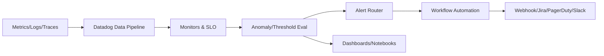

**与 Object Monitor 映射**
- `Evaluation/Notifications` 非常强；
- `Object Model` 与 `Link Type` 需要外部系统补足。

**适配建议**
- 作为外层告警分发与运维自动化；
- 核心对象语义和持续时长状态建议留在本体平台。

**图解说明（本节 Mermaid）**
- 读图顺序：`可观测数据 -> Monitors/SLO -> 异常或阈值评估 -> 路由 -> 自动化工作流`。
- `Alert Router` 是治理核心，负责把评估结果分发到不同目标系统。
- 该图强调“评估与分发能力强”，对象关系语义仍需本体平台承载。

---

### 4.1.3 Splunk ITSI / ES

**产品定位**
- 强项是事件关联、风险评分、SOC 分析与调查闭环。
- 适合“安全/运维事件态势”，不是对象本体优先产品。

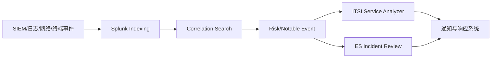

**与 Object Monitor 映射**
- `Activity/Audit` 与事件调查链路较强。
- `Object-centric` 规则需要额外对象语义层。

**适配建议**
- 作为安全分析下游；
- 不替代本体对象监控核心引擎。

**图解说明（本节 Mermaid）**
- 读图顺序：`多源安全/运维事件 -> 索引 -> 关联检索 -> 风险事件 -> ITSI/ES 分支 -> 响应系统`。
- `Correlation Search` 是价值核心，决定噪声收敛质量与告警有效性。
- 该图更像“事件调查和安全运营中枢”，不是对象本体规则主引擎。

---

### 4.1.4 Dynatrace（Davis AI + Automation）

**产品定位**
- 以应用拓扑和性能根因为主，适合技术栈异常诊断。

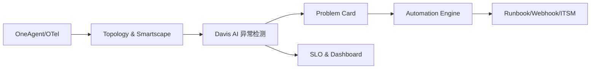

**与 Object Monitor 映射**
- 技术对象（服务/主机）监控强；
- 业务对象和跨域关系需外部建模。

**适配建议**
- 作为技术运行态监控并行能力；
- 与业务对象监控分层协同。

**图解说明（本节 Mermaid）**
- 读图顺序：`采集代理 -> 拓扑图 -> AI 异常检测 -> 问题卡 -> 自动化执行`。
- `Topology & Smartscape` + `Davis AI` 组合决定根因分析质量。
- 图中显示其强项是技术运行态诊断，业务对象规则仍需额外层。

---

### 4.1.5 Elastic Watcher / Kibana Alerting

**产品定位**
- 面向查询型告警：基于索引和 DSL 查询进行条件评估。

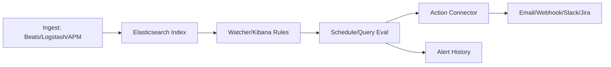

**与 Object Monitor 映射**
- 能覆盖部分 `condition/evaluation`；
- 复杂关系规则、持续状态机通常需外置流式引擎。

**适配建议**
- 中等复杂场景可快速落地；
- 对关系密集规则建议配合图或流计算组件。

**图解说明（本节 Mermaid）**
- 读图顺序：`数据采集 -> 索引 -> Watcher/Rules -> 定时查询评估 -> Connector -> 通知`。
- `Schedule/Query Eval` 决定告警及时性与误报率。
- 图示更适合查询型规则；复杂关系和持续状态建议外置流式引擎。

---

### 4.1.6 云厂商告警（AWS/Azure/GCP）

**产品定位**
- 托管监控告警与自动化触发能力成熟，适合云原生体系。

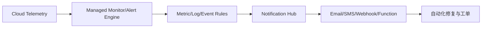

**与 Object Monitor 映射**
- 机制可借鉴；
- 私有云主部署场景下不宜作为核心依赖。

**适配建议**
- 借鉴其规则治理、告警路由、可靠性工程实践。

**图解说明（本节 Mermaid）**
- 读图顺序：`云遥测 -> 托管告警引擎 -> 规则评估 -> 通知中心 -> 自动修复`。
- 图中表达的是通用机制，不代表私有云可直接复用产品本身。
- 可借鉴点是规则治理、告警路由、自动修复链路设计。

---

### 4.1.7 Cognite Data Fusion (CDF)

**产品定位**
- CDF 是工业数据平台，核心能力是把 OT/IT 数据进行上下文建模（Contextualization）、时间序列管理、关系建模、工作流与事件自动化。
- 在“资产对象 + 时间序列 + 事件规则”的工业场景中，与 Object Monitor 的对象监控链路高度相似。

**推导的详细实现方案（尽量贴近可落地形态）**

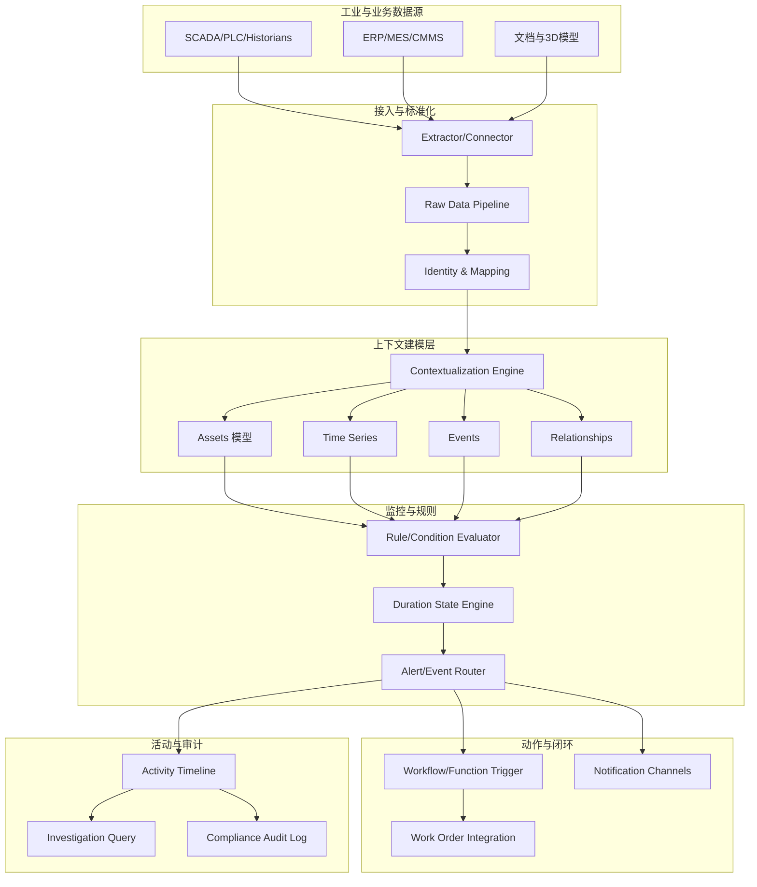

**实现机制推导（对应 Object Monitor）**
1. **对象层（Object）**：可由 `Assets + Relationships` 承载，对应对象类型与关系。
2. **输入层（Input）**：来自 `Time Series + Events + Asset 属性` 的联合输入绑定。
3. **条件层（Condition）**：阈值、区间、统计窗口、关系约束（如父子资产联动）。
4. **持续时长（Duration）**：由 `Duration State Engine` 维护进入/退出时间点，支持“持续高温1小时”类规则。
5. **评估层（Evaluation）**：事件触发 + 周期扫描混合执行，写活动日志。
6. **动作层（Actions）**：触发工作流/工单系统并回写状态，形成闭环。
7. **审计层（Activity）**：保留输入快照哈希、规则版本、通知轨迹。

**可行性与局限**
- 可行性：在工业资产监控上非常强，尤其是对象上下文 + 时序规则。
- 局限：若扩展到通用企业本体（非工业语义），需要额外抽象层对齐业务域模型。

**图解说明（本节 Mermaid）**
- 读图主线：`多源工业数据 -> 上下文建模 -> 规则评估 -> 动作闭环 -> 审计追踪`。
- 图中 `Contextualization Engine` 是关键，它决定对象关系与时序信号如何被统一解释。
- 该图最接近“对象+时序+事件”的监控模式，适合制造与能源类场景。

---

### 4.1.8 Azure Digital Twins (ADT)

**产品定位**
- ADT 提供数字孪生图模型（DTDL）、关系建模与基于事件路由的数字孪生状态处理。
- 与 Object Monitor 的对应关系在于“实体图 + 事件驱动 + 条件触发”，但需要外部规则/工作流服务协同。

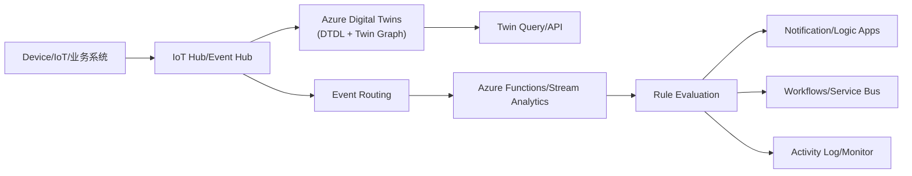

**与 Object Monitor 映射**
- `Object/Link`：ADT Twin + Relationship。
- `Input`：Twin 属性、遥测事件、外部查询结果。
- `Condition/Evaluation`：通常由 Functions/Stream Analytics/Rules 服务实现。
- `Actions/Notifications`：Logic Apps、Service Bus、Teams/Email/Webhook。

**可行性与局限**
- 可行性：在 Azure 生态中构建数字孪生监控链路较顺畅。
- 局限：规则引擎和复杂持续状态管理往往需要额外服务拼装。

**图解说明（本节 Mermaid）**
- 读图主线：`数据接入 -> Twin 图更新 -> 事件路由 -> 外部规则评估 -> 通知/动作`。
- 图中 ADT 负责对象图语义，规则执行主体在外围服务，属于“图语义强、规则需外接”模式。

---

### 4.1.9 多产品组合成“Object Monitor 对标方案”的整体逻辑视图

> 组合思路：本体平台负责对象语义与规则引擎，企业产品负责下游动作闭环与安全运营。

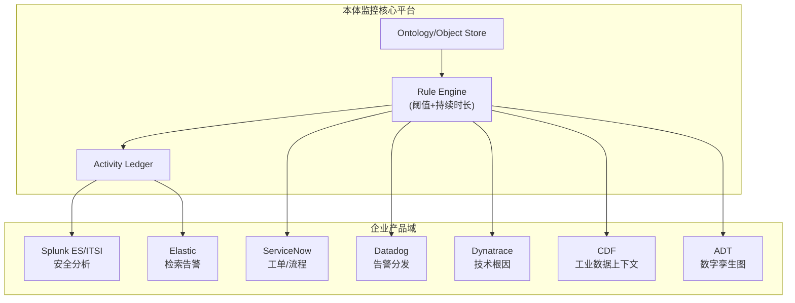

**图解说明（本节 Mermaid）**
- 图分为 `Core` 与 `Ops` 两个域：Core 保留对象语义与规则执行主权，Ops 承担外部长板能力。
- 关键交互是 `Rule Engine/Activity Ledger` 向外分发结果，避免外部产品反向侵入核心语义。
- 该图的核心设计思想是“核心内聚、能力外接”。

**说明**
- 核心平台保持“对象语义 + 规则执行 + 审计”主权；
- 外部产品按长板接入，避免把核心对象语义分散到多个产品。

## 4.2 开源组合方案（扩展，超出此前两种）

> 本节每套方案都给出 Mermaid 逻辑图、关键交互与可行性判断。

### 方案 A：Kafka + Flink CEP + Temporal + PostgreSQL + OpenSearch + Keycloak（首选）

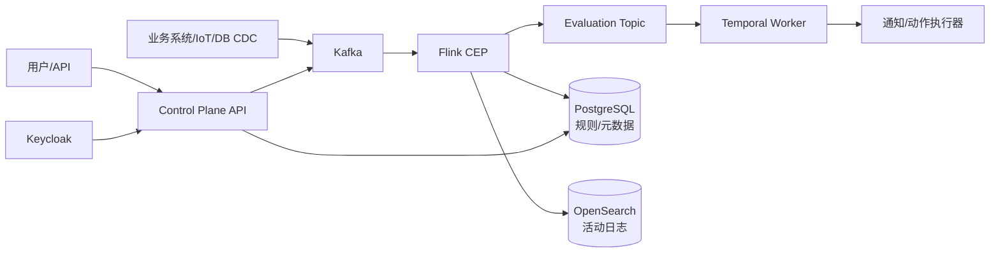

**交互与分工**
- Kafka：事件总线与回放基础；
- Flink CEP：持续时长、序列模式等复杂评估；
- Temporal：动作重试/补偿/幂等；
- OpenSearch：活动检索与审计查询。

**可行性**：高（功能完整、可扩展、私有云成熟）。

**图解说明（本节 Mermaid）**
- 主链路：`事件源 -> Kafka -> Flink CEP -> Evaluation -> Temporal -> 通知/动作`。
- 控制面：`Control Plane API -> PostgreSQL` 管理规则与版本。
- 审计面：`OpenSearch` 提供活动检索，形成执行与审计双闭环。

---

### 方案 B：Kafka + Kafka Streams + Drools + Argo Workflows + PostgreSQL

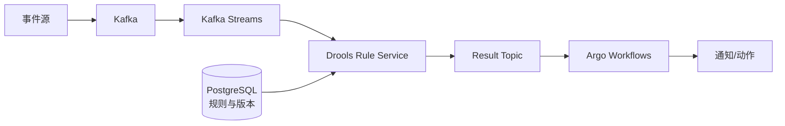

**交互与分工**
- Kafka Streams 处理轻量状态；
- Drools 负责规则执行；
- Argo 管理流程动作。

**可行性**：中高（团队 Java 强时优势明显）。

**图解说明（本节 Mermaid）**
- 主链路：`Kafka Streams` 处理流，`Drools` 做规则求值，`Argo` 执行动作流程。
- `PostgreSQL` 提供规则与版本的统一管理。
- 图的重点是“轻量组合 + Java 生态友好”，但 CEP 深度弱于 Flink。

---

### 方案 C：Pulsar + Flink + OPA/CEL + Temporal + ClickHouse

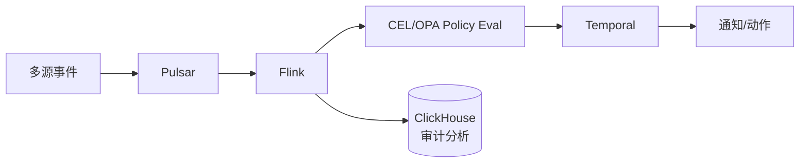

**交互与分工**
- Pulsar 负责多租户 topic/订阅；
- OPA/CEL 负责策略表达；
- ClickHouse 提供高压缩分析存储。

**可行性**：中（吞吐强，但整合门槛高）。

**图解说明（本节 Mermaid）**
- 主链路：`Pulsar` 承载多租户消息，`Flink` 计算，`OPA/CEL` 做策略求值。
- `Temporal` 执行动作，`ClickHouse` 承接审计分析。
- 图体现“高吞吐 + 强分析”的路线，代价是整合复杂。

---

### 方案 D：Debezium + PostgreSQL + NATS JetStream + CEL + Prefect

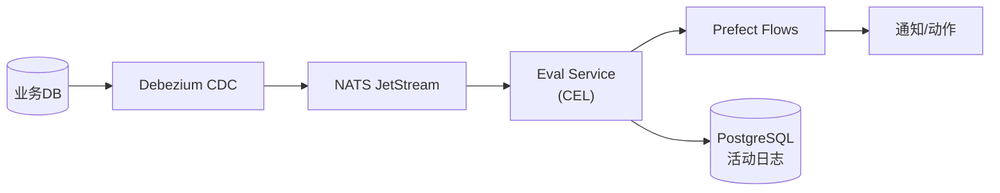

**交互与分工**
- Debezium 提供低侵入 CDC；
- NATS 提供轻量消息中枢；
- Prefect 承担工作流执行。

**可行性**：中（MVP 快，但超大规模弹性偏弱）。

**图解说明（本节 Mermaid）**
- 主链路：`Debezium CDC -> NATS -> Eval Service(CEL) -> Prefect`。
- 活动日志回写 PostgreSQL，形成最小可用闭环。
- 图强调 MVP 速度，适合先验证再扩展。

---

### 方案 E：Neo4j + Kafka + Flink + Temporal（图中心）

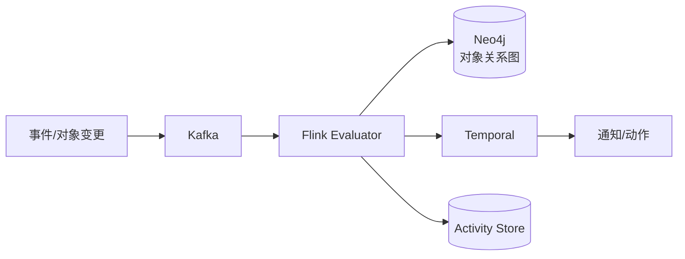

**交互与分工**
- Neo4j 提供关系查询与路径规则；
- Flink 维护持续时长状态机，避免图库热点击穿。

**可行性**：中高（关系密集场景很优，但成本高）。

**图解说明（本节 Mermaid）**
- 主链路：`Kafka -> Flink Evaluator -> Neo4j` 查询关系规则，再由 `Temporal` 执行动作。
- 关键实践：持续时长状态放在 Flink，而不是图库。
- 图对应“关系密集规则优先”的选型思路。

---

### 方案 F：JanusGraph + Cassandra + Kafka + Flink（全开源横向扩展）

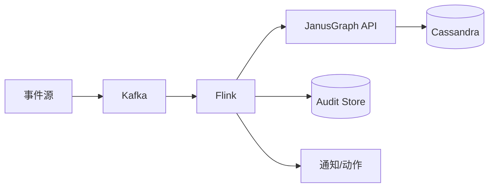

**交互与分工**
- JanusGraph + Cassandra 提供大规模图扩展；
- Flink 负责主评估路径。

**可行性**：中（超大规模潜力强，但研发/运维门槛高）。

**图解说明（本节 Mermaid）**
- 主链路：`Kafka + Flink` 做评估，`JanusGraph + Cassandra` 提供大规模图存储。
- 审计与通知为并行输出，强调横向扩展能力。
- 图显示该路线偏长期与超大规模，实施门槛最高。

---

### 4.2.7 开源方案对比结论

- **首选**：方案 A（能力完整与工程可控性平衡最佳）。
- **成本敏感 MVP**：方案 D。
- **关系密集行业（反欺诈/供应链）**：方案 E。
- **超大规模长期路线**：方案 F（需强平台团队）。

---
